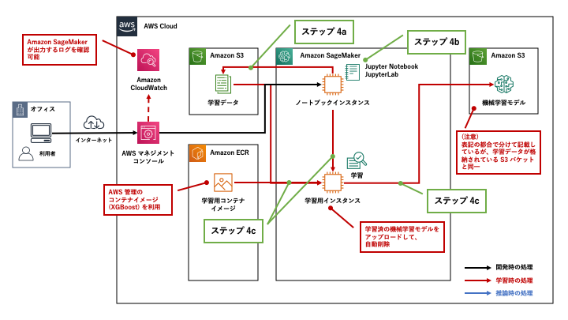
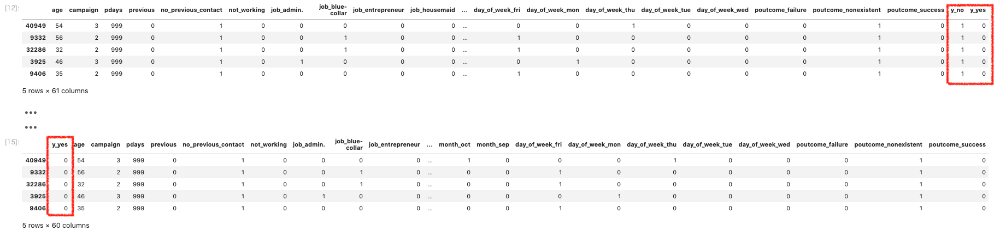
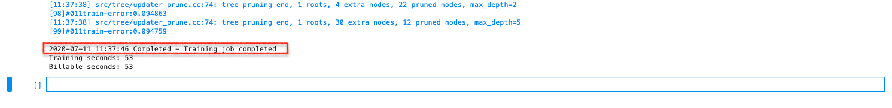
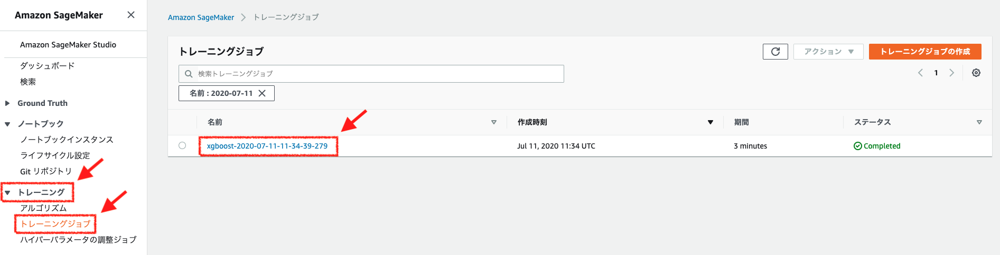
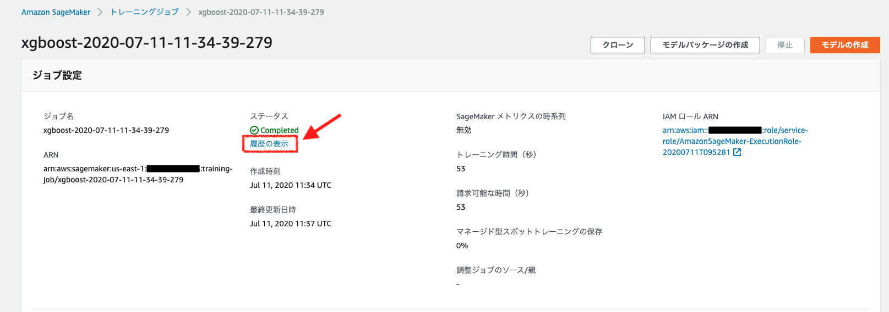
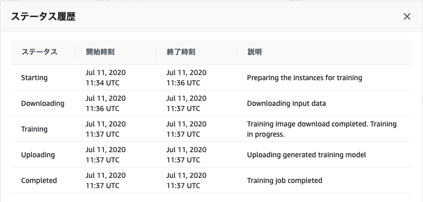
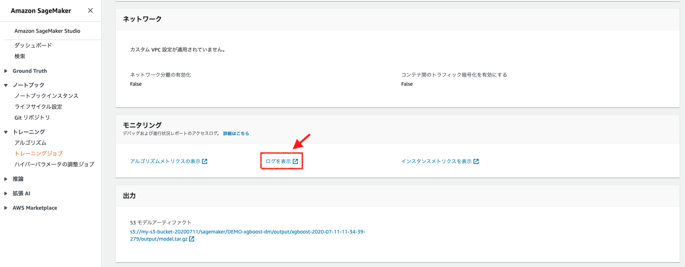
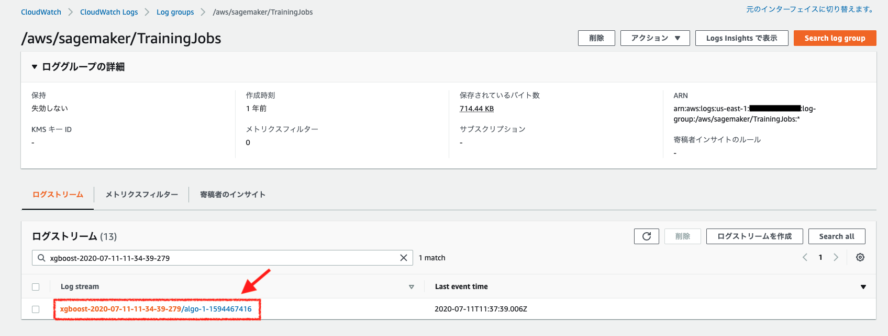
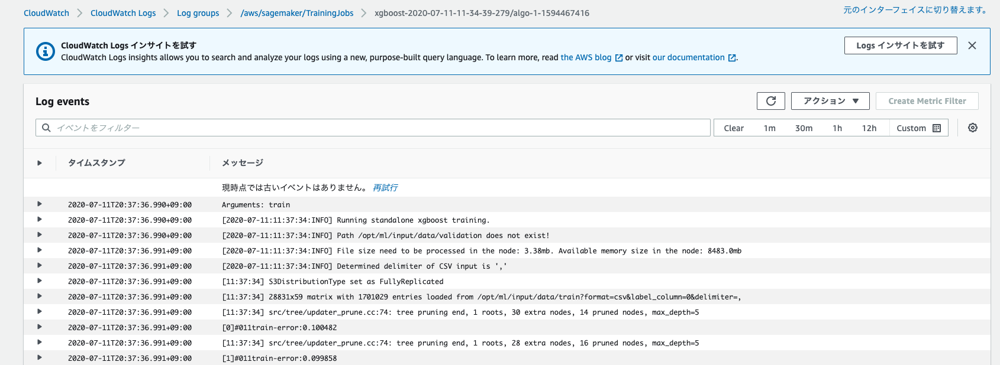

[第7回] Amazon SageMaker の基本的な使い方を理解する (3)
========================================================

はじめに
--------------------
| 前回は、Amazon SageMaker のチュートリアルをベースにして、学習・推論に利用するデータの準備を行う手順をご説明させていただきました。
| 今回は、前回準備したデータを使って学習を行っていきます。

今回の記事で実施すること
^^^^^^^^^^^^^^^^^^^^^^^^^^^^^^^^^^^^^
今回は下記の表の「ステップ 4: データからのモデルのトレーニング」を扱います。

.. list-table::
    :header-rows: 1

    * - 工程
      - ステップ
      - 枝番
      - 実施内容
      - 連載回
    * - 開発
      - 1
      - 
      - Amazon SageMaker コンソールにログインする
      - 第 5 回
    * -
      - 2
      - 
      - Amazon SageMaker notebook instance を作成する
      - 第 5 回
    * -
      - 3
      - 
      - データの準備
      - 第 6 回
    * -
      - 
      - 3a, 3b
      - ノートブックを起動する
      - 
    * -
      - 
      - 3c
      - ノートブックの利用準備をする
      - 
    * -
      - 
      - 3d
      - S3 バケットを作成する
      - 
    * -
      - 
      - 3e
      - 学習・推論に利用するデータをダウンロードする
      - 
    * -
      - 
      - 3f
      - データを分割する
      - 
    * - 学習
      - 4
      - 
      - データからのモデルのトレーニング
      - 第 7 回
    * - 
      - 
      - 4a
      - 学習データを S3 バケットにアップロードする
      - 
    * - 
      - 
      - 4b
      - 学習の設定をする
      - 
    * - 
      - 
      - 4c
      - 学習を行う
      - 
    * - 推論
      - 5
      - 
      - モデルのデプロイ
      - 第 8 回
    * - 
      - 
      - 5a
      - 推論エンドポイントを作成して、モデルをデプロイする
      - 
    * - 
      - 
      - 5b
      - 推論を行う
      - 
    * - 
      - 6
      - 
      - モデルの性能評価
      - 第 8 回
    * - 後片付け
      - 7
      - 
      - リソースを終了する
      - 第 8 回

ステップ 4: データからのモデルのトレーニング
-----------------------------------------------------
| データの準備まで完了しましたので、ここからは学習用のコードを開発していきます。
| 今回は Amazon SageMaker に `組み込みアルゴリズム <https://docs.aws.amazon.com/ja_jp/sagemaker/latest/dg/algos.html>`_ として用意されている「`XGBoost <https://docs.aws.amazon.com/ja_jp/sagemaker/latest/dg/xgboost.html>`_」と呼ばれる機械学習アルゴリズムを利用します。

| 組み込みアルゴリズムとして提供されている機械学習アルゴリズムは、コンテナイメージとして予め Amazon ECR のレジストリに準備されています。
| 学習用のコードを開発すると言いつつ、 **利用者は機械学習アルゴリズムを実装する必要はありません。**
| 利用したい機械学習アルゴリズムのコンテナイメージをダウンロードしてコンテナを起動し、学習データを渡すだけで利用することができます。

ステップ 4a: 学習データを S3 バケットにアップロードする
^^^^^^^^^^^^^^^^^^^^^^^^^^^^^^^^^^^^^^^^^^^^^^^^^^^^^^^^^^^^^^^
XGBoost を利用するための準備として、学習用データの加工と S3 バケットへのアップロードを行います。

実行するコード
********************
下記のコードをセルにコピー＆ペーストして実行してください。

.. code-block:: python

  pd.concat([train_data['y_yes'], train_data.drop(['y_no', 'y_yes'], axis=1)], axis=1).to_csv('train.csv', index=False, header=False)
  boto3.Session().resource('s3').Bucket(bucket_name).Object(os.path.join(prefix, 'train/train.csv')).upload_file('train.csv')
  s3_input_train = sagemaker.s3_input(s3_data='s3://{}/{}/train'.format(bucket_name, prefix), content_type='csv')

コードの解説
********************

.. code-block:: python

    pd.concat([train_data['y_yes'], train_data.drop(['y_no', 'y_yes'], axis=1)], axis=1)
        .to_csv('train.csv', index=False, header=False)

| 解釈し易くするために、改行して表記します。
| ここでは、train_data (DataFrame) に読み込んだ学習データを加工して、CSV 形式のファイルに出力しています。

| 組み込みアルゴリズムの XGBoost は、学習データを表形式のファイルでデータを与える必要があり、学習データの1列目を「**目的変数**」に、2列目以降を「**説明変数 (特徴量)**」とする必要があります。
| 今回の場合、目的変数は「キャンペーンの結果、顧客が定期預金を申し込んだか否か」、説明変数は年齢や職業などの「顧客の属性情報」となります。

| 加工前の状態では、目的変数の列が一番後ろに存在することに加えて、「`y_yes` (申し込んだ)」だけでなく、「`y_no` (申し込まなかった)」も存在します。
| Pandas の `concat <https://pandas.pydata.org/pandas-docs/stable/reference/api/pandas.concat.html>`_ 関数を使って、「`y_yes`」を切り出して1列目に、後方に存在する「y_yes」「y_no」を削除 (drop) した表を結合して新たな表を作成しています。
| 下図の上段の表が加工前、下段の表が加工後の学習データです。

| 組み込みアルゴリズムの XGBoost は、学習データのファイル形式として CSV 形式もしくは libsvm 形式をサポートしています。
| ここでは Pandas の `to_csv <https://pandas.pydata.org/pandas-docs/stable/reference/api/pandas.DataFrame.to_csv.html>`_ メソッドを使って DataFrame に格納されているデータを CSV 形式に変換しています。
| なお、CSV の行名 (index) と列名 (header) が不要なので、ともに `False` を設定してデータのみを出力しています。

.. code-block:: python

    boto3
        .Session()
        .resource('s3')
        .Bucket(bucket_name)
        .Object(
            os
                .path
                .join(
                    prefix,
                    'train/train.csv'
                )
        )
        .upload_file('train.csv')

| メソッドチェーンで多数つながっていて見通しが悪いので、改行して表記します。
| 要するに、ここでやりたいことは「学習データを S3 バケットにアップロードする」ことです。

| `Session <https://boto3.amazonaws.com/v1/documentation/api/latest/guide/session.html>`_ クラスは、AWS のリソースを操作するために環境変数やプロファイルから認証情報を取得して設定します。
| その後の処理はメソッド名から推測できると思いますが、`resource` メソッドで S3 を設定し、S3 バケット名とオブジェクト名を指定して、学習データを S3 バケットにアップロードしています。

.. code-block:: python  

    s3_input_train = sagemaker.s3_input(
        s3_data='s3://{}/{}/train'.format(bucket_name, prefix), 
        content_type='csv'
    )

| 次の処理も改行して記載します。

| Amazon SageMaker SDK for Python の `s3_input <https://sagemaker.readthedocs.io/en/stable/api/utility/inputs.html#sagemaker.inputs.s3_input>`_ クラスのオプジェクトを生成しています。
| その名の通りで、入力となる学習データが格納された S3 バケットと学習データのファイル形式 (CSV) を設定しています。

| なお、実行時に下記の警告が表示されますが、このチュートリアルでは無視して問題ありません。
| 近々 Amazon SDK for Python のメジャーバージョンアップが予定されており、`s3_input` メソッドの名称が変わることを通知するものです。
| `'s3_input' class will be renamed to 'TrainingInput' in SageMaker Python SDK v2.`

| 以降の手順でも同様の警告が表示されるものがありますが、このチュートリアルでは同様に無視して問題ありません。
| 本格的な開発に着手する場合は、どちらのメジャーバージョンを採用するかを検討してください。

ステップ 4b: 学習の設定をする
^^^^^^^^^^^^^^^^^^^^^^^^^^^^^^^^^^^^^^^^
| 学習データのアップロードまで完了しました。
| 学習の実施前の最後の作業として、Estimator と呼ばれる Amazon SageMaker の学習の設定を行います。

実行するコード
********************
下記のコードをセルにコピー＆ペーストして実行してください。

.. code-block:: python

  sess = sagemaker.Session()
  xgb = sagemaker.estimator.Estimator(containers[my_region],role, train_instance_count=1, train_instance_type='ml.m4.xlarge',output_path='s3://{}/{}/output'.format(bucket_name, prefix),sagemaker_session=sess)
  xgb.set_hyperparameters(max_depth=5,eta=0.2,gamma=4,min_child_weight=6,subsample=0.8,silent=0,objective='binary:logistic',num_round=100)

コードの解説
********************

.. code-block:: python

  sess = sagemaker.Session()

Amazon SageMaker API およびその他の必要な AWS サービスとのやり取りを管理するための Session オブジェクトを作成しています。

.. code-block:: python

  xgb = sagemaker.estimator.Estimator(
    containers[my_region],
    role, 
    train_instance_count=1, 
    train_instance_type='ml.m4.xlarge',
    output_path='s3://{}/{}/output'.format(bucket_name, prefix),
    sagemaker_session=sess
  )

| 上記の処理も改行して記載します。
| Amazon SageMaker SDK for Python の `Estimator <https://sagemaker.readthedocs.io/en/stable/api/training/estimators.html#sagemaker.estimator.Estimator>`_ クラスのオプジェクトを生成しています。
| パラメータ (引数) で学習の設定を行います。ここで設定する項目の意味を下記の表に示します。

.. list-table::
    :header-rows: 1

    * - パラメータ (引数)
      - パラメータの意味
    * - containers
      - | **学習に利用するコンテナイメージの URI を指定する。**
        |
        | ここでは、組み込みアルゴリズムの XGBoost リリース 0.72 のコンテナイメージの URI を指定している。
        | ステップ 3c で設定した値のうち、「バージニア北部 (us-east-1)」が選択される。
    * - role
      - | **Amazon SageMaker にアタッチする IAM ロールの名前もしくは ARN を指定する。**
        |
        | ステップ 2 で作成した IAM ロール (AmazonSageMakerFullAccess ポリシーが設定されたもの) を ステップ 3c で取得しており、これが設定される。
    * - train_instance_count
      - | **学習用インスタンス数を設定する。**
        |
        | 2 以上を設定することで複数インスタンスでの分散学習の実行が可能である。
        | ただし、独自アルゴリズムを利用する場合は分散学習に対応したコードを開発する必要がある。
    * - train_instance_type
      - | **学習用インスタンスのインスタンスタイプを設定する。**
        |
        | ML インスタンスとして様々なタイプが用意されており、学習の特性に応じたものを選択する。
        | ここでは、汎用 (M4) の xlarge を設定している。その他に利用できるインスタンスタイプと料金は下記を参照のこと。
        |
        | (参考)
        | - 「`Amazon SageMaker ML インスタンスタイプ <https://aws.amazon.com/jp/sagemaker/pricing/instance-types/>`_」
        | - 「`Amazon SageMaker の料金 <https://aws.amazon.com/jp/sagemaker/pricing/>`_」
    * - output_path
      - | **学習におけるアウトプット (モデルアーティファクトと出力ファイル) の出力先となる S3 バケットを指定する。**
        |
        | ステップ 3d で作成し、ステップ 4a で学習データをアップロードした S3 バケットと同一のバケットを出力先に設定している。
    * - sagemaker_session
      - | **Session オブジェクトを設定する。**
        |
        | 直前に作成したセッションオブジェクトを設定している。

.. code-block:: python

    xgb.set_hyperparameters(
      max_depth=5,
      eta=0.2,
      gamma=4,
      min_child_weight=6,
      subsample=0.8,
      silent=0,
      objective='binary:logistic',
      num_round=100
    )

| 上記の処理も改行して記載します。
| ここでは、XGBoost の「ハイパーパラメータ」を設定しています。

| ハイパーパラメータとは機械学習アルゴリズムの設定に相当するものであり、その値は機械学習モデルの精度に直結します。
| Amazon SageMaker にはハイパーパラメータを自動チューニングする機能がありますが、ここでは固定値として上記の値を設定しています。

| XGBoost で設定できるハイパーパラメータとそれぞれの意味は、「`XGBoost リリース 0.72 のハイパーパラメータ <https://docs.aws.amazon.com/ja_jp/sagemaker/latest/dg/xgboost-72.html#xgboost-72-hyperparameters>`_ 」に一覧でまとめられています。
| ここでは説明を割愛しますが、詳しく知りたい方は参照してください。

ステップ 4c: 学習を行う
^^^^^^^^^^^^^^^^^^^^^^^^^^^^^^
学習の設定まで完了しましたので、ここではいよいよ実際に学習を行います。

実行するコード
********************
下記のコードをセルにコピー＆ペーストして実行してください。

.. code-block:: python

  xgb.fit({'train': s3_input_train})

| なお、学習が開始されると下記の画像に示したような実行ログが出力されます。
| 1 画面に収まらない量が出力されますが、ただの実行ログですので問題ありません。

.. image:: ../../../images/blog/5th/sagemaker-training-start.png
  :width: 900px

| 学習が完了すると、下記のように完了を示すメッセージが出力されます。
| このチュートリアルはデータ量が少ないため、数分で完了します。

コードの解説
********************
| Amazon SageMaker における学習の実行は、`fit <https://sagemaker.readthedocs.io/en/stable/api/training/estimators.html#sagemaker.estimator.Estimator.fit>`_ メソッドに学習データが格納されている S3 バケットの所在を渡すだけで実行できます。
| fit メソッドを実行すると、学習ジョブが起動して XGBoost による機械学習モデルが構築されます。
| 学習の完了時に機械学習モデルの S3 バケットへのアップロード、学習用インスタンスの削除が自動で行われます。

| ノートブックに表示される実行ログを簡単に見てみましょう。
| Amazon SageMaker が背後で行っている処理を確認することができます。

.. list-table::
    :header-rows: 1

    * - 実行ログ
      - 処理内容
    * - 2020-07-11 11:34:39 Starting - Starting the training job...
      - 学習ジョブの開始
    * - 2020-07-11 11:34:42 Starting - Launching requested ML instances......
      - 学習用インスタンスの起動開始
    * - 2020-07-11 11:35:57 Starting - Preparing the instances for training......
      - 学習を開始するためのインスタンスの準備開始
    * - 2020-07-11 11:36:53 Downloading - Downloading input data
      - S3 バケットから学習データをダウンロード中
    * - 2020-07-11 11:37:39 Training - Downloading the training image...
      - トレーニングに利用する XGBoost の Docker コンテナイメージのダウンロード中
    * - 2020-07-11 11:37:39 Uploading - Uploading generated training model
      - 学習が完了し、アーティファクトを S3 バケットにアップロード中
    * - Arguments: train
      - 学習の実行を示すメッセージ
    * - [2020-07-11:11:37:34:INFO] Running standalone xgboost training.
      - | XGBoost による学習の実行ログ
        | 
    * - (中略)
      - 
    * - 2020-07-11 11:37:46 Completed - Training job completed
      - 学習ジョブの完了
    * - Training seconds: 53
      - トレーニングに要した時間 (秒)
    * - Billable seconds: 53
      - 課金される時間 (秒)

Amazon SageMaker は従量課金性ですが、今回のトレーニングでは 53 秒分の課金がされることがわかります。

| なお、学習ジョブのステータスの移行履歴は Amazon SageMaker のコンソール、学習の詳細な実行ログは CloudWatch Logs にて確認することができます。
| ノートブックインスタンスが停止状態にある場合やセルを再実行して履歴が消えてしまった場合はこちらで確認します。

| 学習ジョブのステータスの移行履歴を確認する方法を下記に示します。

左側の折りたたみメニューの「トレーニング」をクリックして開き、「トレーニングジョブ」をクリックします。

| 学習ジョブの詳細ページに移動します。このページでは、学習ジョブに関する色々な情報を確認することができます。
| 「ジョブ設定」の「ステータス」に「履歴の表示」がありますので、これをクリックします。

ここで学習ジョブのステータスの移行履歴を確認することができます。

学習の詳細な実行ログを確認する方法を下記に示します。

| 学習ジョブの詳細ページで下にスクロールすると「モニタリング」という項目があります。
| 「ログを表示」をクリックします。

| CloudWatch Logs のロググループの画面に移動し、学習の詳細な実行ログが記録されているログストリームが表示されます。
| ログストリームをクリックします。

学習の詳細な実行ログが表示されますので、ここでログの確認が可能です。

まとめ
--------------------
| 今回の記事では、Amazon SageMaker のチュートリアルをベースにして、学習を行って機械学習モデルの構築まで実施しました。
| 次回は推論と簡単な結果の考察を行います。

+++++++++++

.. include:: ../author/author.rst
