[第10回] Amazon SageMaker Studio の基本的な使い方 (2)
===================================================================

はじめに
-------------------------------------------------------------------

`前回 <https://news.mynavi.jp/itsearch/article/devsoft/5232>`_ は Amazon SageMaker Studio の概要について解説しました。
今回は実際に Amazon SageMaker Studio を使ってみたいと思います。

下記を理解していただくことを目標にして解説をしていきます。

* Amazon SageMaker Studio の使い方がわかる。
* Amazon SageMaker Autopilot の概要と使い方がわかる。

実際に Amazon SageMaker Studio を使う
-------------------------------------------------------------------

今回も AWS 社が公開するチュートリアルを利用して解説を進めていきます。

    * `「機械学習モデルを自動的に作成する Amazon SageMaker Autopilot を使用」 <https://aws.amazon.com/jp/getting-started/hands-on/create-machine-learning-model-automatically-sagemaker-autopilot/>`_

このチュートリアルでは、Amazon SageMaker Studio に加えて、下記の機能も体験することができます。

* Amazon SageMaker Notebooks: Amazon SageMaker Studio に統合されたフルマネージドなノートブック
* Amazon SageMaker Autopilot: AutoML 機能による機械学習モデルの自動構築
* Amazon SageMaker Experiments: 学習ジョブの実行履歴や設定、結果を一元管理

| なお、Amazon SageMaker Studio は、2020 年 11 月に東京リージョンでの提供開始が発表されました。
| チュートリアルはバージニア北部リージョンを利用する手順となっていますが、今回の記事では東京リージョンを利用して進めていきます。

    * `Amazon SageMaker Studio is now expanded to AWS regions worldwide <https://aws.amazon.com/jp/about-aws/whats-new/2020/11/amazon-sagemaker-studio-is-expanded-to-aws-regions-worldwide/>`_

チュートリアルの概要
^^^^^^^^^^^^^^^^^^^^^^^^^^^^^^^^^^^^^^^^^^^^^^^^^^^^^^^^^^^^^^^^^^^

| このチュートリアルで扱う課題とデータセットは、第5〜8回目の連載と同一です。
| 「ポルトガル銀行のダイレクトマーケティングのデータ」を利用して、顧客の属性データから顧客が定期預金を「申し込む」か「申し込まないか」の二値分類を行います。
| 機械学習を使って見込み顧客を予測できることにより、営業活動の効率化を図ることができます。

`第5回目の連載 <https://news.mynavi.jp/itsearch/article/devsoft/5099>`_ で背景を説明していますので、必要に応じて確認してください。

チュートリアルの流れを下記に示します。

.. list-table::
    :header-rows: 1

    * - 工程
      - ステップ
      - 枝番
      - 実施内容
      - 連載回
    * - 準備
      - 1
      - 
      - AWS アカウントを今すぐ無料で作成
      - 第 10 回
    * - 開発
      - 2
      - 
      - Amazon SageMaker Studio をセットアップする
      - 
    * -
      - 3
      - 
      - データセットをダウンロードする
      - 
    * - 学習
      - 4
      - 
      - SageMaker Autopilot 実験を作成する
      - 
    * - 
      - 5
      - 
      - SageMaker Autopilot 実験のさまざまなステージを調べる
      - 
    * - 推論
      - 6
      - 
      - 最適なモデルをデプロイする
      - 
    * - 
      - 7
      - 
      - モデルを使用して予測を行う
      - 
    * - 
      - 8
      - 
      - クリーンアップ
      - 

注意事項
^^^^^^^^^^^^^^^^^^^^^^^^^^^^^^^^^^^^^^^^^^^^^^^^^^^^^^^^^^^^^^^^^^^

今回の解説の題材に使うチュートリアルを試す場合、下記に注意してください。
特に、課金が発生する点に注意してください。

* 想定外の影響を避けるため、本番環境 (商用サービスが稼働するAWSアカウント) ではなく、開発環境や検証環境で実施してください
* チュートリアルの最終更新日が「2020年5月12日」となっています。Amazon SageMaker は2020年11〜12月に大幅な機能アップデートがありましたが、その内容がまだ取り込まれておらず、チュートリアルの画面の一部が古いものがあります
* チュートリアルの「時間」に「10分」と記載されていますが、実際には Amazon SageMaker Autopilot のジョブ実行による待ち時間を含めると2時間程度はかかります。時間に余裕をもって実行してください
* Amazon SageMaker Autopilot により数多くのジョブが起動されます。無償枠を超えて10ドル未満の課金が発生する可能性があります

ステップ 1 : AWS アカウントを今すぐ無料で作成
-------------------------------------------------------------------

| **このステップは、AWS アカウントを持っていない場合にのみ実施してください。**
| 開発者ガイドの「Amazon SageMakerをセットアップします」を参照して、AWS アカウントの取得とセットアップを実施してください。

    * `AWS アカウントを作成する <https://docs.aws.amazon.com/ja_jp/sagemaker/latest/dg/gs-set-up.html#gs-account>`_
    * `IAM 管理者ユーザーおよびグループの作成 <https://docs.aws.amazon.com/ja_jp/sagemaker/latest/dg/gs-set-up.html#gs-account-user>`_

ステップ 2 : Amazon SageMaker Studio をセットアップする
-------------------------------------------------------------------

AWS マネジメントコンソールにログインして、リージョンが「東京」であることを確認してください。

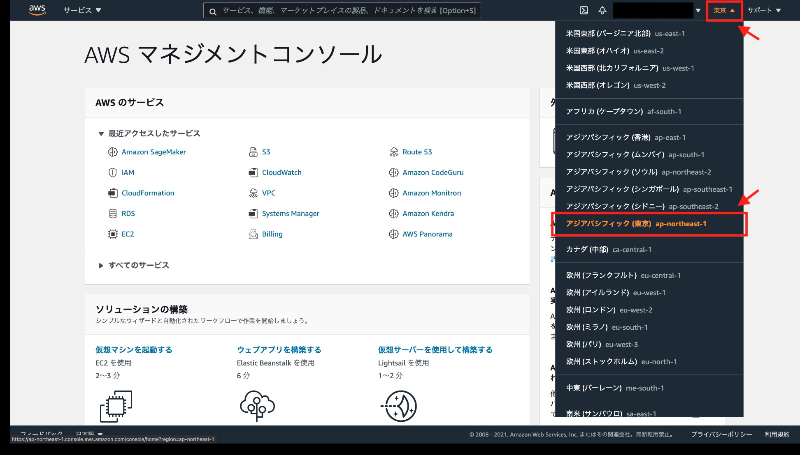

AWS マネジメントコンソールの上部の検索ウィンドウに「sagemaker」などと入力して、Amazon SageMaker のコンソールに移動します。

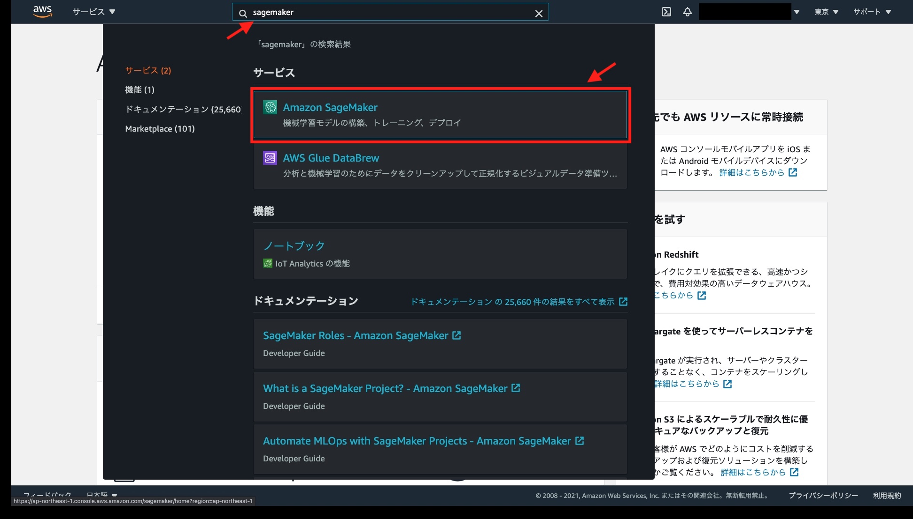

左側のメニューの「Amazon SageMaker Studio」もしくは「今すぐ始める」の配下にある「SageMaker Studio」のいずれかを選択します。

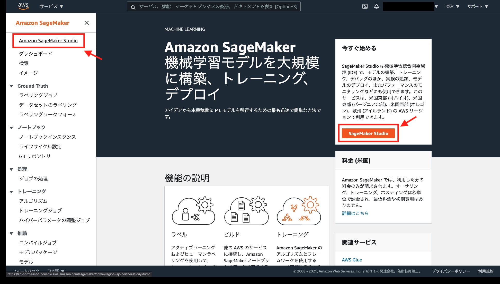

下図のようなセットアップ画面に移動します。

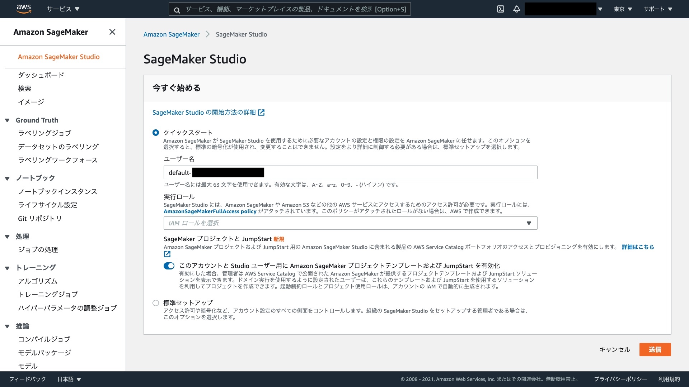

Amazon SageMaker Studio のセットアップ方法について補足します。

| セットアップ方法には、下記の2つがあります。
| ここではチュートリアルに従って、「クイックスタート」でセットアップを進めます。
| なお、IAM 認証を選択して構築したドメイン (Amazon SageMaker Studio の環境) を AWS SSO 認証に変更する場合は、一度ドメインを削除して再作成が必要になります。特に、本番環境で利用する際は注意して選択してください。

.. list-table::
    :header-rows: 1

    * - セットアップ方法
      - 説明
    * - クイックスタート
      - | ・Amazon SageMaker Studio の操作に必要なアカウントや権限設定の大部分を Amazon SageMaker に任せる
        | ・認証方法は IAM となる
    * - 標準セットアップ
      - | ・Amazon SageMaker Studio の操作に必要なアカウントや権限設定を詳細に行う場合に選択する
        | ・認証方法は IAM に加えて、AWS SSO が選択可能である

| 「クイックスタート」での設定項目やその意味について、下記の表にまとめます。
| なお、今回は検証ですので、特に理由がない限り、以降の設定はデフォルト値のまま進めることとします。

.. list-table::
    :header-rows: 1

    * - 設定項目
      - 説明
      - デフォルト値
    * - ユーザー名
      - | **Amazon SageMaker Studio のユーザ作成**
        | Amazon SageMaker Studio で利用するユーザを作成する
      - | default-xxxxxxxxxxxxx
        | (ハイフン以降は自動で採番)
    * - 実行ロール
      - | **上記のユーザに付与する AWS リソースの操作権限の設定**
        | 本表の下に補足情報を記載するので、そちらも参照されたい
      - | IAM ロールを選択する
        | (新しいIAMロールの作成)
    * - SageMaker プロジェクトと JumpStart
      - | **Amazon SageMaker Pipelines と Amazon SageMaker JumpStart の利用可否の設定**
        | Amazon SageMaker Pipelines (MLOps プロジェクト) および Amazon SageMaker JumpStart の利用可否を設定する
        | ※ (注意) 上記は AWS Service Catalog や AWS CloudFormation を利用して実装されており、それぞれの利用するリソースへのアクセス許可を設定する
      - 有効

ここで作成される IAM ロールは、`「第5回の連載」 <https://news.mynavi.jp/itsearch/article/devsoft/5099>`_ で作成したものと同様となります。
「AmazonSageMakerFullAccess」と、下記で設定した条件に当てはまる Amazon S3のバケットとオブジェクト(ファイル)の操作権限を持つ IAM ロールが作成されます。
今回は下図の設定で IAM ロールを作成しますが、本番環境で利用する場合は必要最低限の権限を付与してください。

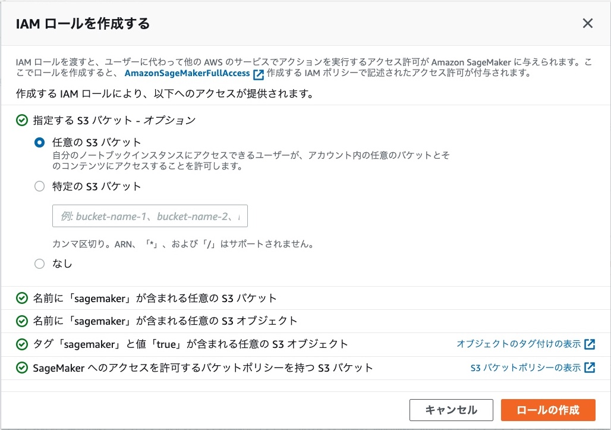

「送信」をクリックして、下記に示す「SageMaker Studio コントロールパネル」が表示されればセットアップは完了です。

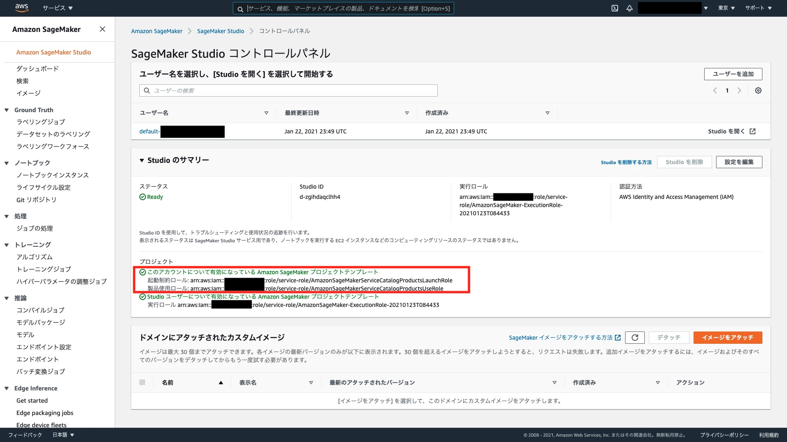

注意事項
^^^^^^^^^^^^^^^^^^^^^^^^^^^^^^^^^^^^^^^^^^^^^^^^^^^^^^^^^^^^^^^^^^^

著者の AWS アカウントでは、下図のようなエラーが発生しました。
プロジェクトの「起動制約ロール」と「製品使用ロール」が存在しないことを示すエラーです。

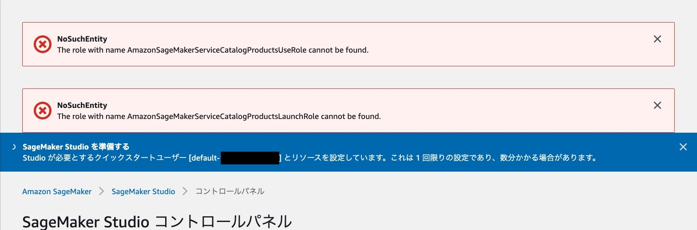

しかし、「SageMaker Studio コントロールパネル」の図の赤枠内に示したようにどちらのロールも正常にアタッチされていますので、問題なしと考えて進めることにします。

ステップ 3 : データセットをダウンロードする
-------------------------------------------------------------------

「SageMaker Studio コントロールパネル」で「Studio を開く」を選択します。

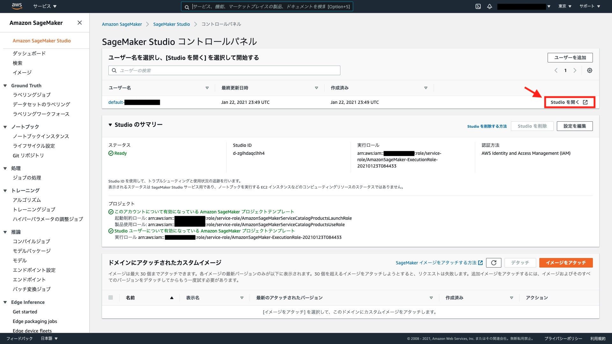

1分程度待つと、下記に示すような画面に遷移します。
これが Amazon SageMaker Studio の Launcher の画面となります。

「Select a SageMaker Image」で「Data Science」を選択し、「Notebook」を選択します。

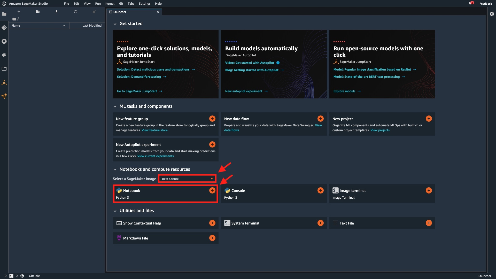

すると、下記のような JupyterLab の画面に遷移します。
これが「Amazon SageMaker Notebooks」となります。
Amazon SageMaker Studio に統合された JupyterLab のノートブック環境です。
ダークテーマとなっていますが、`第6回の連載 <https://news.mynavi.jp/itsearch/article/devsoft/5101>`_ で紹介した JupyterLab と同等です。

ノートブックの右上の赤枠が「Unknown」となっている場合は、Amazon SageMaker Notebooks の背後で稼働するインスタンスが停止状態にあるため、これを選択します。

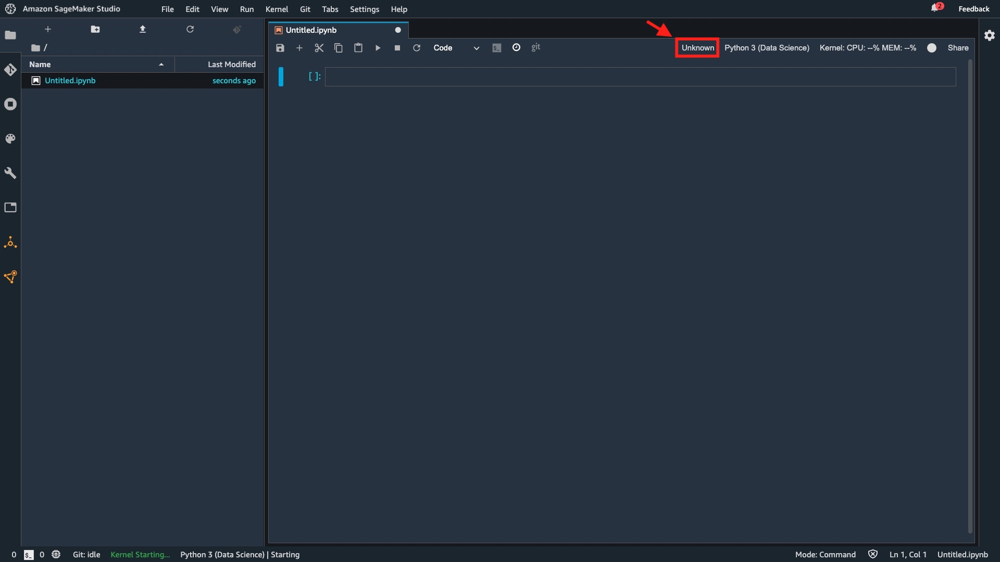

今回のチュートリアルでは小さいインスタンスで十分であるため、汎用 (General purpose) の「ml.t3.medium」を選択して、「Save and continue」を選択します。

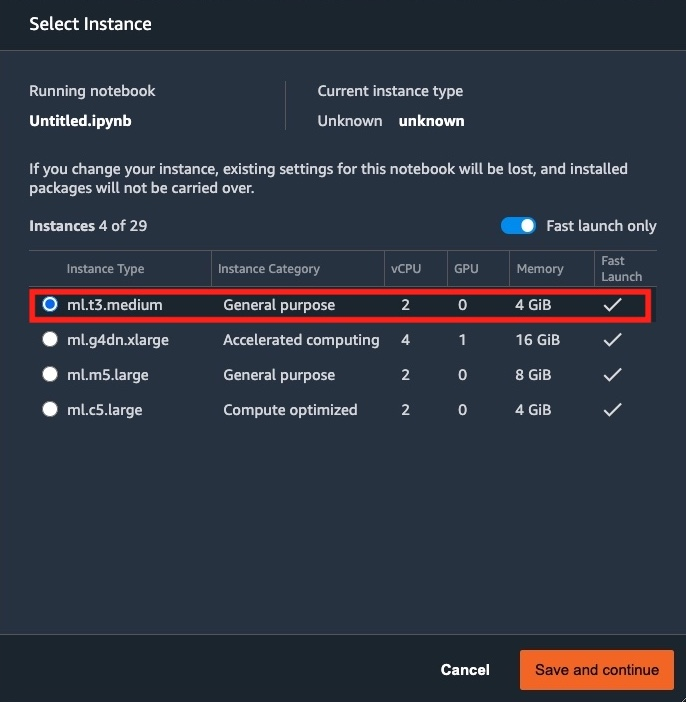

インスタンスの起動に成功すると、「Unknown」で選択したインスタンスタイプの vCPU とメモリサイズが表示が変わります。
「ml.t3.medium」の場合は、「2 vCPU + 4 GiB」と表示されます。

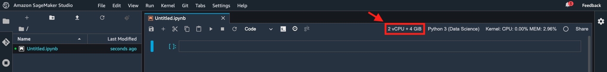

実行するコード
^^^^^^^^^^^^^^^^^^^^^^^^^^^^^^^^^^^^^^^^^^^^^^^^^^^^^^^^^^^^^^^^^^^

| ノートブックのセルに下記のコードをコピー＆ペーストして実行してください。
| ノートブック上部にある「▶︎」か、「Shift キー」＋「Enter キー」で実行できます。

.. code-block:: python

    %%sh
    apt-get install -y unzip
    wget https://sagemaker-sample-data-us-west-2.s3-us-west-2.amazonaws.com/autopilot/direct_marketing/bank-additional.zip
    unzip -o bank-additional.zip

下記のような出力と、左側に「bank-additional」というフォルダが作成されれば成功です。

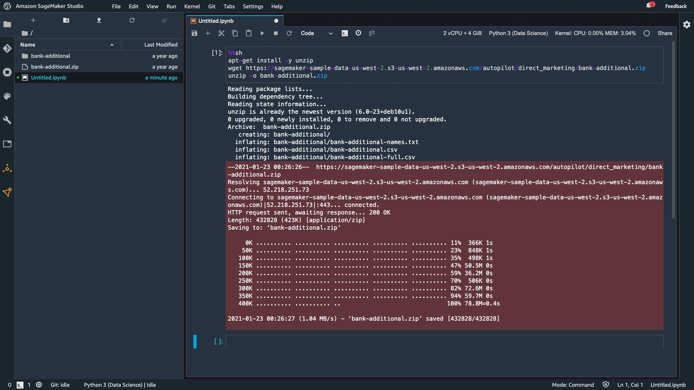

コードの解説
^^^^^^^^^^^^^^^^^^^^^^^^^^^^^^^^^^^^^^^^^^^^^^^^^^^^^^^^^^^^^^^^^^^

マジックコマンド (%%sh) を使って OS のコマンドを実行しています。
ここでは、下記の3つの処理を実行しています。

* ZIP ファイルを解凍するための unzip のパッケージのダウンロード
* チュートリアルで利用する「ポルトガル銀行のダイレクトマーケティングのデータ」(zip 形式) のダウンロード
* ダウンロードしたデータの解凍 (unzip)

実行するコード
^^^^^^^^^^^^^^^^^^^^^^^^^^^^^^^^^^^^^^^^^^^^^^^^^^^^^^^^^^^^^^^^^^^

ノートブックのセルに下記のコードをコピー＆ペーストして実行してください。

.. code-block:: python
    
    import pandas as pd
    data = pd.read_csv('./bank-additional/bank-additional-full.csv')
    data[:10]

下記のように表形式でデータが表示されれば成功です。

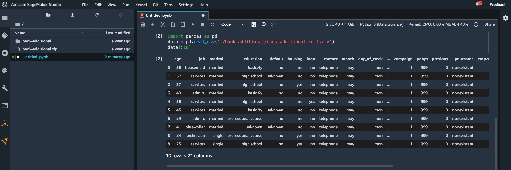

コードの解説
^^^^^^^^^^^^^^^^^^^^^^^^^^^^^^^^^^^^^^^^^^^^^^^^^^^^^^^^^^^^^^^^^^^

ここでは、Pandas の `read_csv 関数 <https://pandas.pydata.org/pandas-docs/version/1.0.1/reference/api/pandas.read_csv.html>`_ を使って、ダウンロードした CSV 形式のデータを DataFrame に読み込み、最初の10行を出力しています。

実行するコード
^^^^^^^^^^^^^^^^^^^^^^^^^^^^^^^^^^^^^^^^^^^^^^^^^^^^^^^^^^^^^^^^^^^

ノートブックのセルに下記のコードをコピー＆ペーストして実行してください。

.. code-block:: python
    
    import sagemaker

    prefix = 'sagemaker/tutorial-autopilot/input'
    sess   = sagemaker.Session()

    uri = sess.upload_data(path="./bank-additional/bank-additional-full.csv", key_prefix=prefix)
    print(uri)

| 下記のように S3 バケットの URI が表示されれば成功です。
| 「ACCOUNT_NUMBER」はご自身の AWS アカウントの 12 ケタの数字に読み替えてください。
| この URI は、ステップ 4 で利用します。

.. code-block::
    
    s3://sagemaker-ap-northeast-1-ACCOUNT_NUMBER/sagemaker/tutorial-autopilot/input/bank-additional-full.csv

実行するコード
^^^^^^^^^^^^^^^^^^^^^^^^^^^^^^^^^^^^^^^^^^^^^^^^^^^^^^^^^^^^^^^^^^^

ここでは、Amazon SageMaker Python SDK の `upload_data メソッド <https://sagemaker.readthedocs.io/en/stable/api/utility/session.html?highlight=session#sagemaker.session.Session.upload_data>`_ を利用して、S3 バケットにデータセットをアップロードしています。

ステップ 4 : SageMaker Autopilot 実験を作成する
-------------------------------------------------------------------

ステップ 3 までで環境構築とデータの準備が終わりました。
ここからは、Amazon SageMaker Autopilot の設定を行っていきます。

Amazon SageMaker Autopilot では、表形式 (CSV 形式) の学習データから前処理・学習アルゴリズムの選択・学習・ハイパーパラメータの最適化を自動で行います。
背後では、 Amazon SageMaker Experiment と連携して実現されています。
チュートリアルの本文に「Experiment」や「実験」という単語が出てきますが、これに由来すると考えられます。

なお、実験の完了までに2時間程度かかる点に注意してください。
途中経過を観察する必要はありませんが、放置が許されない場合もあるかと思いますので、時間に余裕を持って実施してください。

左側のナビゲーションペインで、下図に示す三角形のアイコンを選択します。
続けて、「Project」と表示されているプルダウンメニューから、「Experiments and trials」を選択します。

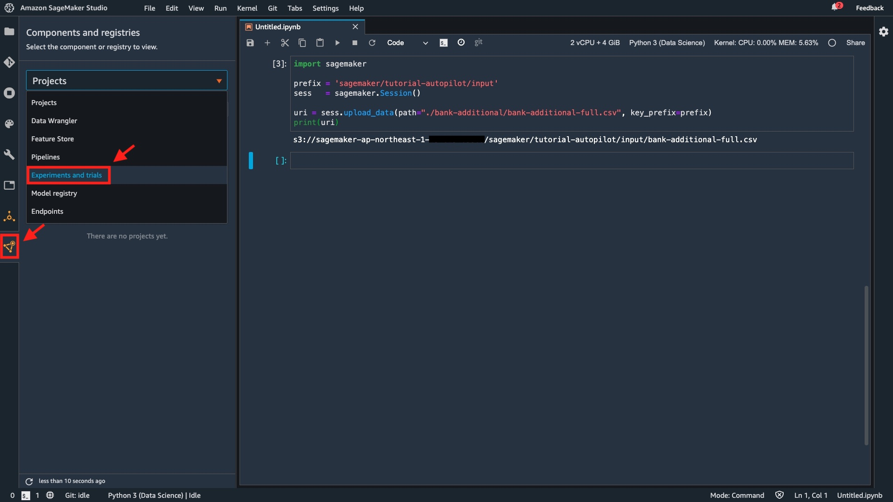

続けて、「Create Experiment」を選択します。

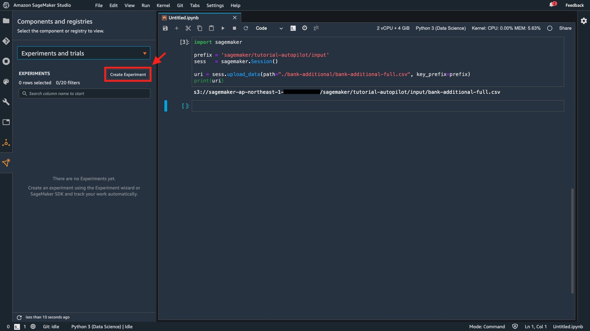

ここで、「AUTOPILOT EXPERIMENT SETTINGS」で実験の設定を行います。

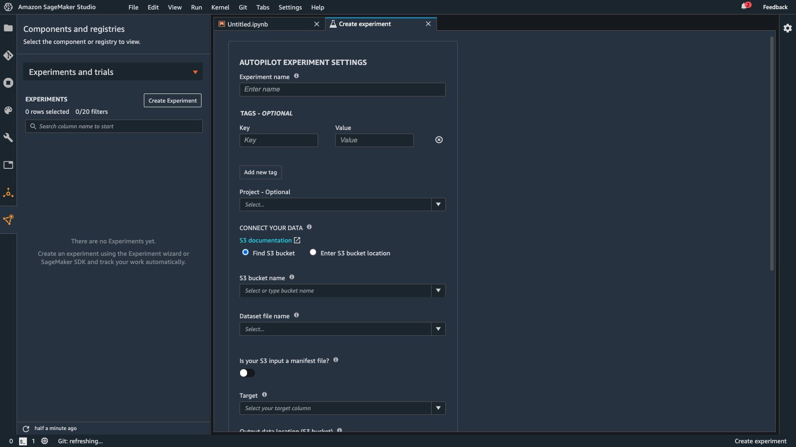

今回は簡単なチュートリアルですので、原則としてデフォルト値を設定します。
各設定値の説明を簡単に記しますので、実際の業務で利用する際は参考にしてください。

.. list-table::
    :header-rows: 1

    * - 分類
      - 設定値名
      - 説明
      - デフォルト値
    * - AUTOPILOT EXPERIMENT SETTINGS
      - Experiment name
      - | **実験の名称の設定**
        | 最大 63 文字まで設定可能であり、英数字もしくはハイフン (-) の利用が可能。1つの AWS リージョンのアカウント内で一意である必要がある
      - | なし
        | (今回は「tutorial-autopilot」を設定)
    * - 
      - TAGS - Optional
      - | **実験に付与するタグの設定**
        | タグをキーバリュー形式で設定する。オプション設定であるため、必要に応じて設定する
      - なし
    * -
      - Project - Optional
      - | **プロジェクトの設定**
        | 既存のプロジェクトを利用する場合に設定する。オプション設定であるため、必要に応じて設定する
      - なし
    * - 
      - CONNECT YOUR DATA
      - | **入力データの設定**
        | 学習データが格納されている S3 バケットとファイル名を指定する。S3 バケットは同一リージョンに存在する必要があり、ファイルは CSV 形式で 500 行以上である必要がある
        | ・Find S3 bucket: バケット名とファイル名をプルダウンから選択する
        | ・Enter S3 bucket location: 「s3://」から始まる URI 形式でファイル名を指定する
      - | Enter S3 bucket location
        | (今回は「ステップ 3」で確認した S3 の URI を指定)
    * - 
      - Is your S3 input a manifest file?
      - | **マニフェストファイルの設定**
        | S3 バケットに格納したファイルがマニフェストファイルである場合に有効化する。マニフェストファイルは、入力となる学習データとメタデータ (データの格納場所などの属性情報) が含まれる
      - 無効
    * - 
      - Target
      - | **正解データの列名**
        | 推論の対象となる正解データが格納されている列名
      - | なし
        | (今回は「y」を設定)
    * -
      - Output data location (S3 bucket)
      - | **出力データの格納場所の設定**
        | 機械学習モデルなどの出力ファイルを出力する S3 バケットを指定する。設定値の意味は「CONNECT YOUR DATA」と同じ
      - | Find S3 bucket
        | (今回は「ステップ 3」で確認した S3 バケットを設定)
    * -
      - Select the machine learning problem type
      - | **機械学習の問題の設定**
        | 実験で扱う機械学習の問題を下記の中から設定する
        | ・Auto: 自動
        | ・Binary classification: 二値分類
        | ・Regression: 回帰
        | ・Multiclass classification: 多値分類
      - Auto
    * - ADVANCED SETTINGS - Optional
      - Do you want to run a complete experiment?
      - | **実験の実行範囲の設定**
        | Amazon SageMaker Autopilot による実験のうち、4つのステップを全てを行うか、ステップ 2 の「Candidate Definitions Generated」までに留めるかを選択する
        | ・Yes
        | ・No, run a pilot to create a notebook with candidate definitions
      - Yes
    * -
      - IAM role
      - | **IAM ロールの設定**
        | Amazon SageMaker Autopilot に付与する AWS リソースの操作権限を設定した IAM ロールを指定する
      - Default SageMaker Role
    * -
      - Encryption key - Optional
      - | **データの暗号化の設定**
        | AWS Key Management Service (KMS) によるデータの暗号化を実施する場合に暗号鍵を指定する
      - なし
    * -
      - Virtual private cloud (VPC) - Optional
      - | **VPC への配置の設定**
        | セキュリティ要件などでインスタンスをユーザ管理の VPC 内に配置する必要がある場合に設定する
      - なし
    * -
      - Max trial runtime in seconds
      - | **試行の実行時間の設定**
        | 試行 (学習ジョブ) の完了を待機する実行時間 (秒)
      - | 0
        | (設定しない)
    * -
      - Max job runtime in seconds
      - | **ジョブの実行時間の設定**
        | ジョブ (AutoML ジョブ) の完了を待機する実行時間 (秒)
      - | 0
        | (設定しない)
    * -
      - Max candidates
      - | **試行の実行回数の設定**
        | 試行の実行回数
        | (複数の試行を実行して機械学習モデルの候補を多数生成する。その中から最終的に1つに絞って推論エンドポイントとしてデプロイする)
      - | 0
        | (設定しない)

入力が終わったら、「Create Experiment」を選択します。

下記のような画面に遷移すれば成功です。

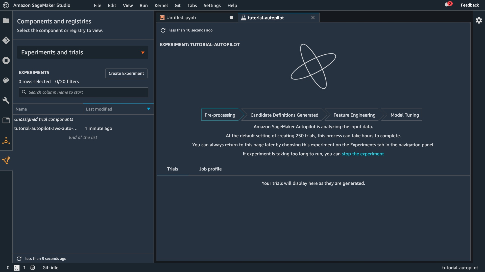

ステップ 5 : SageMaker Autopilot 実験のさまざまなステージを調べる
-------------------------------------------------------------------

Amazon SageMaker Autopilot が下記の4つのタスクを自動で実行します。

1. Pre-processing (前処理)
2. Candidate Definitions Generated (候補定義生成)
3. Feature Engineering (特徴エンジニアリング)
4. Model Tuning (モデルチューニング)

1. Pre-processing
^^^^^^^^^^^^^^^^^^^^^^^^^^^^^^^^^^^^^^^^^^^^^^^^^^^^^^^^^^^^^^^^^^^

2. Candidate Definitions Generated
^^^^^^^^^^^^^^^^^^^^^^^^^^^^^^^^^^^^^^^^^^^^^^^^^^^^^^^^^^^^^^^^^^^

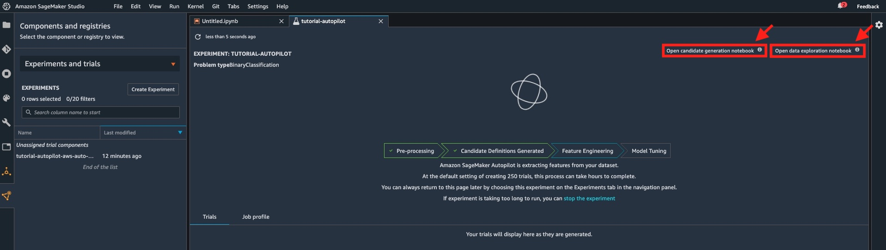

.. list-table::
    :header-rows: 1

    * - 生成されるノートブック
      - 説明
    * - | データ探索ノートブック
        | (Data Exploration Notebook)
      - | 学習データの分析結果として下記を提示する
        | ・データセットのサンプル
        | ・カラムごとの分析結果
        | 　・欠損値の割合
        | 　・値の種類
        | 　・統計情報 (最大・最小値、平均値、中央値)
    * - | 候補生成ノートブック
        | (Candidate Generation Notebook)
      - | Amazon SageMaker Autopilot が判断した内容が示される。ノートブックをダウンロードして編集や手動実行も可能
        | ・前処理と機械学習アルゴリズムの組み合わせ
        | ・ハイパーパラメータ最適化の手法や探索範囲
        | ・上記の実行方法

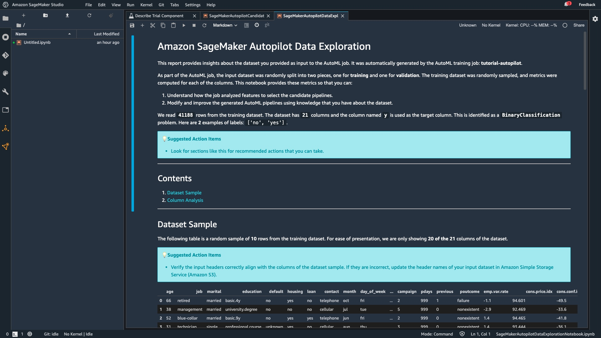

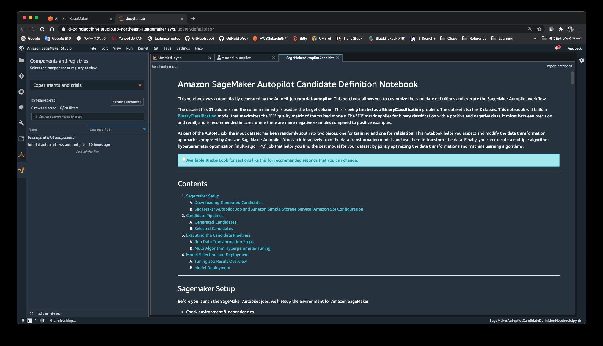

3. Feature Engineering
^^^^^^^^^^^^^^^^^^^^^^^^^^^^^^^^^^^^^^^^^^^^^^^^^^^^^^^^^^^^^^^^^^^

4. Model Tuning
^^^^^^^^^^^^^^^^^^^^^^^^^^^^^^^^^^^^^^^^^^^^^^^^^^^^^^^^^^^^^^^^^^^

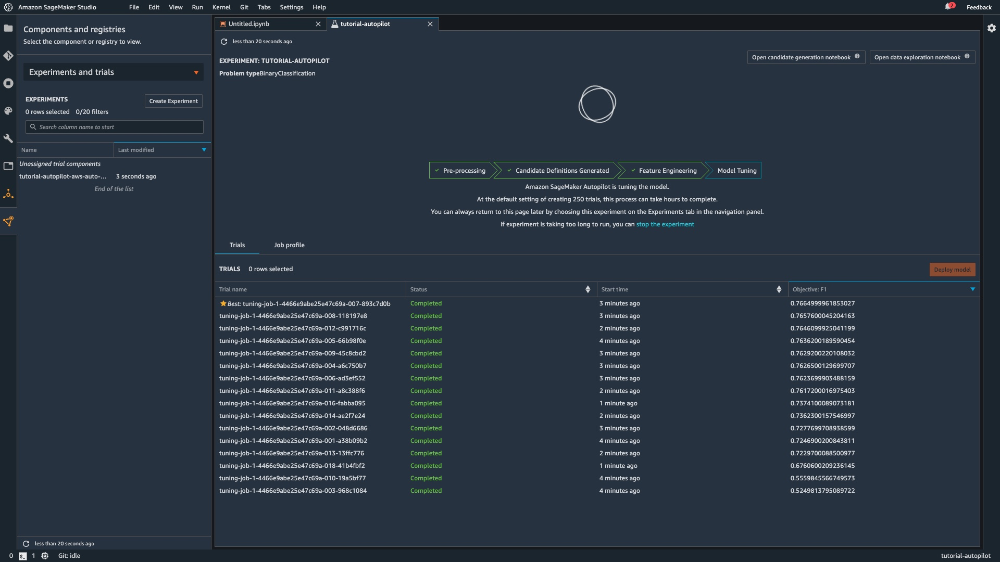

実験が完了すると、下記のようにアニメーションが消えて、結果の表示のみとなります。

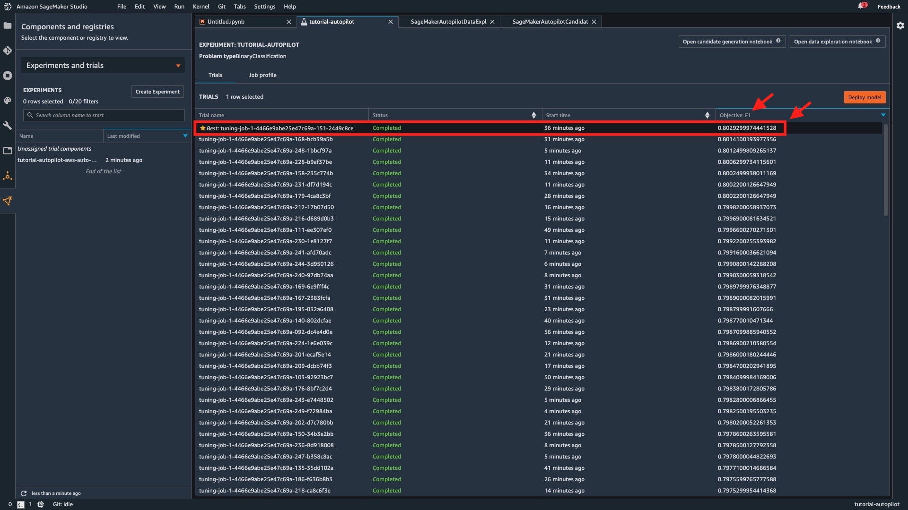

ステップ 6 : 最適なモデルをデプロイする
-------------------------------------------------------------------

実験が完了したら、次は推論を行うために機械学習モデルのデプロイを行い、推論エンドポイントを作成します。
「Best」の表示がある行を選択した状態で右上の「Deploy model」を選択するか、右クリックで「Deploy model」を選択します。

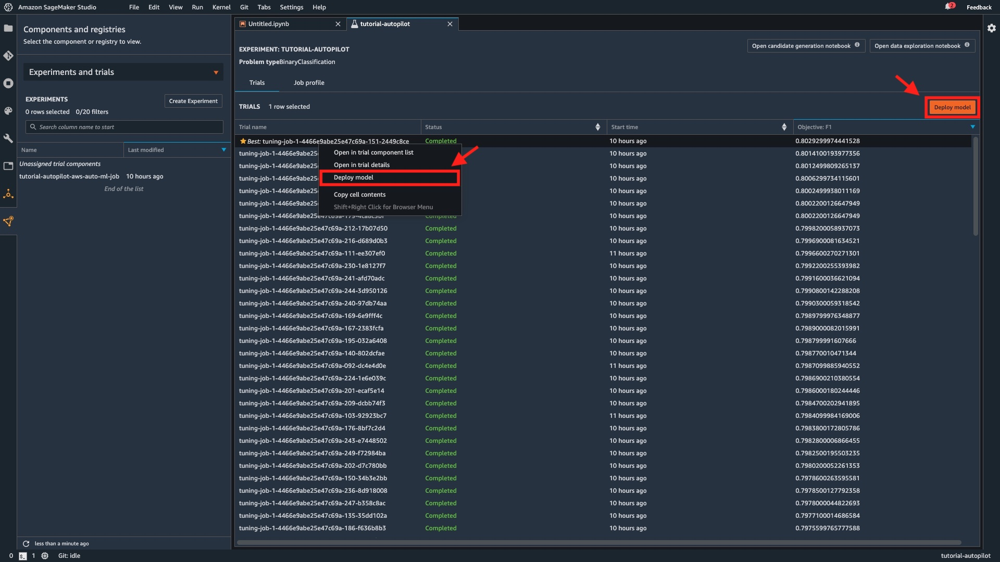

ここで、「REALTIME DEPLOYMENT SETTINGS」でデプロイ (推論エンドポイント) の設定を行います。

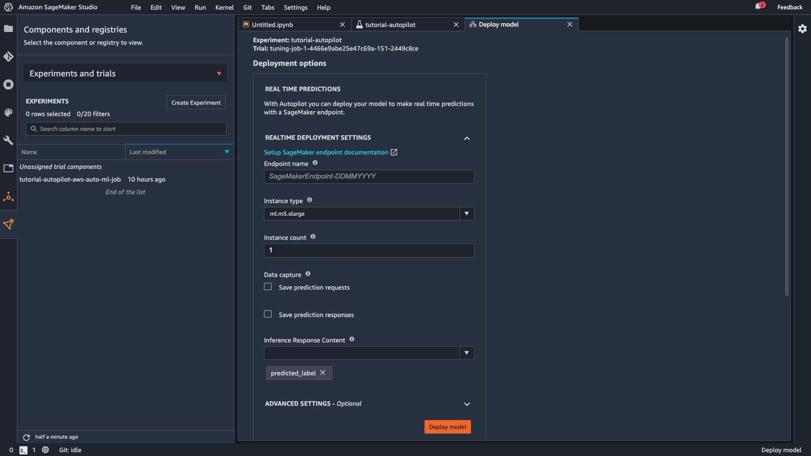

ここでも原則としてデフォルト値を設定します。 
各設定値の説明を簡単に記しますので、実際の業務で利用する際は参考にしてください

.. list-table::
    :header-rows: 1

    * - 分類
      - 設定値名
      - 説明
      - デフォルト値
    * - REALTIME DEPLOYMENT SETTINGS
      - Endpoint name
      - | **推論エンドポイント名の設定**
        | 推論エンドポイントの名称を設定する。最大 63 文字まで設定可能であり、英数字もしくはハイフン (-) の利用が可能。1つの AWS リージョンのアカウント内で一意である必要がある
      - | なし
        | (今回は「tutorial-autopilot-best-model」を設定)
    * - 
      - Instance type
      - | **インスタンスタイプの設定**
        | 推論エンドポイントをホストする推論インスタンスのインスタンスタイプを設定する
        | ※この表の下に補足情報を記載するので、そちらも参照されたい
      - | ml.m5.xlarge
        | (今回は「ml.m5.large」を設定)
    * - 
      - Instance count
      - | **インスタンス数の設定**
        | 推論エンドポイントをホストする推論インスタンスのインスタンス数を設定する
      - 1
    * - 
      - Data capture
      - | **データの取得**
        | 推論エンドポイントのリクエストまたはレスポンスを収集して S3 バケットに保存する。有効化する場合は Amazon SageMaker Studio がランダムに取得する割合を設定できる
        | ・Save prediction requests
        | ・Save prediction responce
      - 未選択
    * - 
      - Inference Responce Content
      - | **推論エンドポイントの応答コンテンツの設定**
        | 推論エンドポイントが入力データごとに返す応答コンテンツを設定する
        | ・predicted_label：分類されたクラスのラベル
        | ・probability: 分類されたクラスの確率
        | ・probabilites: 全てのラベルの確率のリスト
        | ・labels：全てのラベルのリスト
      - predicted_label
    * - ADVANCED SETTINGS - Optional
      - Environment variables - Optional
      - | **環境変数の設定**
        | 推論エンドポイントの Docker コンテナに環境変数を設定する
      - なし
    * - 
      - IAM role
      - | **IAM ロールの設定**
        | 推論エンドポイントに付与する AWS リソースの操作権限を設定した IAM ロールを指定する
      - Default SageMaker Role
    * - 
      - Encryption key - Optional
      - | **データの暗号化の設定**
        | AWS Key Management Service (KMS) によるデータの暗号化を実施する場合に暗号鍵を指定する
      - なし
    * - 
      - Virtual private cloud (VPC) - Optional
      - | **VPC への配置の設定**
        | セキュリティ要件などでインスタンスをユーザ管理の VPC 内に配置する必要がある場合に設定する
      - なし

設定の完了後に「Deploy model」を選択します。
推論インスタンスの作成と機械学習モデルのデプロイが行われます。

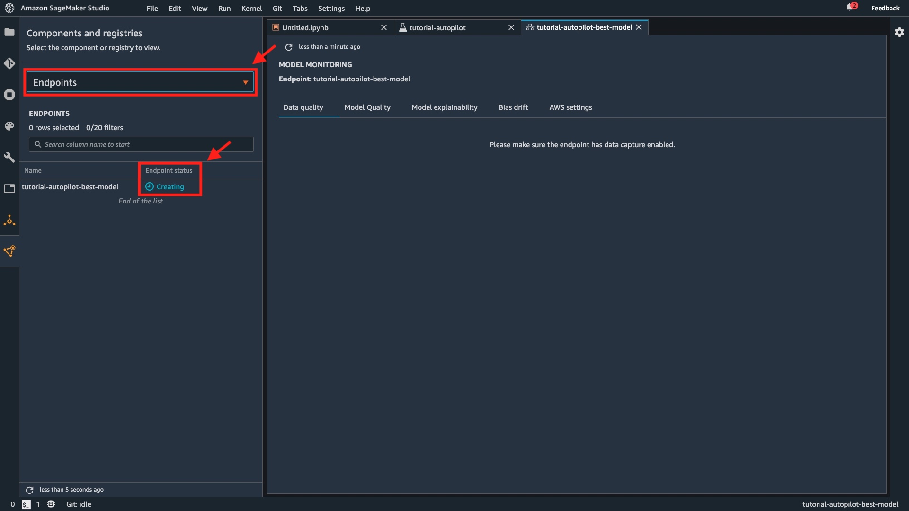

上記の画面では進行状況がわかりづらいため、「Experiments and trials」と表示されているプルダウンメニューから、「Endpoint」を選択して移動します。
「Endpoint status」が「Creating」から「InService」となれば完了です。

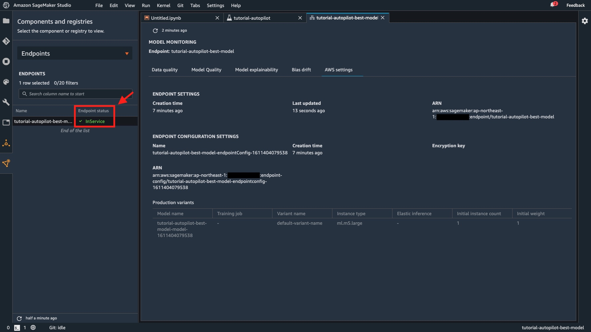

注意事項
^^^^^^^^^^^^^^^^^^^^^^^^^^^^^^^^^^^^^^^^^^^^^^^^^^^^^^^^^^^^^^^^^^^

| 「Instance type」について補足します。
| デフォルト値は「ml.m5.xlarge」ですが、下記のようにリソースの構成上限に抵触してデプロイを行うことができません。
| 今回は「ml.m5.large」を選択しましたが、実際の業務などで「ml.m5.xlarge」の利用が必要な場合は AWS サポートに上限緩和申請を行ってください。

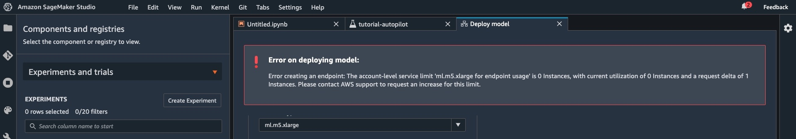

ステップ 7 : モデルを使用して予測を行う
-------------------------------------------------------------------

ノートブックのセルに下記のコードをコピー＆ペーストして実行してください。
なお、「ep_name」はステップ 6 で設定した「Endpoint name」と一致させてください。

.. code-block:: python

    import boto3, sys

    ep_name = 'tutorial-autopilot-best-model'
    sm_rt = boto3.Session().client('runtime.sagemaker')

    tn=tp=fn=fp=count=0

    with open('bank-additional/bank-additional-full.csv') as f:
        lines = f.readlines()
        for l in lines[1:2000]:   # Skip header
            l = l.split(',')      # Split CSV line into features
            label = l[-1]         # Store 'yes'/'no' label
            l = l[:-1]            # Remove label
            l = ','.join(l)       # Rebuild CSV line without label
                    
            response = sm_rt.invoke_endpoint(EndpointName=ep_name, 
                                            ContentType='text/csv',       
                                            Accept='text/csv', Body=l)

            response = response['Body'].read().decode("utf-8")
            #print ("label %s response %s" %(label,response))

            if 'yes' in label:
                # Sample is positive
                if 'yes' in response:
                    # True positive
                    tp=tp+1
                else:
                    # False negative
                    fn=fn+1
            else:
                # Sample is negative
                if 'no' in response:
                    # True negative
                    tn=tn+1
                else:
                    # False positive
                    fp=fp+1
            count = count+1
            if (count % 100 == 0):   
                sys.stdout.write(str(count)+' ')
                
    print ("Done")

    accuracy  = (tp+tn)/(tp+tn+fp+fn)
    precision = tp/(tp+fp)
    recall    = tn/(tn+fn)
    f1        = (2*precision*recall)/(precision+recall)

    print ("%.4f %.4f %.4f %.4f" % (accuracy, precision, recall, f1))

正確度 (accuracy)、適合率 (precision)、再現率、F1 値の順に結果が表示されます。
著者の環境では下記となりました。
0.9895、0.6909、0.9979、0.8165

ステップ 8 : クリーンアップ
-------------------------------------------------------------------

下記が課金要素となるため、必要に応じて削除を行います。

* 推論エンドポイント
* S3 バケットに格納したデータ

.. code-block:: python

    sess.delete_endpoint(endpoint_name=ep_name)

.. code-block:: python

    %%sh
    aws s3 rm --recursive s3://sagemaker-ap-northeast-1-ACCOUNT_NUMBER/sagemaker/tutorial-autopilot/

Amazon SageMaker Notebooks の背後で動いているインスタンスの停止もしくは削除も忘れずに実施してください。

まとめ
-------------------------------------------------------------------

今回は XXX について解説をしました。次回は YYY について扱いたいと思います。

+++++++++++

.. include:: ../author/author.rst
