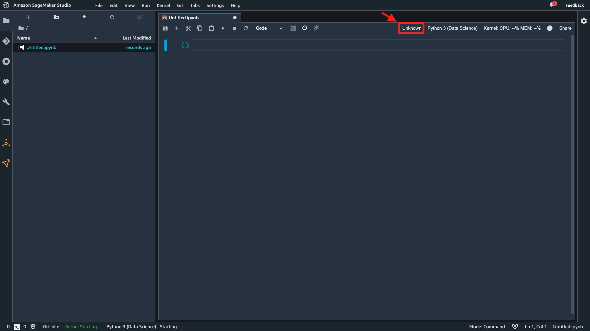
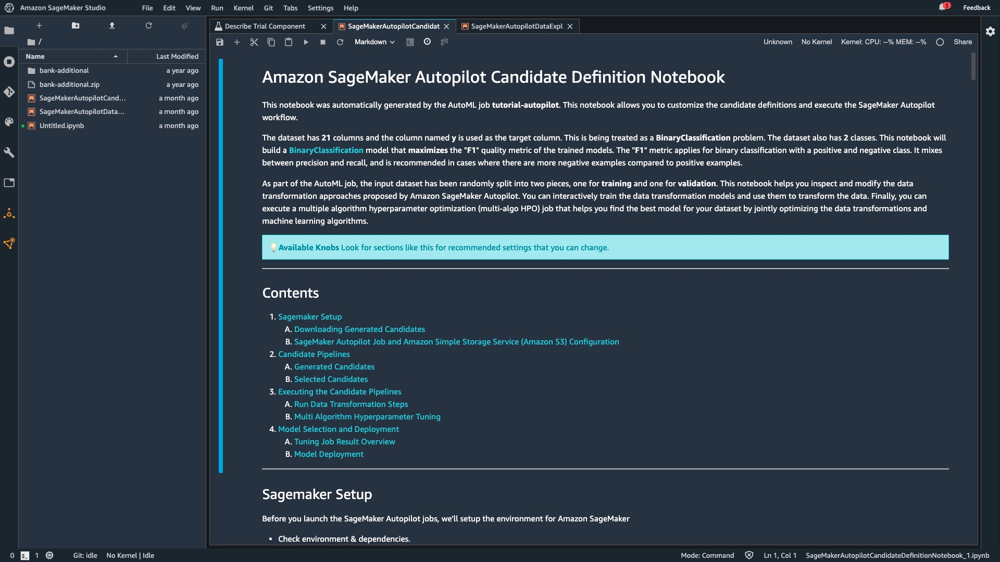
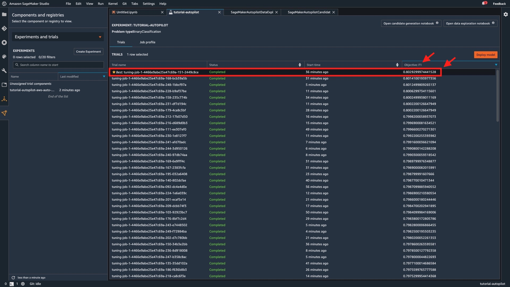

[第11回] Amazon SageMaker Studio の基本的な使い方 (3)
===================================================================

はじめに
-------------------------------------------------------------------

前回は Amazon SageMaker Studio のセットアップまで行いました。
今回は Amazon SageMaker Autopilot を使って機械学習モデルの構築を行っていきます。

.. list-table::
    :header-rows: 1

    * - 工程
      - ステップ
      - 実施内容
      - 連載回
    * - 準備
      - 1
      - AWS アカウントを今すぐ無料で作成
      - 第10回
    * - 開発
      - 2
      - Amazon SageMaker Studio をセットアップする
      - 第10回
    * -
      - 3
      - データセットをダウンロードする
      - 第11回
    * - 学習
      - 4
      - SageMaker Autopilot 実験を作成する
      - 第11回
    * - 
      - 5
      - SageMaker Autopilot 実験のさまざまなステージを調べる
      - 第11回
    * - 推論
      - 6
      - 最適なモデルをデプロイする
      - 第12回
    * - 
      - 7
      - モデルを使用して予測を行う
      - 第12回
    * - 
      - 8
      - クリーンアップ
      - 第12回

ステップ 3 : データセットをダウンロードする
-------------------------------------------------------------------

「SageMaker Studio コントロールパネル」で「Studio を開く」を選択します。

.. figure:: ../../../images/blog/10th/amazon-sagemaker-autopilot-tutorial-step3-open-sagemaker-studio.jpg
  :width: 900px

1分程度待つと、下記に示すような画面に遷移します。
これが Amazon SageMaker Studio の Launcher の画面となります。

「Select a SageMaker Image」で「Data Science」を選択し、「Notebook」を選択します。

.. figure:: ../../../images/blog/10th/amazon-sagemaker-autopilot-tutorial-step3-sagemaker-studio-top.jpg
  :width: 900px

すると、下記のような JupyterLab の画面に遷移します。
これが「Amazon SageMaker Notebooks」となります。
Amazon SageMaker Studio に統合された JupyterLab のノートブック環境です。
ダークテーマとなっていますが、`第6回の連載 <https://news.mynavi.jp/itsearch/article/devsoft/5101>`_ で紹介した JupyterLab と同等です。

ノートブックの右上の赤枠が「Unknown」となっている場合は、Amazon SageMaker Notebooks の背後で稼働するインスタンスが停止状態にあるため、これを選択します。

今回のチュートリアルでは小さいインスタンスで十分であるため、汎用 (General purpose) の「ml.t3.medium」を選択して、「Save and continue」を選択します。

.. figure:: ../../../images/blog/10th/amazon-sagemaker-autopilot-tutorial-step3-sagemaker-notebook-kernel.jpg
  :width: 450px

インスタンスの起動に成功すると、「Unknown」で選択したインスタンスタイプの vCPU とメモリサイズが表示が変わります。
「ml.t3.medium」の場合は、「2 vCPU + 4 GiB」と表示されます。

.. figure:: ../../../images/blog/10th/amazon-sagemaker-autopilot-tutorial-step3-sagemaker-notebook.jpg
  :width: 900px

実行するコード
^^^^^^^^^^^^^^^^^^^^^^^^^^^^^^^^^^^^^^^^^^^^^^^^^^^^^^^^^^^^^^^^^^^

| ノートブックのセルに下記のコードをコピー＆ペーストして実行してください。
| ノートブック上部にある「▶︎」か、「Shift キー」＋「Enter キー」で実行できます。

.. code-block:: python

    %%sh
    apt-get install -y unzip
    wget https://sagemaker-sample-data-us-west-2.s3-us-west-2.amazonaws.com/autopilot/direct_marketing/bank-additional.zip
    unzip -o bank-additional.zip

下記のような出力と、左側に「bank-additional」というフォルダが作成されれば成功です。

.. figure:: ../../../images/blog/10th/amazon-sagemaker-autopilot-tutorial-step3-download.jpg
  :width: 900px

コードの解説
^^^^^^^^^^^^^^^^^^^^^^^^^^^^^^^^^^^^^^^^^^^^^^^^^^^^^^^^^^^^^^^^^^^

マジックコマンド (%%sh) を使って OS のコマンドを実行しています。
ここでは、下記の3つの処理を実行しています。

* ZIP ファイルを解凍するための unzip のパッケージのダウンロード
* チュートリアルで利用する「ポルトガル銀行のダイレクトマーケティングのデータ」(zip 形式) のダウンロード
* ダウンロードしたデータの解凍 (unzip)

実行するコード
^^^^^^^^^^^^^^^^^^^^^^^^^^^^^^^^^^^^^^^^^^^^^^^^^^^^^^^^^^^^^^^^^^^

ノートブックのセルに下記のコードをコピー＆ペーストして実行してください。

.. code-block:: python
    
    import pandas as pd
    data = pd.read_csv('./bank-additional/bank-additional-full.csv')
    data[:10]

下記のように表形式でデータが表示されれば成功です。

.. figure:: ../../../images/blog/10th/amazon-sagemaker-autopilot-tutorial-step3-sagemaker-studio-pandas-read-csv.jpg
  :width: 900px

コードの解説
^^^^^^^^^^^^^^^^^^^^^^^^^^^^^^^^^^^^^^^^^^^^^^^^^^^^^^^^^^^^^^^^^^^

ここでは、Pandas の `read_csv 関数 <https://pandas.pydata.org/pandas-docs/version/1.0.1/reference/api/pandas.read_csv.html>`_ を使って、ダウンロードした CSV 形式のデータを DataFrame に読み込み、最初の10行を出力しています。

実行するコード
^^^^^^^^^^^^^^^^^^^^^^^^^^^^^^^^^^^^^^^^^^^^^^^^^^^^^^^^^^^^^^^^^^^

ノートブックのセルに下記のコードをコピー＆ペーストして実行してください。

.. code-block:: python
    
    import sagemaker

    prefix = 'sagemaker/tutorial-autopilot/input'
    sess   = sagemaker.Session()

    uri = sess.upload_data(path="./bank-additional/bank-additional-full.csv", key_prefix=prefix)
    print(uri)

| 下記のように S3 バケットの URI が表示されれば成功です。
| 「ACCOUNT_NUMBER」はご自身の AWS アカウントの 12 ケタの数字に読み替えてください。
| この URI は、ステップ 4 で利用します。

.. code-block::
    
    s3://sagemaker-ap-northeast-1-ACCOUNT_NUMBER/sagemaker/tutorial-autopilot/input/bank-additional-full.csv

コードの解説
^^^^^^^^^^^^^^^^^^^^^^^^^^^^^^^^^^^^^^^^^^^^^^^^^^^^^^^^^^^^^^^^^^^

ここでは、Amazon SageMaker Python SDK の `upload_data メソッド <https://sagemaker.readthedocs.io/en/stable/api/utility/session.html?highlight=session#sagemaker.session.Session.upload_data>`_ を利用して、S3 バケットにデータセットをアップロードしています。

ステップ 4 : SageMaker Autopilot 実験を作成する
-------------------------------------------------------------------

ステップ 3 までで環境構築とデータの準備が終わりました。
ここからは、Amazon SageMaker Autopilot の設定を行っていきます。

Amazon SageMaker Autopilot では、表形式 (CSV 形式) の学習データから前処理・学習アルゴリズムの選択・学習・ハイパーパラメータの最適化を自動で行います。
背後では、 Amazon SageMaker Experiment と連携して実現されています。
チュートリアルの本文に「Experiment」や「実験」という単語が出てきますが、これに由来すると考えられます。

なお、実験の完了までに2時間程度かかる点に注意してください。
途中経過を観察する必要はありませんが、放置が許されない場合もあるかと思いますので、時間に余裕を持って実施してください。

左側のナビゲーションペインで、下図に示す三角形のアイコンを選択します。
続けて、「Project」と表示されているプルダウンメニューから、「Experiments and trials」を選択します。

.. figure:: ../../../images/blog/10th/amazon-sagemaker-autopilot-tutorial-step4-select-project.jpg
  :width: 900px

続けて、「Create Experiment」を選択します。

.. figure:: ../../../images/blog/10th/amazon-sagemaker-autopilot-tutorial-step4-create-experiment.jpg
  :width: 900px

ここで、「AUTOPILOT EXPERIMENT SETTINGS」で実験の設定を行います。

.. figure:: ../../../images/blog/10th/amazon-sagemaker-autopilot-tutorial-step4-autopilot-experiment-settings.jpg
  :width: 900px

今回は簡単なチュートリアルですので、原則としてデフォルト値を設定します。
各設定値の説明を簡単に記しますので、実際の業務で利用する際は参考にしてください。

.. list-table::
    :header-rows: 1

    * - 分類
      - 設定値名
      - 説明
      - デフォルト値
    * - AUTOPILOT EXPERIMENT SETTINGS
      - Experiment name
      - | **実験の名称の設定**
        | 最大 63 文字まで設定可能であり、英数字もしくはハイフン (-) の利用が可能。1つの AWS リージョンのアカウント内で一意である必要がある
      - | なし
        | (今回は「tutorial-autopilot」を設定)
    * - 
      - TAGS - Optional
      - | **実験に付与するタグの設定**
        | タグをキーバリュー形式で設定する。オプション設定であるため、必要に応じて設定する
      - なし
    * -
      - Project - Optional
      - | **プロジェクトの設定**
        | 既存のプロジェクトを利用する場合に設定する。オプション設定であるため、必要に応じて設定する
      - なし
    * - 
      - CONNECT YOUR DATA
      - | **入力データの設定**
        | 学習データが格納されている S3 バケットとファイル名を指定する。S3 バケットは同一リージョンに存在する必要があり、ファイルは CSV 形式で 500 行以上である必要がある
        | ・Find S3 bucket: バケット名とファイル名をプルダウンから選択する
        | ・Enter S3 bucket location: 「s3://」から始まる URI 形式でファイル名を指定する
      - | Enter S3 bucket location
        | (今回は「ステップ 3」で確認した S3 の URI を指定)
    * - 
      - Is your S3 input a manifest file?
      - | **マニフェストファイルの設定**
        | S3 バケットに格納したファイルがマニフェストファイルである場合に有効化する。マニフェストファイルは、入力となる学習データとメタデータ (データの格納場所などの属性情報) が含まれる
      - 無効
    * - 
      - Target
      - | **正解データの列名**
        | 推論の対象となる正解データが格納されている列名
      - | なし
        | (今回は「y」を設定)
    * -
      - Output data location (S3 bucket)
      - | **出力データの格納場所の設定**
        | 機械学習モデルなどの出力ファイルを出力する S3 バケットを指定する。設定値の意味は「CONNECT YOUR DATA」と同じ
      - | Find S3 bucket
        | (今回は「ステップ 3」で確認した S3 バケットを設定)
    * -
      - Select the machine learning problem type
      - | **機械学習の問題の設定**
        | 実験で扱う機械学習の問題を下記の中から設定する
        | ・Auto: 自動
        | ・Binary classification: 二値分類
        | ・Regression: 回帰
        | ・Multiclass classification: 多値分類
      - Auto
    * - ADVANCED SETTINGS - Optional
      - Do you want to run a complete experiment?
      - | **実験の実行範囲の設定**
        | Amazon SageMaker Autopilot による実験のうち、4つのステップを全てを行うか、ステップ 2 の「Candidate Definitions Generated」までに留めるかを選択する
        | ・Yes
        | ・No, run a pilot to create a notebook with candidate definitions
      - Yes
    * -
      - IAM role
      - | **IAM ロールの設定**
        | Amazon SageMaker Autopilot に付与する AWS リソースの操作権限を設定した IAM ロールを指定する
      - Default SageMaker Role
    * -
      - Encryption key - Optional
      - | **データの暗号化の設定**
        | AWS Key Management Service (KMS) によるデータの暗号化を実施する場合に暗号鍵を指定する
      - なし
    * -
      - Virtual private cloud (VPC) - Optional
      - | **VPC への配置の設定**
        | セキュリティ要件などでインスタンスをユーザ管理の VPC 内に配置する必要がある場合に設定する
      - なし
    * -
      - Max trial runtime in seconds
      - | **試行の実行時間の設定**
        | 試行 (学習ジョブ) の完了を待機する実行時間 (秒)
      - | 0
        | (設定しない)
    * -
      - Max job runtime in seconds
      - | **ジョブの実行時間の設定**
        | ジョブ (AutoML ジョブ) の完了を待機する実行時間 (秒)
      - | 0
        | (設定しない)
    * -
      - Max candidates
      - | **試行の実行回数の設定**
        | 試行の実行回数
        | (複数の試行を実行して機械学習モデルの候補を多数生成する。その中から最終的に1つに絞って推論エンドポイントとしてデプロイする)
      - | 0
        | (設定しない)

入力が終わったら、「Create Experiment」を選択します。

下記のような画面に遷移すれば成功です。

.. figure:: ../../../images/blog/10th/amazon-sagemaker-autopilot-tutorial-step5-initial.jpg
  :width: 900px

画面に記載があるように、デフォルトでは250回の試行 (250個のジョブ) が実行されます。
全て完了するまでに2時間程度かかります。
「stop the experiment」をクリックすれば、途中で停止させることも可能です。

ステップ 5 : SageMaker Autopilot 実験のさまざまなステージを調べる
-------------------------------------------------------------------

Amazon SageMaker Autopilot が下記の4つのタスクを自動で実行します。

1. Pre-processing (前処理)
2. Candidate Definitions Generated (候補定義生成)
3. Feature Engineering (特徴エンジニアリング)
4. Model Tuning (モデルチューニング)

| 2 まで完了すると、画面の右上に2つのボタンが登場します。
| これを選択すると、2つのノートブックを参照することができます。

.. figure:: ../../../images/blog/10th/amazon-sagemaker-autopilot-tutorial-step5-after-candidate-definitions-generated.jpg
  :width: 900px

学習データの分析結果やそれを踏まえて Amazon SageMaker Autopilot が判断した内容した内容が記録されます。
このような自動化の仕組みは中身のブラックボックス化が問題もしくは課題となる場合がありますが、判断内容が利用者に公開されて透明性が確保されることは Amazon SageMaker Autopilot の特徴の1つです。

それぞれのノートブックの概要を下記に示します。

.. list-table::
    :header-rows: 1

    * - 生成されるノートブック
      - 説明
    * - | Data Exploration Notebook
        | (データ探索ノートブック)
      - | 学習データの分析結果として下記を提示する
        | ・データセットのサンプル
        | ・カラムごとの分析結果
        |   ・欠損値の割合
        |   ・値の種類
        |   ・統計情報 (最大・最小値、平均値、中央値)
    * - | Candidate Generation Notebook
        | (候補生成ノートブック)
      - | Amazon SageMaker Autopilot が判断した内容が示される。ノートブックをダウンロードして編集や手動実行も可能
        | ・前処理と機械学習アルゴリズムの組み合わせ
        | ・ハイパーパラメータ最適化の手法や探索範囲
        | ・上記の実行方法

.. figure:: ../../../images/blog/10th/amazon-sagemaker-autopilot-tutorial-step5-data-exploration-notebook-1.jpg
  :width: 900px

| このノートブックをダウンロードし、編集して再利用をすることもできます。
| ステップ 4 の設定で「Do you want to run a complete experiment?」に「Yes」を選択しました。ここで「No, run a pilot to create a notebook with candidate definitions」を選択した場合は、ノートブックの生成後に処理が停止します。Amazon SageMaker Autopilot をデータ分析や採用すべき手法の判断材料を得る手段として利用しても良いでしょう。

実験が完了すると、下記のようにアニメーションが消えて、結果の表示のみとなります。

デフォルトの精度指標値は F1 値となります。
F1 値が最大の試行 (機械学習モデル) に「Best」という印がつきます。 

まとめ
-------------------------------------------------------------------

今回は Amazon SageMaker Autopilot を使って機械学習モデルの構築を行いました。
次回は 機械学習モデルを推論エンドポイントとしてデプロイし、精度検証を行いたいと思います。

+++++++++++

.. include:: ../author/author.rst
