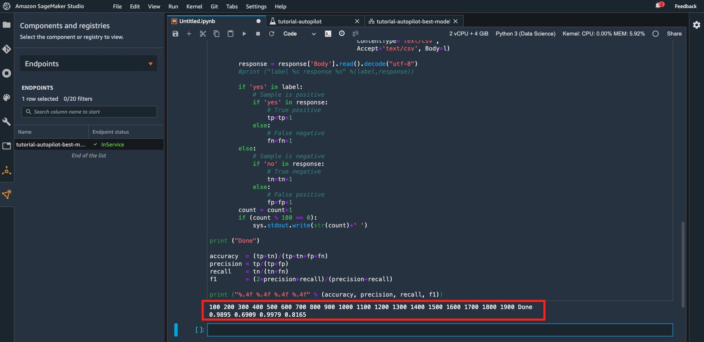
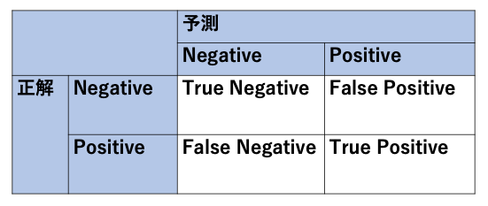
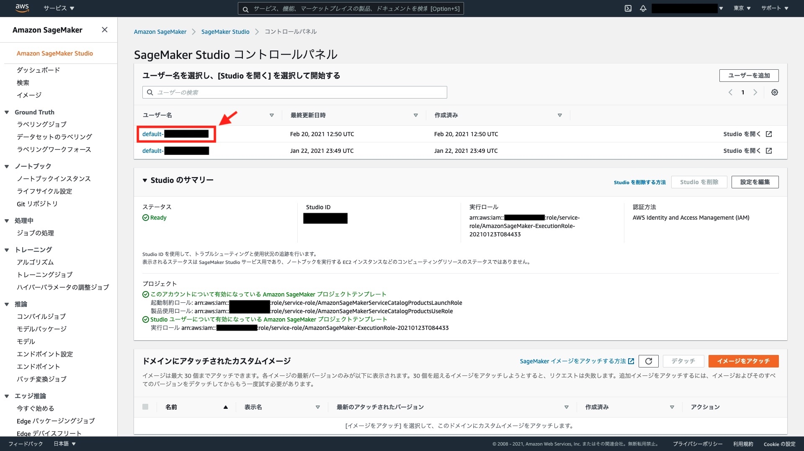
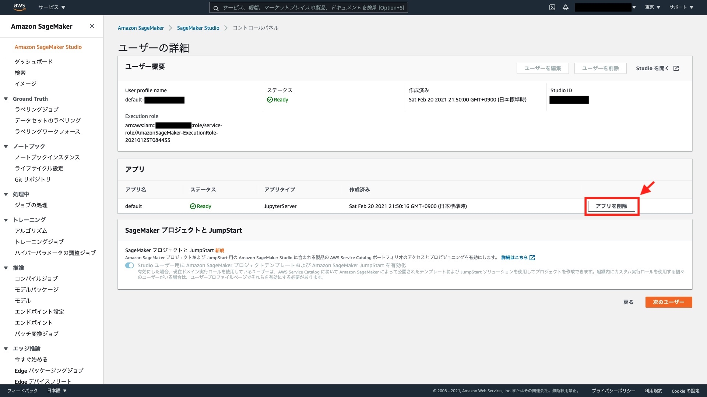
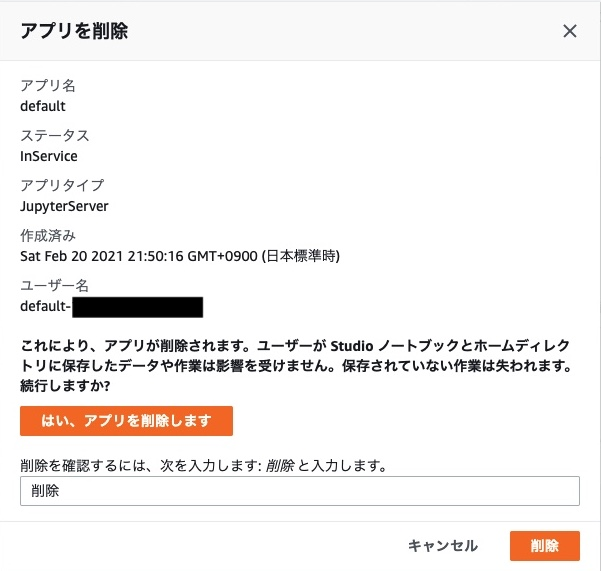
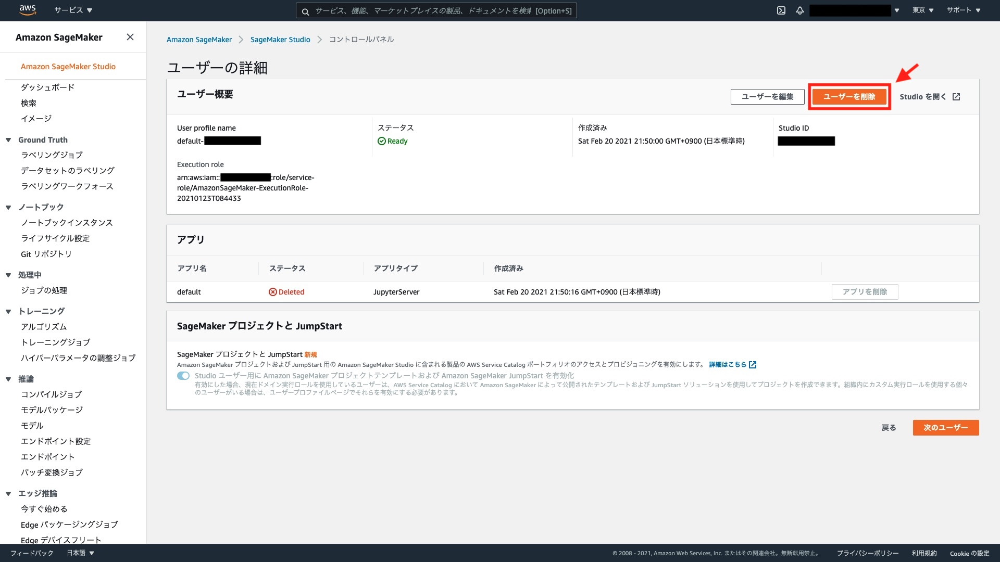
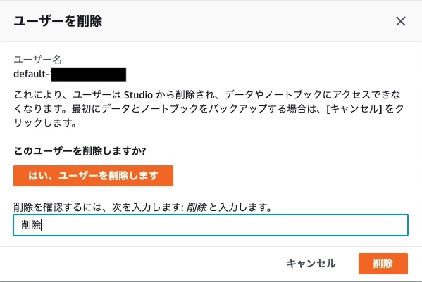

[第12回] Amazon SageMaker Studio の基本的な使い方 (4)
===================================================================

はじめに
-------------------------------------------------------------------

前回は Amazon SageMaker Autopilot を使って機械学習モデルの構築を行いました。
今回は機械学習モデルを推論エンドポイントとしてデプロイし、精度検証を行います。

.. list-table::
    :header-rows: 1

    * - 工程
      - ステップ
      - 実施内容
      - 連載回
    * - 準備
      - 1
      - AWS アカウントを今すぐ無料で作成
      - 第10回
    * - 開発
      - 2
      - Amazon SageMaker Studio をセットアップする
      - 第10回
    * -
      - 3
      - データセットをダウンロードする
      - 第11回
    * - 学習
      - 4
      - SageMaker Autopilot 実験を作成する
      - 第11回
    * - 
      - 5
      - SageMaker Autopilot 実験のさまざまなステージを調べる
      - 第11回
    * - 推論
      - 6
      - 最適なモデルをデプロイする
      - 第12回
    * - 
      - 7
      - モデルを使用して予測を行う
      - 第12回
    * - 
      - 8
      - クリーンアップ
      - 第12回

ステップ 6 : 最適なモデルをデプロイする
-------------------------------------------------------------------

実験が完了したら、次は推論を行うために機械学習モデルのデプロイを行い、推論エンドポイントを作成します。
「Best」の表示がある行を選択した状態で右上の「Deploy model」を選択するか、右クリックで「Deploy model」を選択します。

.. figure:: ../../../images/blog/10th/amazon-sagemaker-autopilot-tutorial-step6-deploy-model.jpg
  :width: 900px

ここで、「REALTIME DEPLOYMENT SETTINGS」でデプロイ (推論エンドポイント) の設定を行います。

.. figure:: ../../../images/blog/10th/amazon-sagemaker-autopilot-tutorial-step6-deploy-model-settings.jpg
  :width: 900px

ここでも原則としてデフォルト値を設定します。 
各設定値の説明を簡単に記しますので、実際の業務で利用する際は参考にしてください

.. list-table::
    :header-rows: 1

    * - 分類
      - 設定値名
      - 説明
      - デフォルト値
    * - REALTIME DEPLOYMENT SETTINGS
      - Endpoint name
      - | **推論エンドポイント名の設定**
        | 推論エンドポイントの名称を設定する。最大 63 文字まで設定可能であり、英数字もしくはハイフン (-) の利用が可能。1つの AWS リージョンのアカウント内で一意である必要がある
      - | なし
        | (今回は「tutorial-autopilot-best-model」を設定)
    * - 
      - Instance type
      - | **インスタンスタイプの設定**
        | 推論エンドポイントをホストする推論インスタンスのインスタンスタイプを設定する
        | ※この表の下に補足情報を記載するので、そちらも参照されたい
      - | ml.m5.xlarge
        | (今回は「ml.m5.large」を設定)
    * - 
      - Instance count
      - | **インスタンス数の設定**
        | 推論エンドポイントをホストする推論インスタンスのインスタンス数を設定する
      - 1
    * - 
      - Data capture
      - | **データの取得**
        | 推論エンドポイントのリクエストまたはレスポンスを収集して S3 バケットに保存する。有効化する場合は Amazon SageMaker Studio がランダムに取得する割合を設定できる
        | ・Save prediction requests
        | ・Save prediction responce
      - 未選択
    * - 
      - Inference Responce Content
      - | **推論エンドポイントの応答コンテンツの設定**
        | 推論エンドポイントが入力データごとに返す応答コンテンツを設定する
        | ・predicted_label：分類されたクラスのラベル
        | ・probability: 分類されたクラスの確率
        | ・probabilites: 全てのラベルの確率のリスト
        | ・labels：全てのラベルのリスト
      - predicted_label
    * - ADVANCED SETTINGS - Optional
      - Environment variables - Optional
      - | **環境変数の設定**
        | 推論エンドポイントの Docker コンテナに環境変数を設定する
      - なし
    * - 
      - IAM role
      - | **IAM ロールの設定**
        | 推論エンドポイントに付与する AWS リソースの操作権限を設定した IAM ロールを指定する
      - Default SageMaker Role
    * - 
      - Encryption key - Optional
      - | **データの暗号化の設定**
        | AWS Key Management Service (KMS) によるデータの暗号化を実施する場合に暗号鍵を指定する
      - なし
    * - 
      - Virtual private cloud (VPC) - Optional
      - | **VPC への配置の設定**
        | セキュリティ要件などでインスタンスをユーザ管理の VPC 内に配置する必要がある場合に設定する
      - なし

設定の完了後に「Deploy model」を選択します。
推論インスタンスの作成と機械学習モデルのデプロイが行われます。

.. figure:: ../../../images/blog/10th/amazon-sagemaker-autopilot-tutorial-step6-endpoint-creating.jpg
  :width: 900px

上記の画面では進行状況がわかりづらいため、「Experiments and trials」と表示されているプルダウンメニューから、「Endpoint」を選択して移動します。
「Endpoint status」が「Creating」から「InService」となれば完了です。

.. figure:: ../../../images/blog/10th/amazon-sagemaker-autopilot-tutorial-step6-endpoint-inservice.jpg
  :width: 900px

注意事項
^^^^^^^^^^^^^^^^^^^^^^^^^^^^^^^^^^^^^^^^^^^^^^^^^^^^^^^^^^^^^^^^^^^

| 「Instance type」について補足します。
| デフォルト値は「ml.m5.xlarge」ですが、下記のようにリソースの構成上限に抵触してデプロイを行うことができません。
| 今回は「ml.m5.large」を選択しましたが、実際の業務などで「ml.m5.xlarge」の利用が必要な場合は AWS サポートに上限緩和申請を行ってください。

.. figure:: ../../../images/blog/10th/amazon-sagemaker-autopilot-tutorial-step6-deploy-model-error.jpg
  :width: 900px

ステップ 7 : モデルを使用して予測を行う
-------------------------------------------------------------------

推論エンドポイントのデプロイまで完了しましたので、最後に実際に推論を実施して精度を検証してみましょう。

実行するコード
^^^^^^^^^^^^^^^^^^^^^^^^^^^^^^^^^^^^^^^^^^^^^^^^^^^^^^^^^^^^^^^^^^^

ノートブックのセルに下記のコードをコピー＆ペーストして実行してください。
なお、「ep_name」はステップ 6 で設定した「Endpoint name」と一致させてください。

.. code-block:: python

    import boto3, sys

    ep_name = 'tutorial-autopilot-best-model'  # (著者追記) ステップ 6 で設定した「Endpoint name」と一致させること
    sm_rt = boto3.Session().client('runtime.sagemaker')

    tn=tp=fn=fp=count=0

    with open('bank-additional/bank-additional-full.csv') as f:
        lines = f.readlines()
        for l in lines[1:2000]:   # Skip header
            l = l.split(',')      # Split CSV line into features
            label = l[-1]         # Store 'yes'/'no' label
            l = l[:-1]            # Remove label
            l = ','.join(l)       # Rebuild CSV line without label
                    
            response = sm_rt.invoke_endpoint(EndpointName=ep_name, 
                                            ContentType='text/csv',       
                                            Accept='text/csv', Body=l)

            response = response['Body'].read().decode("utf-8")
            #print ("label %s response %s" %(label,response))

            if 'yes' in label:
                # Sample is positive
                if 'yes' in response:
                    # True positive
                    tp=tp+1
                else:
                    # False negative
                    fn=fn+1
            else:
                # Sample is negative
                if 'no' in response:
                    # True negative
                    tn=tn+1
                else:
                    # False positive
                    fp=fp+1
            count = count+1
            if (count % 100 == 0):   
                sys.stdout.write(str(count)+' ')
                
    print ("Done")

    accuracy  = (tp+tn)/(tp+tn+fp+fn)
    precision = tp/(tp+fp)
    recall    = tn/(tn+fn)
    f1        = (2*precision*recall)/(precision+recall)

    print ("%.4f %.4f %.4f %.4f" % (accuracy, precision, recall, f1))

| 推論が100個行われるごとに数字が表示され、「Done」が表示されると完了です。
| 4つ数字が表示され、左から「正確度 (accuracy)」、「適合率 (precision)」、「再現率 (recall)」、「F1 値 (F-measure)」を表します。

コードの解説
^^^^^^^^^^^^^^^^^^^^^^^^^^^^^^^^^^^^^^^^^^^^^^^^^^^^^^^^^^^^^^^^^^^

ここでは、「bank-additional-full.csv」のヘッダ行を除いた最初の2,000行を精度検証用のテストデータとして利用しています。

.. code-block:: Python

    response = sm_rt.invoke_endpoint(EndpointName=ep_name, 
                                     ContentType='text/csv',       
                                     Accept='text/csv', Body=l)

AWS SDK for Python (Boto3) の SageMakerRuntime クラスの `invoke_endpoint メソッド <https://boto3.amazonaws.com/v1/documentation/api/latest/reference/services/sagemaker-runtime.html#SageMakerRuntime.Client.invoke_endpoint>`_ を使って、テストデータを1行ずつ推論エンドポイントに送信し、その応答として推論結果を取得しています。

.. code-block:: Python

    if 'yes' in label:
        # Sample is positive
        if 'yes' in response:
            # True positive
            tp=tp+1
        else:
            # False negative
            fn=fn+1
    else:
        # Sample is negative
        if 'no' in response:
            # True negative
            tn=tn+1
        else:
            # False positive
            fp=fp+1

上記のコードでは、推論結果を基にして混同行列を計算しています。
前回のチュートリアルでは Pandas の crosstab 関数を使っていましたが、今回のチュートリアルでは手動で計算を行っています。

混同行列については、`第8回目の連載 <https://news.mynavi.jp/itsearch/article/devsoft/5115>`_ で解説しましたが、下記に再掲します。

| 行方向 (縦軸) が「正解 (観測; Observed)」、列方向 (横軸) が「予測 (Predicted)」を表します。
| 正解 (2種類) * 予測 (2種類) で、下記に示す 4 つの指標があります。
| 混同行列という名前の通りで混乱しやすいですが、Positive/Negative はあくまで「予測」に対してかかります。
| その予測の正解と不正解により、True/Negative が付いていると考えると理解しやすいと思います。

- True Positive (TP): 定期預金を申し込むと予測して、実際に申し込んだ顧客の数
- False Poritive (FP): 定期預金を申し込むと予測したが、実際には申し込まなかった顧客の数
- True Negative (TN): 定期預金を申し込まないと予測して実際に申し込まなかった顧客の数
- False Negative (FN): 定期預金を申し込まないと予測したが、実際には申し込んだ顧客の数

「正確度 (accuracy)」、「適合率 (precision)」、「再現率 (recall)」、「F1 値 (F-measure)」は、機械学習モデルの精度を評価する際によく用いられる指標であり、それぞれ下記を意味します。

- 正確度 (accuracy): 予測したもののうち、正しく定期預金を申し込む・申し込まないを予測できた割合 (今回は 0.9895)

.. math::

    \rm{accuracy} = \frac{TP + TN}{TP + FP + TN + FN}

- 適合率 (precision): 定期預金を申し込むと予測したもののうち、正しく定期預金を申し込むと予測できた割合 (今回は 0.6909)

.. math::

    \rm{precision} = \frac{TP}{TP + FP}

- 再現率 (recall): 実際に定期預金を申し込んだもののうち、正しく定期預金を申し込むと予測できた割合 (今回は 0.9979)

.. math::

    \rm{recall} = \frac{TP}{TP + FN}

- F1 値 (F-measure): 適合率と再現率の調和平均 (今回は 0.8165)

.. math::

    \rm{F-measure} = \frac{2 \cdot \rm{recall} \cdot \rm{precision}}{\rm{recall} + \rm{precision}}

今回の精度検証では、正確度と再現率が高い一方で、適合率が低くなっています。
適合率の定義は、「定期預金を申し込むと予測したもののうち、正しく定期預金を申し込むと予測できた割合」を表すため、「定期預金を申し込むと予測した誤検出」が多いと言えます。

`第8回目の連載 <https://news.mynavi.jp/itsearch/article/devsoft/5115>`_ で確認したように、このチュートリアルのデータは、「定期預金を申し込んだ顧客」のデータ数が不足している「不均衡データ」でした。
このデータはオープンデータであるためデータ数を増やすことはできませんが、実際の業務で同様の事象が発生した場合は、定期預金を申し込んだ顧客のデータ数を増やすと指標値が改善する可能性があります。

注意事項
^^^^^^^^^^^^^^^^^^^^^^^^^^^^^^^^^^^^^^^^^^^^^^^^^^^^^^^^^^^^^^^^^^^

精度検証で「bank-additional-full.csv」を利用していますが、厳密に言うと学習に用いたデータを精度検証に用いるのは正しい方法とは言えません。

今回はチュートリアルに従いましたが、正しく評価するためには、「`第6回の連載 <https://news.mynavi.jp/itsearch/article/devsoft/5101>`_」で紹介したように NumPy のメソッド、Pandas の sample メソッドを使うなどして、学習に利用しなかったデータをテストデータに採用して精度検証を行うべきでしょう。

ステップ 8 : クリーンアップ
-------------------------------------------------------------------

下記が課金要素となるため、必要に応じて削除を行います。

* 推論エンドポイント
* S3 バケットに格納したデータ

| ノートブックのセルに下記のコードをそれぞれコピー＆ペーストして実行してください。
| なお、「ACCOUNT_NUMBER」はご自身の AWS アカウントの 12 ケタの数字に読み替えてください。

.. code-block:: python

    sess.delete_endpoint(endpoint_name=ep_name)

.. code-block:: python

    %%sh
    aws s3 rm --recursive s3://sagemaker-ap-northeast-1-ACCOUNT_NUMBER/sagemaker/tutorial-autopilot/

また、Amazon SageMaker Studio を削除する場合は、下記の手順で削除を行ってください。

| 「SageMaker Studio コントロールパネル」に移動します。
| 削除対象の「ユーザー名」を選択します。

下記の図の赤枠内に示す「アプリを削除」を選択します。

| 下記の図の赤枠内に示す「はい、アプリを削除します」を選択します。
| テキストボックスに「削除」を記載して、「削除」を選択します。

| 数分程度待って、アプリの「ステータス」が「Deleted」になったことを確認します。
| その後、「ユーザーを削除」を選択します。

| 下記の図の赤枠内に示す「はい、ユーザーを削除します」を選択します。
| テキストボックスに「削除」を記載して、「削除」を選択します。

まとめ
-------------------------------------------------------------------

今回までの4回で Amazon SageMaker Studio の基本的な使い方について解説しました。
Amazon SageMaker Autopilot も扱いましたが、データの準備と簡単な設定で機械学習モデルの構築ができることがわかったと思います。
是非ご自身でもチュートリアルを試していただき、実際の業務でご活用いただきたいと思います。

+++++++++++

.. include:: ../author/author.rst
