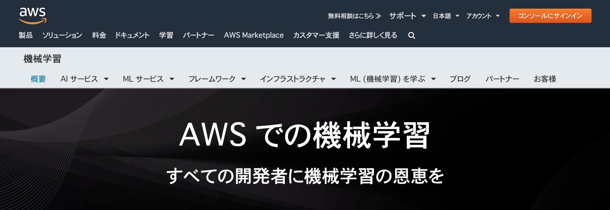
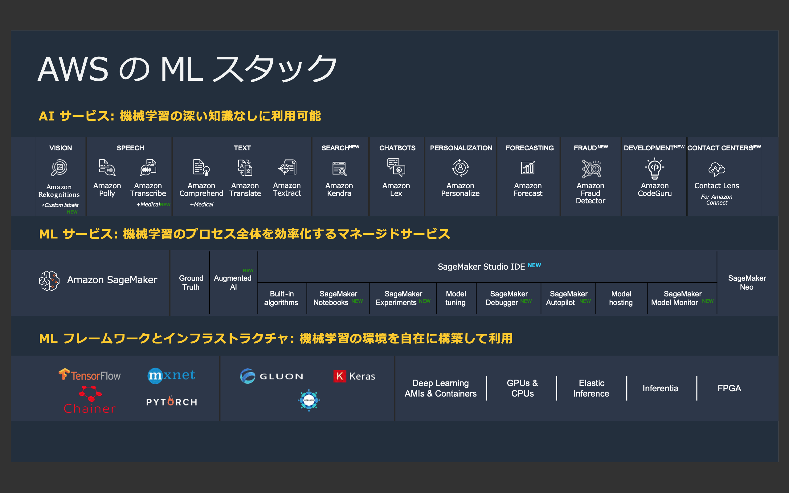

 Overview
=========================

機械学習における AWS のミッション
--------------------------------
- 「すべての開発者に機械学習の恩恵を」。
- 機械学習を専門に扱う研究者やエンジニアだけでなく、これから機械学習をビジネスに取り入れたいなど機械学習に関する専門的な知識を持たないエンジニアに向けたサービスも提供。

(出典：`機械学習サービスの製品紹介ページ <https://aws.amazon.com/jp/machine-learning/?nc1=h_ls>`_)

機械学習サービスの種類
-------------------------------
大きくは3つ。
AI サービス、 ML サービス、 ML フレームワーク & インフラストラクチャ。

(出典：2019年12月12日開催 「AWS re:Invent 2019 re:Cap | AI/ML」 の資料より)

AI サービス
^^^^^^^^^^^^^^^^^
(サービスの特徴、種類、使い方、etc.)

(表を使って分類し、概要をまとめる程度で良いかも。言語サービスは日本語対応状況も)

画像認識
***************

静止画・動画認識
+++++++++++++++++++++++
- Amazon Rekognition Image/Video

ドキュメント分析
++++++++++++++++++++
- Amazon Textract

自然言語処理
*******************

音声処理
+++++++++++++++++
- Amazon Polly
- Amazon Transcribe

テキスト処理
++++++++++++++++++
- Amazon Translate
- Amazon Comprehend

チャットボット
++++++++++++++++++
- Amazon Lex

時系列データ解析
********************

時系列データ予測
++++++++++++++++++
- Amazon Forecast

パーソナライズ
*********************

レコメンデーション
++++++++++++++++++++++
- Amazon Personalize

ML サービス
^^^^^^^^^^^^^^^^
(サービスの特徴、種類、使い方、etc.)

- Amazon SageMaker

ML フレームワーク & インフラストラクチャ
^^^^^^^^^^^^^^^^^^^^^^^^^^^^^^^^^^^^^^^^
(サービスの特徴、種類、使い方、etc.)

ディープラーニング用のフレームワーク

- TensorFlow
- PyTorch
- MXNet
- Chainer
- theano
- Keras
- Microsoft Cognitive Toolkit
- Gluon
- etc.

機械学習に最適化されたインフラストラクチャ

- GPU
- Amazon Elastic Inference
- CPU
- FPGA
- Edge

その他のサービス (学習ツール)
^^^^^^^^^^^^^^^^^^^^^^^^^^^^^^^^^
(サービスの特徴、種類、使い方、etc.)

- AWS DeepRacer
- AWS DeepLens

DeepRacer Summit リーグ、 Virtual Circuit

その他、情報を得る方法
-------------------------
著者が情報を得る方法、かつ、無料で得られる情報をまとめる。

- twitter (US/Japan公式、SA)

    - `Amazon Web Services <https://twitter.com/awscloud?s=20>`_
    - `アマゾン ウェブ サービス ジャパン株式会社 <https://twitter.com/awscloud_jp?s=20>`_

- ブログ

    - `AWS Machine Learning Blog <https://aws.amazon.com/jp/blogs/machine-learning/>`_

- セミナー

    - `国内のクラウドセミナー・イベントスケジュール <https://aws.amazon.com/jp/about-aws/events/>`_
    - `AWS サービス別資料 (Black Belt オンラインセミナーの過去資料) <https://aws.amazon.com/jp/aws-jp-introduction/aws-jp-webinar-service-cut/>`_
    - `AWS トレーニングと認定 <https://www.aws.training/>`_
