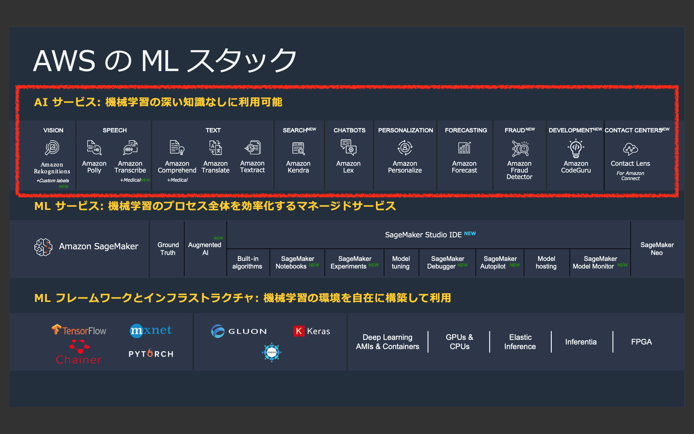
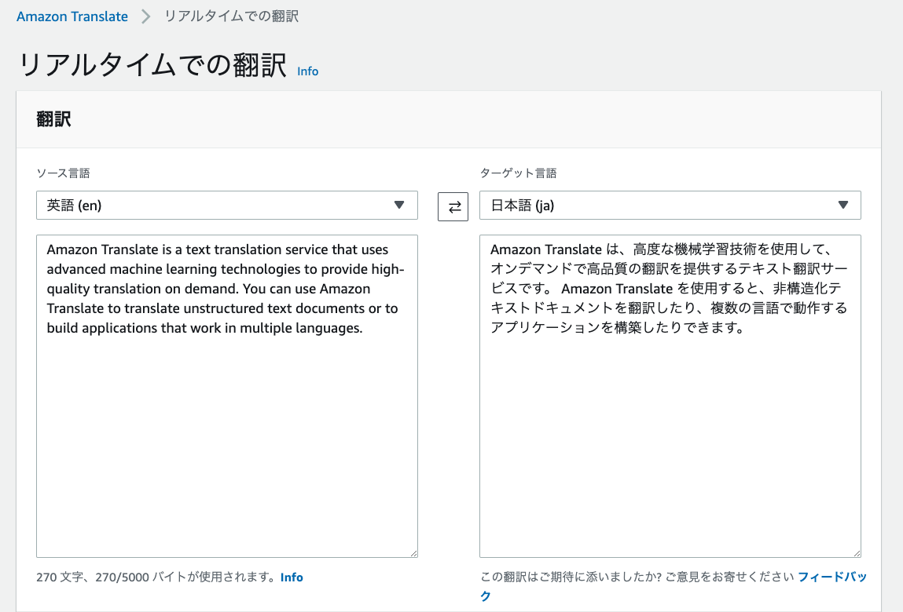
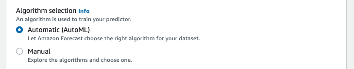
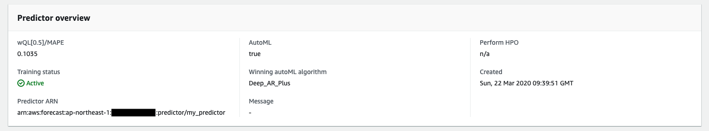
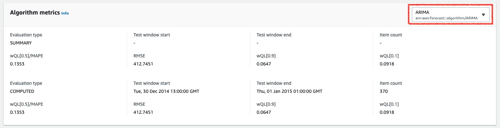
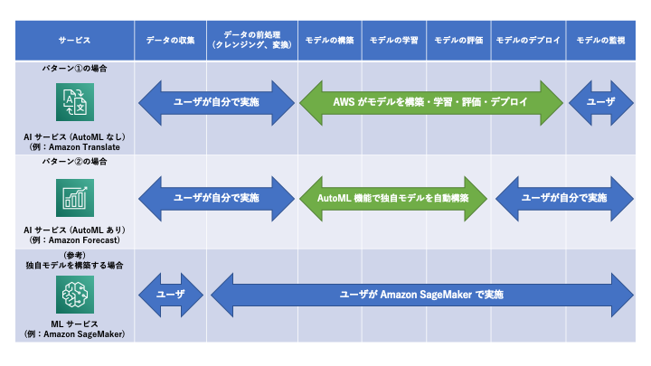

[第3回] AI サービスの全体像
==================================

はじめに
----------------
| `前回 <https://news.mynavi.jp/itsearch/article/cloud/4799>`_ は、AWS の機械学習サービスの全体像と機械学習を活用する際の前提事項ついてご説明しました。
| 今回は `AI サービス <https://aws.amazon.com/jp/machine-learning/ai-services/>`_ の全体像を見ていきたいと思います。

今回の記事では、下記を理解していただくことを目標に解説をしていきます。

- AI サービスのラインナップとそれぞれの概要 (特長、ユースケース、東京リージョンでの利用可否等) がわかる。

なお、今回の記事では全体感をつかむことを目標とし、個々の AI サービスの詳細や具体的な使い方については後続の連載で扱う予定です。

AI サービスとは
---------------------

AI サービスの全体像
^^^^^^^^^^^^^^^^^^^^^^^^^
| AI サービスは、3つのレイヤーで提供される機械学習サービスで最上位に位置するサービスであり、下図の赤枠内のサービスです。
| AWS re:Invent 2019 で下記の4つのサービスが新たに追加され、AI サービスは 10 カテゴリ、13 サービスとなりました。
| ただし、これらは2020年3月24日時点で「プレビュー」での提供であり、東京リージョンでは提供されていません。一般公開までに仕様が変更される可能性がありますので、本番環境でご利用される場合はご注意ください。

- Amazon Kendra (ドキュメント検索サービス)
- Amazon CodeGuru (コードレビューの自動化サービス)
- Amazon Faud Detector (不正検知サービス) ※ 要プレビュー参加申し込み
- Contact Lens for Amazon Connect (Amazon Connect によるコンタクトセンターの分析サービス) ※ 要プレビュー参加申し込み

(出典：2019年12月12日開催 「AWS re:Invent 2019 re:Cap | AI/ML」 の資料より)

AI サービスの特徴
^^^^^^^^^^^^^^^^^^^^^^^^^^
AI サービスの主な特徴は、下記の2点です。

#. AWS から学習済の機械学習モデル、もしくは、機械学習モデルを生成する仕組みが提供される。
#. ユースケースごとにサービスが用意されている。

それぞれの特徴について、詳しく見ていきます。

AWS から学習済の機械学習モデル、もしくは、機械学習モデルを生成する仕組みが提供される。
++++++++++++++++++++++++++++++++++++++++++++++++++++++++++++++++++++++++++++++++++++++++
| AI サービスでは、AWS から下記のいずれかが提供されます。それぞれを「パターン①」「パターン②」とします。
| このパターン分けは、後述の AutoML (Automated Machine Learning) 機能の有無とも捉えることができます。

- パターン①：学習済の機械学習モデル (AutoML なし)
- パターン②：機械学習モデルを自動で生成する仕組み (AutoML あり)

パターン①：学習済の機械学習モデル (AutoML なし)
*****************************************************
| このパターンでは、AWS が準備した学習データと機械学習アルゴリズムを基に生成された機械学習モデルを利用します。すなわち、全ユーザが共通の機械学習モデルを利用ということです。
| AI サービスの多くのサービス・機能がこのパターンとなります。

| 例えば、Amazon Translate を考えてみましょう。
| Amazon Translate を使うと、「テキストの翻訳」を行うことができます。英語のテキストから日本語のテキストへの翻訳やその逆も行うことができます。
| 下記の図は Amazon Translate のコンソールで英語のテキストの日本語訳を行ったものです。
| この時にユーザがやるべきことは、「翻訳したいテキストの準備」と「Amazon Translate での翻訳」だけです。
| 学習データとなる英語や日本語のテキストの準備や機械学習アルゴリズムの選定、構築などは不要です。
| 下記は Amazon Translate のコンソールにて「`Amazon Translate の開発者ガイド <https://docs.aws.amazon.com/translate/latest/dg/what-is.html>`_ 」の冒頭のテキストを日本語訳させたものです。
| Amazon Translate の SDK を利用してユーザのアプリに翻訳機能を組み込むことも可能です。

| AI サービスの謳い文句となっている「機械学習の深い知識なしに利用可能」や「素早くビジネスへの取り込みが可能」というメリットがある反面、機械学習モデルに関してチューニングできる範囲が限定されるというデメリットがあります。
| 例えば、Amazon Translate では「`カスタム用語 <https://docs.aws.amazon.com/ja_jp/translate/latest/dg/how-custom-terminology.html>`_」が提供されています。
| テキスト中にユーザの組織に固有の単語が存在する場合は翻訳に失敗することが想定されますが、カスタム用語として単語を登録することで正しく翻訳させることができます。
| このようなチューニングを行ってもビジネス要件 (精度等) を満たせない、もっときめ細やかなチューニングを行いたいという場合は、Amazon SageMaker を利用するなど独自の機械学習モデルを構築する必要があります。

パターン②：機械学習モデルを自動で生成する仕組み (AutoML あり)
******************************************************************
| このパターンでポイントとなるのが、機械学習モデルを自動生成する仕組みである「AutoML 機能」です。
| AutoML 機能を利用すると、ユーザが準備した学習データからユーザ独自の機械学習モデルを構築することができます。

| 下記のサービスで AutoML 機能が提供されています。
| なお、Amazon Fraud Detector はユーザの過去の不正データから不正検知モデルを自動生成するサービスです。`Amazon Fraud Detector の開発者ガイド <https://docs.aws.amazon.com/frauddetector/latest/ug/what-is-frauddetector.html>`_ に "AutoML" という単語が登場しないものの、AutoML と同等の機能を提供するため、パターン②に分類しています。

.. list-table::
  :header-rows: 1

  * - サービス名
    - 機能名
    - 機能の説明
  * - Amazon Rekognition
    - カスタムラベル
    - | ユーザ独自のラベルを定義して検出できる。
      | 例：ペットの犬をラベルに定義して検出する。
  * - Amazon Comprehend
    - カスタムエンティティ
    - | ユーザ独自のエンティティ (人、組織、場所など) を
      | 分類するモデルを作成できる。
  * -
    - カスタム分類子
    - ユーザ独自のラベルにテキストを分類するモデルを作成できる。
  * - Amazon Personalize
    - レコメンドモデルの自動構築
    - | 最適なレコメンドアルゴリズムを自動選択して、
      | ユーザ独自のモデルを構築できる。
  * - Amazon Forecast
    - 時系列データ予測モデルの自動構築
    - | 最適な時系列予測アルゴリズムを自動選択して、
      | ユーザ独自のモデルを構築できる。
  * - Amazon Fraud Detector
    - 不正検知モデルの自動構築
    - | 過去の不正データからユーザ独自の不正検知モデルを
      | 自動構築できる。

| パターン①と違って、ユーザのデータに即した機械学習モデルを構築することができて、かつ、自動で実行できる点がメリットです。
| 単純に利用すれば良いパターン①と比べると導入までにかかる時間はかかるものの、多くの処理が自動化されているため、簡便かつ迅速に機械学習を導入することができます。

| 例えば、Amazon Forecast における AutoML 機能ををみてみましょう。
| Amazon Forecast では、下記の5つの時系列予測アルゴリズムを利用することができます。

- `ARIMA (自己回帰和分移動平均) <https://docs.aws.amazon.com/ja_jp/forecast/latest/dg/aws-forecast-recipe-arima.html>`_
- `DeepAR+ <https://docs.aws.amazon.com/ja_jp/forecast/latest/dg/aws-forecast-recipe-deeparplus.html>`_
- `ETS (指数平滑法) <https://docs.aws.amazon.com/ja_jp/forecast/latest/dg/aws-forecast-recipe-ets.html>`_
- `NPTS (ノンパラメトリック時系列) <https://docs.aws.amazon.com/ja_jp/forecast/latest/dg/aws-forecast-recipe-npts.html>`_
- `Prophet <https://docs.aws.amazon.com/ja_jp/forecast/latest/dg/aws-forecast-recipe-prophet.html>`_

| 取り扱うデータやそれぞれのアルゴリズムの特徴を考慮して使用するアルゴリズムを選択すべきですが、それには機械学習に関する専門的な知識が必要となります。
| Amazon Forecast の AutoML 機能を利用すると、上記の5つのアルゴリズムから最適なアルゴリズムを自動で選択することができます。
| Amazon Forecast の AutoML 機能は、下記を自動で行います。

- 上記の5つのアルゴリズムを使ってそれぞれ学習を行い、時系列予測の機械学習モデルを構築する。
- 時系列予測の機械学習モデルの精度の評価を行う。
- 最も精度の高い機械学習モデルを選択し、提示する。

Amazon Forecast のコンソールで AutoML 機能を利用する場合についてみてみます。

| AutoML 機能は、予測子 (Predictor) の設定の「Algorithm selection (アルゴリズムの選択)」で "Automatic (AutoML)" を選択するだけ利用できます。
| 「予測子の作成」とは、すなわち、「時系列予測の機械学習モデルの構築」です。作成ボタン押下後、しばらく待つと予測子が作成されます。

| 上記が最も精度が高かった時系列予測の機械学習モデルの提示画面です。
| この場合は、DeepAR+ という再帰型ニューラルネットワーク (Recurent Neural Network) を用いたアルゴリズムが選択されました。
| これを本番環境にデプロイして、予測を行います。

Amazon Forecast のコンソールでは、その他の4つの機械学習モデルの情報を確認することもできます。(上記は ARIMA を使った機械学習モデルの情報)

| AI サービスの提供形態を整理しつつ、AI サービスが簡単に利用できることをみてきました。
| このパートのまとめとして、パターン①とパターン②の機械学習のワークフローにおけるカバー範囲を下記に示します。
| 参考情報として、ML サービス (Amazon SageMaker) にて独自モデルを構築する場合についても示します。

(※ 機械学習のワークフローは、`「機械学習のワークフローってどうなっているの ? AWS の機械学習サービスをグラレコで解説 (builders.flash)」 <https://aws.amazon.com/jp/builders-flash/202003/awsgeek-sagemaker/>`_」を参考に作成)

ユースケースごとにサービスが用意されている。
++++++++++++++++++++++++++++++++++++++++++++++++++++
ここからは、それぞれの AI サービスのユースケースについて整理します。

| Amazon Translate のように単一の機能 (テキストの翻訳) が提供されているものがある一方で、Amazon Rekognition のようにたくさんの機能が提供されているものもあります。
| ここでは表形式での簡単なサービスの説明や代表的なユースケースを紹介するに留め、次回以降の記事で詳細な説明を行うこととします。

| 下記にまとめる情報は、2020年3月24日時点の公開情報に基づいて作成します。
| 「カテゴリー」や「サービス」の記載は文献によって多少の違いがありますが、ここでは上記で示した「AWS の ML スタック」に従って記載することとします。
| また、読者の多くは東京リージョンでの利用を想定していると考えられるため、東京リージョンでの利用可否についても記載します。
| 言語を扱うサービスでは日本語の対応状況がポイントとなると考えられるため、カッコ内に日本語の対応状況を記載します。

.. list-table::
    :header-rows: 1

    * - カテゴリー
      - サービス名
      - サービスの説明と代表的なユースケース
      - AutoML 機能の有無
      - 東京での利用可否
    * - | Vision
        | 画像・動画像処理
      - `Amazon Rekognition <https://aws.amazon.com/jp/rekognition/>`_
      - | **画像・動画像処理**
        | - 事前定義のラベルによる人物や物体の特定
        | - カスタムラベルによる人物や物体の特定
        | - 有害コンテンツの特定
        | - テキストの検出
        | - 顔の検出と性別や年齢、感情の分析
        | - 顔の検索と人物特定
        | - 画像・動画像内の物体やシーンの特定
        | - 画像・動画像内の人物の表情や感情の分析
      - | ○
        | - カスタムラベル
      - ○
    * - | Speech
        | 音声認識
      - `Amazon Polly <https://aws.amazon.com/jp/polly/>`_
      - | **テキストの読み上げ**
        | - Web サイトなどの文書コンテンツの読み上げ
        | - コンタクトセンター業務の定型文章の読み上げ
      - ×
      - | ○
        | (日本語対応済)
    * - 
      - `Amazon Transcribe <https://aws.amazon.com/jp/transcribe/>`_
      - | **音声の文字起こし**
        | - 音声ファイルの文字起こし
        | - 複数の話者 (2~10人) が存在する会議等の音声ファイルの文字起こし
        | - チャネル (話者) ごとの文字起こし
        | - 個人情報等の自動マスキング
        | - ストリーミング音声のリアルタイム文字起こし ※ 日本語未対応
        | - 医療に特化した文字起こし (`Amazon Transcribe Medical <https://aws.amazon.com/jp/transcribe/medical/>`_) ※ 日本語未対応
      - ×
      - | △
        | (日本語未対応機能あり)
    * - | Text
        | 自然言語処理
      - `Amazon Comprehend <https://aws.amazon.com/jp/comprehend/>`_
      - | **自然言語処理・テキスト分析**
        | - テキスト (メール、SNS、顧客アンケート結果など) からのキーフレーズ抽出、感情分析、構文解析、エンティティ認識、言語検出、トピック分類
        | - カスタムエンティティによるユーザ独自のエンティティ (人、組織、場所など) の分類
        | - カスタム分類子によるユーザ独自のラベルの定義とテキストの分類
        | - 医療に特化したテキスト分析 (`Amazon Comprehend Medical <https://aws.amazon.com/jp/comprehend/medical/>`_) ※ 日本語未対応
      - | ○
        | - カスタムエンティティ
        | - カスタム分類子
      - | △
        | (日本語未対応機能あり)
    * - 
      - `Amazon Translate <https://aws.amazon.com/jp/translate/>`_
      - | **テキストの翻訳**
        | - 大量テキスト (業務マニュアル等) のバッチ翻訳 (一括翻訳)
        | - テキストのリアルタイム翻訳
      - ×
      - | ○
        | (日本語対応済)
    * - 
      - `Amazon Textract <https://aws.amazon.com/jp/textract/>`_
      - | **ドキュメント分析**
        | - X
      - ×
      - | ×
        | (日本語未対応)
    * - | Search
        | ドキュメント検索
      - `Amazon Kendra <https://aws.amazon.com/jp/kendra/>`_ \*1
      - | **検索サービス**
        | - 様々なデータソース (ファイルシステム、RDB、S3 など) に対する検索機能
      - ×
      - | ×
        | (日本語未対応)
    * - | Chatbot
        | チャットボット
      - `Amazon Lex <https://aws.amazon.com/jp/lex/>`_
      - | **チャットボット**
        | - 顧客の問合せや FAQ のチャットボット化
      - ×
      - | ×
        | (日本語未対応)
    * - | Personalization
        | レコメンド
      - `Amazon Personalize <https://aws.amazon.com/jp/personalize/>`_
      - | **レコメンド**
        | - 顧客の購買履歴や購買行動に基づいた商品、類似商品、ランキングのレコメンド
      - | ○
        | - レコメンドモデルの自動構築
      - ○
    * - | Forecasting
        | 予測
      - `Amazon Forecast <https://aws.amazon.com/jp/forecast/>`_
      - | **時系列データの予測**
        | - 小売の需要予測
        | - サプライチェーンとインベントリの計画
        | - 従業員の計画
        | - 今後のウェブトラフィックの見積もり
        | - 収益およびキャッシュフローなどの予測メトリクス
      - | ○
        | - 時系列データ予測モデルの自動構築
      - ○
    * - | Fraud
        | 不正検知
      - `Amazon Fraud Detection <https://aws.amazon.com/jp/fraud-detector/>`_ \*1
      - | **不正検知**
        | - 過去の不正データを基にしたユーザ独自の不正検知モデルの自動構築
      - | ○
        | - 不正検知モデルの自動構築
      - ×
    * - | Development
        | 開発ツール
      - `Amazon CodeGuru <https://aws.amazon.com/jp/codeguru/>`_ \*1
      - | **コードレビューの自動化**
        | - ソースコードのレビュー (問題の検出と修正方法の提示) の自動化 (`Amazon CodeGuru Reviewer <https://docs.aws.amazon.com/codeguru/latest/reviewer-ug/welcome.html>`_)
        | - アプリのパフォーマンスの分析とパフォーマンス最適化方法の提示 (`Amazon CodeGuru Profiler <https://docs.aws.amazon.com/codeguru/latest/profiler-ug/what-is-codeguru-profiler.html>`_)
      - ×
      - ×
    * - | Contact Center
        | コンタクトセンター
      - `Contact Lens for Amazon Connect <https://aws.amazon.com/jp/connect/contact-lens/>`_ \*1
      - | **Amazon Connect のコンタクトセンター分析**
        | - X
      - ×
      - ×

- \*1: 2020年3月24日時点でプレビューでの提供。

まとめ
----------------
今回の記事では、AI サービスの種類とそれぞれのサービスの概要についてご説明させていただきました。

次回からは、AI サービスの個々のサービスについて概要と使い方について見ていきたいと思います。

+++++++++++

.. include:: ../author/author.rst
