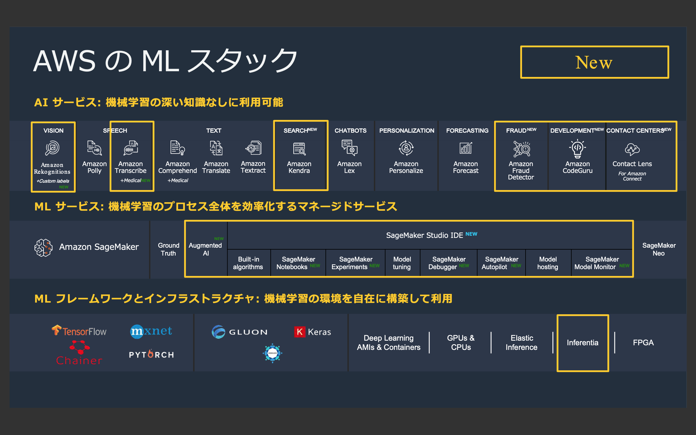

[第3回] AI サービスの全体像
==================================

はじめに
----------------
`前回 <https://news.mynavi.jp/itsearch/article/cloud/4799>`_ は、
AWS の機械学習サービスの全体像と機械学習を活用する際の前提事項ついてご説明させていただきしました。

| 今回からは AI サービスを見ていきたいと思います。
| 下図の赤枠内が AI サービスであり、今回の記事の説明範囲です。

.. image:: ../../../images/AWSのMLスタック_2019_AIサービス.png

(出典：2019年12月12日開催 「AWS re:Invent 2019 re:Cap | AI/ML」 の資料より)

| まずは AI サービスの全体像についてまとめます。
| 次回から何回かに渡って、個々の AI サービスの詳細や具体的な使い方について扱っていきます。

今回の記事では、下記を理解していただくことを目標に解説をしていきます。
- AI サービスのラインナップとそれぞれの概要がわかる。

AI サービスとは
---------------------

AI サービスの全体像
^^^^^^^^^^^^^^^^^^^^^^^^^
AI サービスは、3つのレイヤーで提供される機械学習サービスで最上位に位置するサービスです。

| 「画像・動画像認識」や「機械翻訳」、「不正検知」といったユースケースごとにサービスが用意されている。
| 自身の抱えるビジネス上の問題・課題とユースケースが一致する場合に利用できる。

AWS re:Invent 2019 で下記が新サービスとして追加された。
AI サービスのラインナップ (アイコンの数) が13個になった。
- Amazon Kendra
- Amazon Faud Detector
- Amazon CodeGuru
- Contact Lens for Amazon Connect

ただし、これらはプレビュー版での公開となる点に注意する。
仕様が変わる。ドキュメントの公開も限定的。
魅力的な機能が多いが、本番 (商用) 環境での利用は一般公開 (GA) を待つ、仕様変更の可能性を理解した上で使ってほしい。

既存サービスの機能強化も発表された。
- Amazon Rekognition
- Amazon Transcribe

参考情報として、アップデートを強調した図を下記に示します。

(出典：2019年12月12日開催 「AWS re:Invent 2019 re:Cap | AI/ML」 の資料より)

AI サービスの特徴
^^^^^^^^^^^^^^^^^^^^^^^^^^
AWS の謳い文句は「機械学習の深い知識なしに利用可能」である。これはどういうことなのかを考える。

| まず、AI サービスの利用パターンは、下記のいずれかとなる。
| - AWS により提供される学習済の機械学習モデルを利用する。それを自身のアプリに組み込む。利用者は文字通り機械学習をサービスとして利用する。
| - AWS により提供される機械学習モデルを生成する仕組みを利用する。利用者は自分で用意したデータから機械学習モデルを生成し、それを自身のアプリに組み込む。
| このように利用者が考える部分が少なくて済む。
| 利用者自身が準備する部分が多い ML サービス (Amazon SageMaker とその関連サービス) と比較すると導入の難易度は低くなる。
| 例えば、多くのサービスの背後でディープラーニングが利用されている。
| 利用するサービスのユースケースや使い方を理解していれば、ディープラーニングについて知らなくても利用が可能。
| 結果的に「機械学習の深い知識なしに利用可能」となる。
| 機械学習に明るいエンジニアがいる場合でも要件がマッチしていればアジリティを持って機械学習を導入することができることがメリット。
| しかし、機械学習に関する知識がゼロで良いという訳ではない。例えば、精度が出ない場合に未学習 (under-fitting)、過学習 (over-fitting) のいずれの状態にあるのかが判断できないと正しくチューニングできない。

AI サービスの種類
^^^^^^^^^^^^^^^^^^^^^^^^^^
| AI サービスは、2020年1月X日現在で下記が提供されている。
| 分類は図に従う。日本語は AWS の過去の資料を参考に著者が和訳したもの。今後の AWS 社の発表と異なる可能性がある点に注意。
| 概要を一言でまとめる。(考え中) 利用者の準備具合 (訓練データの要否)
| 読者の多くは東京リージョン (「東京 R」と表記) での利用を想定していると考えられるため利用可否を記載。
| また、言語を扱うサービスは日本語の対応状況を記載。

.. list-table::
    :widths: 5, 5, 5, 5, 5
    :header-rows: 1

    * - 分類
      - サービス名
      - 概要
      - ユースケース
      - 東京 R での利用可否
    * - Vision
      - `Amazon Rekognition <https://aws.amazon.com/jp/rekognition/>`_
      - 画像・動画像解析
      - X
      - ○
    * - Speech
      - `Amazon Polly <https://aws.amazon.com/jp/polly/>`_
      - テキストの読み上げ
      - X
      - | ○
        | (日本語対応済)
    * - 
      - `Amazon Transcribe <https://aws.amazon.com/jp/transcribe/>`_
      - 音声の文字起こし
      - X
      - | ○
        | (一部日本語未対応)
    * - 
      - `Amazon Transcribe Medical <https://aws.amazon.com/jp/transcribe/medical/>`_
      - 医療に特化した音声の文字起こし
      - X
      - | ×
        | (日本語未対応)
    * - Text
      - `Amazon Comprehend <https://aws.amazon.com/jp/comprehend/>`_
      - 自然言語処理・テキスト分析
      - X
      - | ○
        | (日本語対応済)
    * - 
      - `Amazon Comprehend Medical <https://aws.amazon.com/jp/comprehend/medical/>`_
      - 医療に特化した自然言語処理・テキスト分析
      - X
      - | ×
        | (日本語未対応)
    * - 
      - `Amazon Translate <https://aws.amazon.com/jp/translate/>`_
      - テキストの翻訳
      - X
      - | ○
        | (日本語対応済)
    * - 
      - `Amazon Textract <https://aws.amazon.com/jp/textract/>`_
      - ドキュメント分析
      - X
      - | ×
        | (日本語未対応)
    * - Search
      - `Amazon Kendra (プレビュー) <https://aws.amazon.com/jp/kendra/>`_
      - 検索サービス
      - X
      - ×
    * - Chatbot
      - `Amazon Lex <https://aws.amazon.com/jp/lex/>`_
      - チャットボット
      - X
      - | ×
        | (日本語未対応)
    * - Personalization
      - `Amazon Personalize <https://aws.amazon.com/jp/personalize/>`_
      - レコメンド
      - X
      - ○
    * - Forecasting
      - `Amazon Forecast <https://aws.amazon.com/jp/forecast/>`_
      - 時系列データの予測
      - X
      - ○
    * - Fraud
      - `Amazon Fraud Detection (プレビュー) <https://aws.amazon.com/jp/fraud-detector/>`_
      - 不正検知
      - X
      - ×
    * - Development
      - `Amazon CodeGuru (プレビュー) <https://aws.amazon.com/jp/codeguru/>`_
      - コードレビュー
      - X
      - ×
    * - Contact Center
      - `Contact Lens for Amazon Connect (プレビュー) <https://aws.amazon.com/jp/connect/contact-lens/>`_
      - Amazon Connect のコンタクトセンター分析
      - X
      - ×

まとめ
----------------
今回の記事では、AI サービスの種類とそれぞれのサービスの概要についてご説明させていただきました。

次回からは、AI サービスの個々のサービスについて概要と使い方について見ていきたいと思います。

+++++++++++

.. include:: ../author/author.rst
