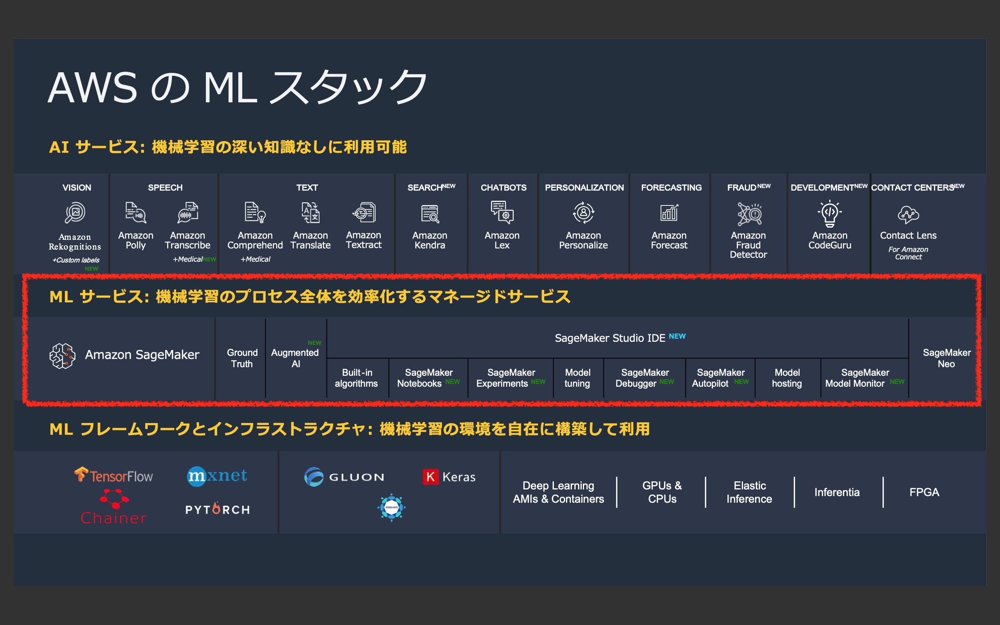

[第4回] ML サービスの全体像を把握する
================================================

はじめに
-------------------
| `前回 <https://news.mynavi.jp/itsearch/article/cloud/4913>`_ は、AI サービスの全体像についてご説明しました。
| 今回は ML サービスの全体像を見ていきたいと思います。

今回の記事では、下記を理解していただくことを目標に解説をしていきます。

- ML サービスのラインナップとそれぞれの概要 (特徴、利用方法、東京リージョンでの利用可否等) がわかる。

なお、今回の記事も全体感をつかむことを目標とし、個々の ML サービスの詳細や具体的な使い方については後続の連載で扱う予定です。

ML サービスとは
------------------------

ML サービスの全体像
^^^^^^^^^^^^^^^^^^^^^^^^^^^^^^
| ML サービスは、3つのレイヤーで提供される機械学習サービスで中位に位置するサービスであり、下図の赤枠内のサービスです。
| ML サービスは [Amazon SageMaker](https://aws.amazon.com/jp/sagemaker/) からなる複数の機能群を指します。

(出典：2019年12月12日開催 「AWS re:Invent 2019 re:Cap | AI/ML」 の資料より)

AWS re:Invent 2019 で下記のサービスが新たに追加されました。

- Amazon SageMaker Studio
- Amazon SageMaker Notebooks
- Amazon SageMaker Experiments
- Amazon SageMaker Debugger
- Amazon SageMaker Autopilot
- Amazon SageMaker Model Monitor
- Amazon Augmented AI (A2I)

Amazon SageMaker は AWS re:Invent 2017 での登場時から機械学習モデルの開発・構築・推論を行うための機能を提供してきました。
その後も機能が次々と追加されてきましたが、AWS re:Invent 2019 のアップデートでは、より一層機能が強化されて、更に便利に使うことができるようになりました。

ML サービスの特徴
^^^^^^^^^^^^^^^^^^^^^^^^^^^
| ML サービスは図中に示されている通り「機械学習のプロセス全体を効率化するマネージドサービス」です。
| 開発者やデータサイエンティストが迅速に機械学習を開発できるように機械学習のワークフローの全体に渡って様々な機能を提供されています。
| 表
| マネージドサービスとして提供されており、利用者は開発など価値の生成に集中でき、差別化につながらない作業は AWS に任せることができます。
| API を使って他のサービスと連携することも、他のサービスから利用することも容易にできます。

| 前回説明した AI サービスは ユースケース (翻訳や音声の文字起こし) ごとにサービスが用意されており、AWS が用意した機械学習モデルを利用するか、機械学習モデルを生成する仕組み (AutoML) を使って機械学習モデルを生成して利用しました。
| 迅速かつ簡便に導入できる反面、柔軟性がありませんでした。
| ML サービスは利用者が選定した機械学習アルゴリズムを採用して独自のモデルを構築できるなど自由に機械学習モデルを構築できます。
| その分専門知識が必要となりますが、初心者でも簡単に扱えるように SDK や API を使って利用できる様々な機能が用意されており、サンプルの Jupyter notebook も多数提供されています。
| 熟練者にとってはこれらを利用することで、アジリティを持って開発することできます。

(サンプルの画像をいれる)

ML サービスで提供される機能
^^^^^^^^^^^^^^^^^^^^^^^^^^^^^^^^^^^^
| 下記の表に ML サービスで提供される機能についてまとめます。
| 機能の簡単な説明に加えて、その機能の利用タイミングと東京リージョンでの利用可否についても記載します。
| ここでまとめる情報は、2020年5月10日時点の公開情報に基づいています。今後のアップデートにより変わる可能性がありますので、ご注意ください。

.. list-table::
    :header-rows: 1

    * - サービス名
      - 利用タイミング
      - 機能の説明
      - 東京での利用可否
    * - Amazon SageMaker
      - 全体
      - 機械学習モデルの開発・構築・推論を行う
      - ○
    * - Amazon SageMaker Studio
      - 
      - | 機械学習モデルを効率的に構築するための統合開発環境 (IDE) を提供する。
        | 下記に示す Amazon SageMaker の各機能と統合されており、シームレスに利用することができる。
      - × (US の4つのリージョンのみ)
    * - Amazon SageMaker Ground Truth
      - データの前処理
      - 学習データのラベル付け、Amazon Mechanical Turk を使ってラベル付け作業のアウトソーシングも可能
      - ○
    * - Amazon SageMaker Processing
      - 
      - 欠損値の補完、標準化、正規化等の前処理を行う
      - ○
    * - Amazon SageMaker Notebooks
      - モデルの構築
      - | 機械学習のアルゴリズム選定、実装を行う環境を提供する
        | 完全マネージドな Jupyter notebook の実行環境が提供される。
        | Amazon SageMaker のノートブックインスタンスとは異なる。(利用者側でインスタンスタイプの設定、起動・停止などを意識する必要がない)
        | Amazon SageMaker Studio に統合されており、個別の利用は不可。
      - ×
    * - AWS Marketplace
      - 
      - サードパーティ製の機械学習モデルの購入ができる
      - ○
    * - Amazon SageMaker Experiments
      - モデルの学習、評価
      - 機械学習モデルの学習を行う
      - ○
    * - Amazon SageMaker Debugger
      - 
      - 機械学習モデルの学習時のデバッグを行う
      - ○
    * - Amazon SageMaker Model Tuning
      - 
      - 機械学習モデルのハイパーパラメータのチューニングを行う
      - ○
    * - Amazon SageMaker Model Monitor
      - モデルのデプロイ・監視
      - 機械学習モデルの学習時のデバッグを行う
      - ○
    * - Amazon Augmented AI (A2I)
      - 
      - 人間が機械学習モデルの推論の性能評価を行う
      - × (バージニアのみ)
    * - Amazon SageMaker Neo
      - −
      - IoT などのエッジデバイスでの機械学習モデルのデプロイ、推論
      - ○

Amazon SageMaker の使い方
^^^^^^^^^^^^^^^^^^^^^^^^^^^^^^^^^^
| Amazon SageMaker の使い方を機械学習の開発の流れ (ワークフロー) に沿って見ていきたいと思います。
| 機械学習モデルを開発する流れは「事前準備」「開発」「学習」「推論」の4ステップとなります。

事前準備
**************
- | 学習データ (機械学習モデルの学習に用いるデータ) を収集し、Amazon S3 に格納する。
  | Amazon SageMaker では収集の仕組みは提供されていないので、例えば、Amazon Kinesis など他のサービス・手段を使って収集する。
- 機械学習モデルの開発環境となるノートブックインスタンス (Jupyter Notebook の実行環境) を構築する。
- 学習データに対して前処理 (欠損値の処理、変換など) をする。

(図をいれる 21)

開発
**************
- 機械学習モデルの構築 (Python によるコーディング) をする。

(図をいれる 22+23)

学習
**************
- Amazon ECR から学習用の Docker コンテナイメージをダウンロードして、学習用インスタンスとしてコンテナを起動する。
- Amazon S3 から学習用インスタンスに学習データをダウンロードして、機械学習モデルの学習を行う。
- 学習した結果得られた機械学習モデルを Amazon S3 に格納する。
- 学習用インスタンスは自動的に停止・削除される。
- 混同行列などの何らかの評価手法を使って、機械学習モデルの精度の評価を行う。
- | 精度がビジネスの要件を満たせない場合は、原因の分析を行って前のステップに戻ってやり直す。
  | 必要に応じて、学習データの再収集や機械学習モデルの再構築をして精度の改善を図る。

(図をいれる 24+25)

推論
**************
- | Amazon ECR から推論用の Docker コンテナイメージをダウンロードして推論用インスタンスを起動する。
  | Amazon S3 から機械学習モデルをダウンロードし、推論インスタンスにデプロイする。
  | 他のアプリからの接続ポイントとなる推論エンドポイントを作成する。 
- 機械学習モデルの監視

(図をいれる 26+27)

Amazon SageMaker の機能
^^^^^^^^^^^^^^^^^^^^^^^^^^^^^^^^^^^
| Amazon SageMaker では、機械学習のワークフロー全体に渡って様々な機能が提供されています。(サービス名は省略表記で記載)
| 必ずしも全ての機能を利用する必要はなく、必要に応じて個別に利用することが可能です。
| 例えば、機械学習モデルの開発環境としてノートブックインスタンスだけを利用するといったことが可能です。

下記を図で示す。

事前準備
- データの収集　別の仕組みを利用して収集し、Amazon S3 に保管
- データの前処理　Ground Truth, Processing

開発
- モデルの構築　ビルトインアルゴリズム/Marketplace/独自アルゴリズム、Jupyter notebook/Jupyter Lab/Notebooks

学習
- モデルの学習　Experiments,Debugger
- モデルの評価　同上

推論
- モデルのデプロイ　Model hosting
- モデルの監視　Model Monitor, A2I

(開発〜学習) Autopilot
(全体) Studio

Amazon SageMaker でのモデルの構築方法
^^^^^^^^^^^^^^^^^^^^^^^^^^^^^^^^^^^^^^^^^^^^
| Amazon SageMaker を使って機械学習モデルを構築する方法についてもう少し詳細に説明します。
| Amazon SageMaker では、下記のいずれかのパターンで構築します。それぞれのパターンの説明と導入の難易度についてまとめます。

.. list-table::
    :header-rows: 1

    * - 構築パターン
      - 構築パターンの説明
      - 導入の難易度
    * - ビルトインアルゴリズムを利用する
      - | AWS が用意した (Amazon SageMaker に組み込んだ) 学習アルゴリズムを使ってモデルを構築する。
        | XGBoost 
        | Amazon SageMaker に最適化されており、最も簡便に利用することができる。
        | 例えば、設定 (パラメータ) を変えるだけで、コードを追加せずに分散学習を行うことができる。
      - 低
    * - AWS Marketplace で購入したを利用する
      - | サードパーティが AWS Marketplace に出品した機械学習アルゴリズムを使ってモデルを構築する。
        | 購入処理が必要となるが、導入の難易度はビルトインアルゴリズムと同程度である。
      - 低
    * - 独自にアルゴリズムを実装する
      - | 機械学習アルゴリズムの選定や実装を利用者自身で行う。
        | SageMaker SDK を使って
      - 高

| ビルトインアルゴリズムには、昨今注目を集めている深層学習 (ディープラーニング) を使うアルゴリズムから、XGBoost などの深層学習を使わないアルゴリズムまで多数用意されています。
| 導入の難易度やビジネスへの導入スピードを考えて、まずはビルトインアルゴリズムの中に自身のビジネス課題に対応できるものがないかを確認します。
| 対応するものがない場合は AWS Marketplace で探し、それでも対応するものがない場合は独自にアルゴリズムを実装することを考えることが望ましいでしょう。

Amazon SageMaker の利用例
-----------------------------------
| ここでは、Amazon SageMaker の利用イメージをつかんでいただくために、ビルトインアルゴリズムを使って機械学習モデルを開発・学習・推論を行ってみます。
| 「[Build, Train, and Deploy a Machine Learning Model with Amazon SageMaker](https://aws.amazon.com/jp/getting-started/hands-on/build-train-deploy-machine-learning-model-sagemaker/)」というチュートリアルがありますので、これを利用します。
| 30分程度で実施できるので、是非ご自身でも試してみてください。

チュートリアルの内容
^^^^^^^^^^^^^^^^^^^^^^^^^^^^^
- 問題の概要：銀行の見込み顧客の予測
- 問題の詳細：銀行の過去の顧客のデータを基にして、見込み顧客の予測モデルを構築し、新規に口座を開設してくれるか判別したい。
- 機械学習のタイプ：分類問題 (顧客に口座開設の見込みがあるか、ないかの分類)
- 利用するデータ：UCI (カリフォルニア大学アーバイン校) が提供する Machine Learning Repository の "[Bank Marketing Data Set](https://archive.ics.uci.edu/ml/datasets/bank+marketing)" を利用する。
- データの概要：ポルトガルの金融機関が過去に行ったダイレクトマーケティングキャンペーンのデータ。年齢、職業、婚姻歴、ローンの有無など口座開設の判断材料になりそうなデータ (特徴量、説明変数) と実際に口座開設したかのデータ (目的変数) が含まれる。
- 

1. データの収集
**********************

2. データの前処理
***********************

3. モデルの構築
**********************

4. モデルの学習
**********************

5. モデルの評価
********************

6. モデルのデプロイ
**************************

7.モデルの監視
**************************
| 今回は Amazon SageMaker の基本的な使い方の紹介であるため、割愛させていただきます。
| Amazon SageMaker Model Monitor や Amazon A2I を利用して精度の監視を行います。

まとめ
---------------
今回の記事では、ML サービスの全体像についてご説明させていただきました。
次回は、今回あまり触れられなかった Amazon SageMaker の新機能について見ていきたいと思います。

+++++++++++

.. include:: ../author/author.rst