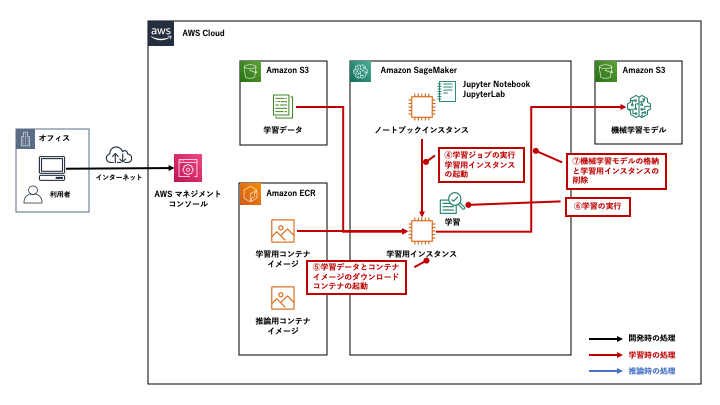

[第4回] ML サービスの全体像を把握する
================================================

はじめに
-------------------
| `前回 <https://news.mynavi.jp/itsearch/article/cloud/4913>`_ は、AI サービスの全体像についてご説明しました。今回は ML サービスの全体像を見ていきたいと思います。
| 今回の記事では、下記を理解していただくことを目標に解説をしていきます。

- ML サービスで提供される機能とそれぞれの概要 (特徴、東京リージョンでの利用可否等) がわかる。
- Amazon SageMaker の基本的な利用方法がわかる。

ML サービスとは
------------------------

ML サービスの全体像
^^^^^^^^^^^^^^^^^^^^^^^^^^^^^^
ML サービスは、3つのレイヤーで提供される機械学習サービスの中位に位置するサービスであり、下図の赤枠内のサービスです。

(出典：2019年12月12日開催 「AWS re:Invent 2019 re:Cap | AI/ML」 の資料より)

| Amazon SageMaker を中心とする複数の機能の集合が ML サービスです。
| 上図に記載されている通り「機械学習のプロセス全体を効率化するマネージドサービス」です。

| ML スタック内に示された機能のうち、下記に示すサービスは昨年末に米国のラスベガスで開催された「AWS re:Invent 2019」で新たに発表された機能です。
| (機能名にリンクがないものは、`Amazon SageMaker <https://aws.amazon.com/jp/sagemaker/>`_ の製品ページに記載があります)

- Amazon SageMaker Studio (Web ブラウザベースの統合開発環境 (IDE))
- Amazon SageMaker Notebooks (Amazon SageMaker Studio に統合された完全マネージドなノートブック)
- Amazon SageMaker Experiments (学習ジョブの実行履歴や設定、結果を一元管理)
- Amazon SageMaker Debugger (学習の監視、記録、分析と異常の検知)
- `Amazon SageMaker Autopilot <https://aws.amazon.com/jp/sagemaker/autopilot/>`_ (AutoML 機能による機械学習モデルの自動構築)
- Amazon SageMaker Model Monitor (本番環境にデプロイした推論エンドポイントの継続的な監視)
- `Amazon Augmented AI (A2I) <https://aws.amazon.com/jp/augmented-ai/>`_ (信頼性の低い推論結果の人間の確認と修正)

| Amazon SageMaker は、登場時から機械学習ワークフローの全体に渡って様々な機能が提供されてきました。
| その後も機能が次々と追加されてきましたが、今回のアップデートでは、より一層の機能が強化されて、更に便利に使うことができるようになりました。
| ここでは、この程度の簡単な紹介に留め、各機能の詳細は後続の記事で扱います。

Amazon SageMaker とは
-----------------------------
ここからは ML サービスの中心機能である Amazon SageMaker の概要や基本的な使い方について見ていきます。

Amazon SageMaker の概要
^^^^^^^^^^^^^^^^^^^^^^^^^^^^^
| Amazon SageMaker は、データサイエンティストや開発者向けのサービスであり、機械学習ワークフローの全体に渡って多数の機能が提供されています。
| マネージドサービスとして提供されており、差別化につながらない作業は AWS に任せて、利用者はビジネス価値を創出に全力を注ぐことができます。

機械学習モデルを開発する際に発生しがちな問題・課題について見てみましょう。

機械学習モデルの開発における問題・課題
********************************************
機械学習ワークフローは大きく「開発」「学習」「推論」の3段階に分けることができます。

| これらを実行するための環境が必要。
| 開発であれば、Fat PC などを準備して、Python や Jupyter をインストール
| 機械学習の開発ではフレームワークなどの充実具合から Python が選択されることが多いです。
| Jupyter Notebook やその後継である JupyterLab と呼ばれるツールを利用してすると、コードを少しずつ記述して確認しながら実行できるので便利です。

学習は大規模にデータを扱う
マシンパワーが必要。ずっと稼働させておくとコスト高になる
開発とは別のサーバが必要
ツールの導入　機械学習フレームワーク、深層学習フレームワーク
開発環境とのバージョンの統一
差別化につながらないが、時間や手間がかかる

学習に時間がかかるから分散させる
あるいは、ハイパーパラメータ (機械学習アルゴリズムの設定値) が異なる複数のパターンを実行したい
ハイパーパラメータやその際のモデルの精度

推論は本番環境
構築した機械学習モデルをデプロイして推論を行う環境の準備
セキュリティ、マシン負荷などを考えて別のサーバでの用意が必要
リクエスト数に応じてサーバを増やしたい　オートスケール (水平展開) したい

Amazon SageMaker が提供する機能
********************************************
| Amazon SageMaker では上記のような問題・課題を解決するために下記のような機能を提供しています。
| なお、ここで挙げた機能は代表的なものであり、一部です。上記で紹介した新機能を含めて多数の機能が提供されています。
| 後続の連載で扱っていく予定ですが、いち早く知りたい方は `Amazon SageMaker の開発者ガイド <https://docs.aws.amazon.com/ja_jp/sagemaker/latest/dg/whatis.html>`_ などをご参照ください。

- 「開発」「学習」「推論」のための環境 (インスタンス) を提供する。

  - 開発環境：ノートブックインスタンス
  - 学習環境：学習用インスタンス
  - 推論環境：推論用インスタンス

- 「開発」「学習」「推論」に必要なツールを提供する。

  - Jupyter Notebook/JupyterLab
  - 「開発」「学習」「推論」を効率化するための SDK (Software Developer Kit)
  - 人気の高い機械学習アルゴリズム (ビルトインアルゴリズム)
  - 人気の高い機械学習・深層学習フレームワーク

- 「開発」「学習」「推論」に必要なツールを提供する。

  - 分散学習
  - オートスケーリング
  - ハイパーパラメータのチューニング機能　など

- 利用者のニーズに応じて必要な機能を選択して利用することができる。

  - 開発環境としてノートブックインスタンスのみを利用する
  - 分散学習をするために学習時のみ利用する　など

- API を経由した AWS の他のサービスとの連携機能を提供する。

  - Amazon S3
  - Amazon ECR など

Amazon SageMaker の基本的な使い方
^^^^^^^^^^^^^^^^^^^^^^^^^^^^^^^^^^^^^^^^^^
ここからは Amazon SageMaker の基本的な使い方について見ていきます。

全体像を抑える
********************
| Amazon SageMaker では様々な機能が提供されており、他の AWS のサービスと連携しながら使っていきます。
| 名称の似ている登場人物も多く、初学者にとってはそれが混乱の一因となってしまう可能性があります。(実際に私自身がそうでした)

| ここでは、下記の図と表で Amazon SageMaker を利用する上でまず最初に抑えるべきコンポーネントとそれぞれの役割をまとめます。
| 今回はイメージの構築を優先するため、記載粒度のばらつきがある点などはご了承ください。

.. image:: ../../../images/amazon_sagemaker_notebook_instance_0.png
  :width: 900px

(Amazon SageMaker の利用における全体像)

.. list-table::
    :header-rows: 1

    * - コンポーネント名
      - 役割
    * - `Amazon S3 <https://aws.amazon.com/jp/s3/>`_
      - 学習のインプットとなる学習データやアウトプットとなる機械学習モデルを格納に利用するオブジェクトストレージ。
    * - `Amazon ECR <https://aws.amazon.com/jp/ecr/>`_
      - | Amazon SageMaker では、学習と推論に Docker コンテナを利用する。
        | 学習や推論に必要なコードやライブラリを Docker コンテナイメージとしてビルドしておき、学習用・推論用インスタンスでそれぞれ Docker コンテナとして実行する。
        | Amazon ECR は、それらを格納しておくための Docker コンテナイメージのレジストリ。
    * - ノートブックインスタンス
      - | 学習や推論用のコードの開発を行うためのインスタンス。
        | Jupyter Notebook もしくは JupyterLab を利用して開発を行う。
        | SDK を利用して、ここからから学習ジョブの起動や機械学習モデルのデプロイ・推論用エンドポイント (API) の作成を実施することができる。
    * - 学習用インスタンス
      - | 学習用 Docker コンテナを稼働させるためのインスタンス。
        | 学習ジョブの開始を契機に学習用インスタンスが自動で起動し、Amazon S3 と Amazon ECR から学習データとコンテナイメージをそれぞれダウンロードして、学習用コンテナの起動を行う。  
        | 学習の完了後に、学習済の機械学習モデルを Amazon S3 に格納し、自動で学習用インスタンスが削除されるため、余計なコストがかからない仕組みになっている。
    * - 推論用インスタンス
      - | 推論用 Docker コンテナを稼働させるためのインスタンス。  
        | デプロイ操作を契機に推論用インスタンスを起動し、Amazon S3 と Amazon ECR から学習済の機械学習モデルと推論用コンテナイメージをダウンロードして、推論用コンテナの起動を行う。  
        | 推論用エンドポイント (API) が作成され、これを経由してアプリなど外部からのリクエストを受け付けて推論結果を返す。

ここからは上記の悩みに注意しながら、 Amazon SageMaker の利用方法について説明していきたいと思います。

| ここでは、簡単のために機械学習ワークフローを「開発」、「学習」、「推論」の3つと考えます。
| 特徴として説明したように、Amazon SageMaker は、利用者が必要な機能を選択して利用することができます。
| 本連載の趣旨に従って、AWS を使ってこれから機械学習を始める場合を想定し、上記の3つの全てを Amazon SageMaker で実施する場合を考えます。

| Amazon SageMaker の利用方法は「開発環境」を軸に整理すると、下記の2パターンに分けられます。

- ノートブックインスタンスを利用するパターン (従来からの利用パターン)
- Amazon SageMaker Studio を利用するパターン

| 前者が従来からの Amazon SageMaker の利用方法で、後者は「AWS re:Invent 2019」での Amazon SageMaker Studio が登場したことにより発生したパターンです。
| 前者が Amazon SageMaker の基本的な使い方となるため、これをベースにして用語や使い方を説明していきたいと思います。
| 今回はイメージの構築を優先するため、多少の正確さに欠ける点はご了承ください。

主要な登場人物の整理
#################################
まずは「ノートブックインスタンスを利用するパターン」の登場人物を下記の図と表に整理します。

開発時の流れ
######################

.. image:: ../../../images/amazon_sagemaker_notebook_instance_1.png
  :width: 900px

開発時の

  1. ノートブックインスタンスの作成を作成し、学習や推論用のコードを開発する。
  2. Amazon S3 に学習データを格納する。
  3. 学習、推論用のコンテナイメージを作成して格納する。

学習時の流れ
######################

4. ノートブックインスタンスから学習ジョブを起動し、学習用インスタンスを作成する。
5. Amazon S3 から学習データと、Amazon ECR からコンテナイメージをダウンロードして、コンテナを起動する。
6. 学習を実行する。
7. 学習が完了したら、Amazon S3 に学習済の機械学習モデルを格納して、学習用インスタンスを削除する。

推論時の流れ
######################

.. image:: ../../../images/amazon_sagemaker_notebook_instance_3.png
  :width: 900px

8. ノートブックインスタンスから推論用インスタンスの起動する。
9. Amazon S3 から機械学習モデルを、Amazon ECR からコンテナイメージのダウンロードしてコンテナを起動する。
10. 推論エンドポイントを作成する。

まとめ
---------------
| 今回の記事では、ML サービスの全体像と Amazon SageMaker の概要、利用方法についてご説明させていただきました。
| 次回は、実際に Amazon SageMaker を使って機械学習モデルを構築してみたいと思います。

+++++++++++

.. include:: ../author/author.rst