[第5回] Amazon SageMaker の基本的な使い方を理解する (1)
========================================================

はじめに
--------------------
| `前回 <https://news.mynavi.jp/itsearch/article/devsoft/4983>`_ は、ML サービスおよび Amazon SageMaker の概要と利用方法についてご説明させていただきました。
| 図を用いて「開発」「学習」「推論」の流れを説明しましたが、今回の記事では、実際に Amazon SageMaker を使ってみたいと思います。
| 今回は、下記を理解していただくことを目標に解説をしていきます。

- Amazon SageMaker を使って実際に「開発」を始めるまでの準備作業の流れがわかる。
- Amazon SageMaker を使って、「開発」「学習」「推論」の流れがわかる。

実際に Amazon SageMaker を使う
---------------------------------------
`「機械学習モデルの構築およびトレーニング、デプロイ with Amazon SageMaker」 <https://aws.amazon.com/jp/getting-started/hands-on/build-train-deploy-machine-learning-model-sagemaker/>`_ という簡単なチュートリアルがありますので、これをベースに進めたいと思います。

「自分が今何をしているのか」、「背後でどのような処理が行われているか」を整理しながら解説を進めていきます。
前回の記事で示した「開発」「学習」「推論」に沿った流れとなりますが、より細かい手順を示す点に注意してください。

チュートリアルの概要
^^^^^^^^^^^^^^^^^^^^^^^^^^^^
- Amazon SageMaker を使って、「開発」「学習」「推論」の一連の流れを体験できる。
- XGBoost と呼ばれる機械学習アルゴリズムを利用して、二値分類を行う。
- 学習・推論に利用するデータは、カリフォルニア大学アーバイン校が公開しているオープンデータを利用する。
- 利用するデータは「Bank Marketing Data Set」と呼ばれる「ポルトガルの銀行マーケティングキャンペーン」のデータである。
- データには大きく2種類の情報が記録されている。

  - データ 1：「年齢」や「職業」といった銀行の顧客の属性情報など
  - データ 2：マーケティングを行った結果、その顧客が実際に「預金証書 (CD)」を申し込んだか否かのフラグ

- 「データ 1」から機械学習アルゴリズムによって何らかのパターンを見出して、これから営業をかける顧客 (「データ 2」が未知の顧客) が「預金証書 (CD)」を申し込んでくれそうかどうかを分類する機械学習モデルを構築する。
- 「預金証書 (CD) を申し込んでくれそうな顧客」を重点的に営業をかけることによって営業活動を効率化することができる。顧客名簿の上から順に営業をかけるよりも顧客を獲得できる可能性が高まる。

今回の記事で実施すること
^^^^^^^^^^^^^^^^^^^^^^^^^^^^^^

.. list-table::
    :header-rows: 1

    * - 工程
      - 実施内容
      - 連載回
    * - 開発
      - AWS マネジメントコンソールにログインする
      - 第5回
    * - 
      - ノートブックインスタンスを作成する
      - 第5回
    * - 
      - 学習・推論に利用するデータを格納するための S3 バケットを作成する
      - 第5回
    * - 
      - 学習・推論に利用するデータを準備する
      - 第5回
    * - 
      - 学習用のコードを開発する
      - 第5回
    * - 学習
      - 
      - 第6回
    * - 推論
      - 
      - 第7回

前提
^^^^^^^^^^^^^^^^^^
今回の記事の内容を実施する際の前提を下記に示します。

- 本番環境 (商用サービスが稼働する AWS アカウント) ではなく、開発環境や検証環境で実施する。
- 「AWS アカウントの取得」と「IAM ユーザの作成」を未実施の場合は、下記の Amazon SageMaker の開発者ガイドを参照して実施する。
  IAM ユーザに管理者権限 (AdministratorAccess) を付与する手順となっているが、実際の業務では必要最小限の権限に制限してほしい。

  - `「AWS アカウントを作成する」 <https://docs.aws.amazon.com/ja_jp/sagemaker/latest/dg/gs-account.html>`_
  - `「IAM 管理者ユーザーおよびグループの作成」 <https://docs.aws.amazon.com/ja_jp/sagemaker/latest/dg/gs-account-user.html>`_

- この記事の内容を実施すると数百円程度の課金が発生する可能性がある。課金が気になる場合は必ず削除。
- 画面や手順は2020年7月11日時点のもの。仕様変更などにより表示内容や設定値に変更が入る可能性がある。
- チュートリアルのリージョンは「バージニア北部 (us-east-1)」を想定している。簡単のために「バージニア北部 (us-east-1)」で実施する。

  - チュートリアルのソースコードには「バージニア北部」リージョンを想定するコードがあるので、これを「東京」リージョン向けに改変すれば実行は可能。

(開発) AWS マネジメントコンソールにログインする
^^^^^^^^^^^^^^^^^^^^^^^^^^^^^^^^^^^^^^^^^^^^^^^
- このセクションでの該当箇所は下記の赤枠です。

.. image:: ../../../images/amazon_sagemaker_notebook_instance_1.png
  :width: 900px

まずは AWS マネジメントコンソールに自身の IAM ユーザでログインします。

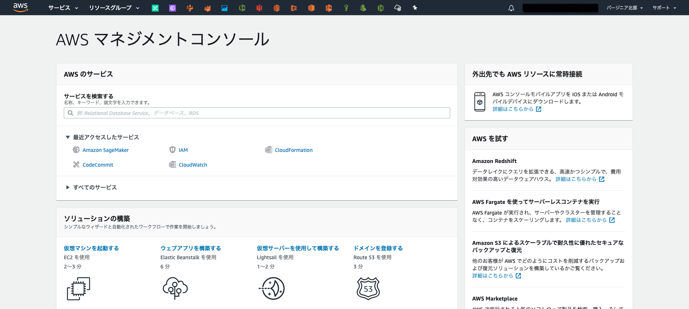

リージョンは「バージニア北部」を利用しますので、その他のリージョンにいる場合は AWS マネジメントコンソールの右上のプルダウンメニューから移動してください。

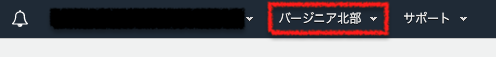

(開発) ノートブックインスタンスを作成する
^^^^^^^^^^^^^^^^^^^^^^^^^^^^^^^^^^^^^^^^^
- このセクションでの該当箇所は下記の赤枠です。

.. image:: ../../../images/amazon_sagemaker_notebook_instance_1.png
  :width: 900px

| それでは、Amazon SageMaker に移動します。
| 「サービスを検索する」の箇所にある検索バーに「sage」程度を入れると、「Amazon SageMaker」が登場しますので、これをクリックして移動します。

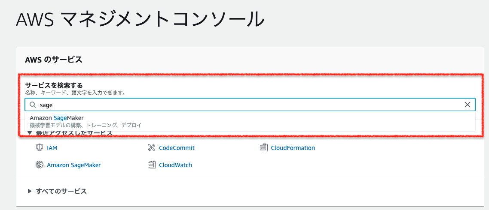

下記のいずれかの画面に移動しますが、どちらでも問題ありません。

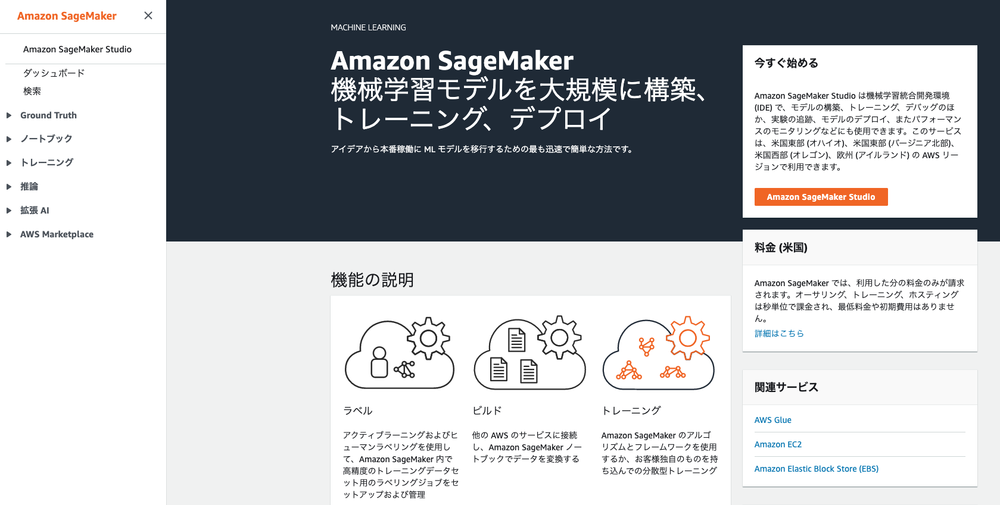

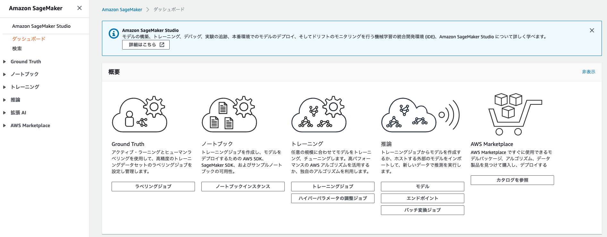

| 学習・推論用のコードの開発環境となる「ノートブックインスタンス」を作成していきます。
| 左側の折りたたみメニューの「ノートブック」をクリックして開き、「ノートブックインスタンス」をクリックします。
| ダッシュボードにいる場合は、画面中央の「概要」の中にある「ノートブックインスタンス」をクリックしても構いません。

.. image:: ../../../images/blog/5th/sagemaker-dashboard-notebook.png
  :width: 900px

| ノートブックインスタンスの画面に移動します。
| 現在はノートブックインスタンスが存在しませんが、ここにそのリージョンに存在するノートブックインスタンスの一覧が表示されます。

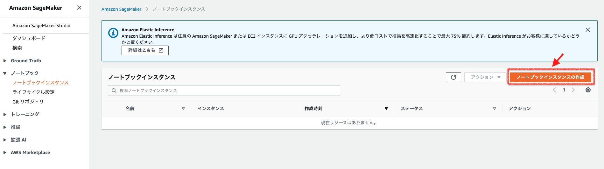

ノートブックインスタンスの作成画面に移動します。

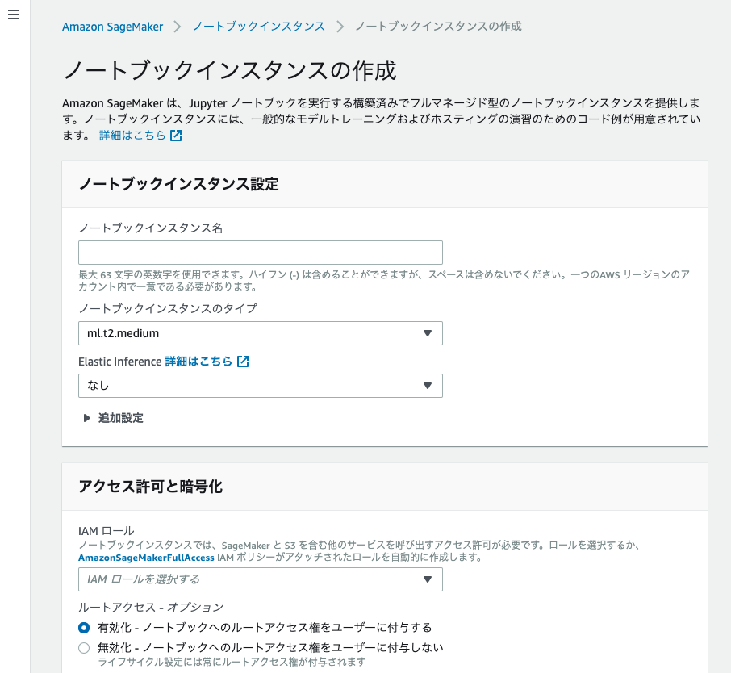

| ノートブックインスタンス作成時の設定項目を下記の表に示します。
| 今回は簡単なチュートリアルですので、原則としてデフォルト値を設定します。各設定値の説明を記しますので、実際の業務で利用する際は要件に従って適切に設定してください。
| 設定が完了したら、画面の最下部にある「ノートブックインスタンスの作成」をクリックします。

.. list-table::
    :header-rows: 1

    * - 大分類
      - 小分類
      - 設定値名
      - 説明
      - デフォルト値
    * - ノートブックインスタンス設定
      - 
      - ノートブックインスタンス名
      - | ノートブックインスタンスの名前を設定する。
        | 最大 63 文字まで設定可能。英数字もしくはハイフン (-) の利用が可能。
        | 1つのAWS リージョンのアカウント内で一意である必要がある。
      - | (空白)
        | 今回は「mynotebook」と設定
    * - 
      - 
      - ノートブックインスタンスのタイプ
      - | ノートブックインスタンスのタイプを設定する。
        | まずは「ml.t2.medium」など小さいインスタンスで試した方が良い。
        | CPU やメモリなどのリソース不足が発生した場合にスケールアップもしくは不足するリソースに応じたインスタンスタイプを選択する。
        | (例) CPUを重点的に増やしたい：コンピューティング最適化 (ml.c5.large など)、 メモリを重点的に増やしたい：メモリの最適化 (ml.r5.large など)
        | `「Amazon SageMaker ML インスタンスタイプ」 <https://aws.amazon.com/jp/sagemaker/pricing/instance-types/>`_
        | `「Amazon SageMaker の料金」 <https://aws.amazon.com/jp/sagemaker/pricing/>`_
      - ml.t2.medium
    * - 
      - 
      - Elastic Inference
      - | GPU リソースをアタッチする。ディープラーニングフレームワーク TensorFlow、 Apache MXNet、PyTorch でサポートされている。 
        | `「Amazon SageMaker Elastic Inference (EI) を使用する」 <https://docs.aws.amazon.com/ja_jp/sagemaker/latest/dg/ei.html>`_
      - なし
    * - 
      - 追加設定
      - ライフサイクル設定
      - ノートブックインスタンスの作成時にスクリプトを実行して、ノートブックインスタンスをカスタマイズする。
      - 設定値なし
    * - 
      - 
      - ボリュームサイズ (GB 単位)
      - | ノートブックインスタンスにアタッチする EBS ボリューム (ディスク) のサイズ。
        | ボリュームサイズは 5 GB - 16 TB の範囲で設定可能。 
      - 5
    * - アクセス許可と暗号化
      - 
      - IAM ロール
      - | ノートブックインスタンスに付与する AWS リソースの操作権限を IAM ロールとして設定する。
        | AmazonSageMakerFullAccess を付与する場合、`「AmazonSageMakerFullAccess ポリシー」 <https://docs.aws.amazon.com/ja_jp/sagemaker/latest/dg/sagemaker-roles.html#sagemaker-roles-amazonsagemakerfullaccess-policy>`_ に記載されている操作権限が付与される。
      - 新しい IAM ロールの作成
    * - 
      - 
      - ルートアクセス - オプション
      - 
      - 有効化 - ノートブックへのルートアクセス権をユーザーに付与する
    * - 
      - 
      - 暗号化キー - オプション
      - ノートブックインスタンスにアタッチする EBS ボリューム (ディスク) の Amazon KMS の暗号鍵を設定する。
      - カスタム暗号化なし
    * - ネットワーク - オプション
      - 
      - VPC - オプション
      - 
      - 非 VPC
    * - Git リポジトリ - オプション
      - デフォルトのリポジトリ
      - リポジトリ
      - | ノートブックインスタンスの作成時に自動で Git リポジトリをクローンする。
        | 例えば、学習・推論用コードが格納された Git リポジトリやアプリのコードが格納されたリポジトリを自動でクローンし、その分の手間が省ける。
        | デフォルトのリポジトリを1つ、追加のリポジトリを最大3つ設定可能。
      - なし
    * - タグ - オプション
      - 
      - キー、値
      - | キーバリュー形式で値を設定する。
        | (例) Name タグ (Name: *<notebook_instance_name>*)、環境タグ (Environment: Production)
      - (空白)

| ノートブックインスタンスに付与する IAM ロールに関して補足します。
| IAM ロールは AWS のリソースに操作権限を与えるために利用します。
| 例えば、学習用データの取得のためにノートブックインスタンスから Amazon S3 のバケットにアクセスが必要となります。
| IAM ユーザに紐づく認証情報として「アクセスキー ID」と「シークレットキー」がありますが、これをコードにハードコーディングすることはアンチパターンとなります。
| IAM ロールに操作権限を定義してノートブックインスタンスに付与することで、具体的な認証情報を記述せずに操作権限を付与することができます。

- (備忘) 図を入れる。

| 今回新規作成した IAM ロールは「AmazonSageMakerFullAccess ポリシー」が操作権限として与えられています。
| 特に、下記の条件に当てはまる Amazon S3 のバケットとオブジェクトの操作権限が与えられる点に注意してください。

.. list-table::
  :header-rows: 1

  * - 条件
    - 説明
  * - 指定する S3 バケット - オプション
    - | 本項目以外の条件に当てはまらない S3 バケットに対するアクセスを許可する。オプション項目であり、これを設定しないことも可能。
      | - **任意の S3 バケット**
      | (例) my-s3-bucket
      | - **特定の S3 バケット**
      | (例) my-s3-bucket-1, my-s3-bucket-2
      | - **なし**
  * - 名前に「sagemaker」が含まれる任意の S3 バケット
    - | 下記のように S3 バケット名に「sagemaker」を含む S3 バケットにはアクセスが可能。
      | (例) **アクセス可能** : my-sagemaker-s3-bucket、**アクセス不可能** : my-s3-bucket
  * - 名前に「sagemaker」が含まれる任意の S3 オブジェクト
    - | 下記のように S3 バケットに格納されているオブジェクト (ファイル) 名に 「sagemaker」を含むオブジェクトにはアクセスが可能。
      | (例) **アクセス可能** : my-sagemaker-object.csv、**アクセス不可能** : my-object.csv
  * - タグ「sagemaker」と値「true」が含まれる任意の S3 オブジェクトにはアクセスが可能。
    - | キーが「sagemaker」、値が「true」と設定されたオブジェクトにはアクセスが可能。
  * - SageMaker へのアクセスを許可するバケットポリシーを持つ S3 バケット
    - 条件に記載されている通り、バケットポリシーにて Amazon SageMaker のアクセスが許可された S3 バケットにはアクセスが可能。

| 設定値に問題がなければ画面が切り替わり、「成功! ノートブックインスタンスが作成されています。」と表示されます。
| 数分間待って、「ステータス」が「**Pending**」から「**InService**」に変わると、ノートブックインスタンスの作成が完了です。

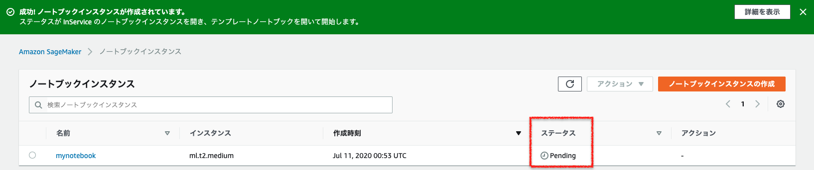

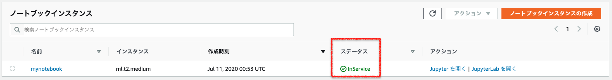

(開発) ノートブックを起動する
^^^^^^^^^^^^^^^^^^^^^^^^^^^^^^^^^^^^^^^^^
- このセクションでの該当箇所は下記の赤枠です。

.. image:: ../../../images/amazon_sagemaker_notebook_instance_1.png
  :width: 900px

| ノートブックインスタンスの作成まで完了したので、ノートブックを起動します。

| Amazon SageMaker のノートブックインスタンスでは、Jupyter Notebook もしくは JupyterLab が利用できます。
| これらがプリインストールされた状態でノートブックインスタンスが作成されており、利用者側でインストールは必要ありません。

| Jupyter Notebook、JupyterLab は `Project Jupyter <https://jupyter.org/index.html>`_ と呼ばれる非営利の OSS プロジェクトにより管理されているプログラミングのツールです。
| Python をはじめとして、R や Spark など様々な言語で利用することができます。
| コードを「セル」と呼ばれるブロックに記載して、少しずつ確認しながら実行することができます。
| また、マークダウンでテキストや画像、数式なども記載することもできますので、従来のテキストベースのソースコードと比較すると背景や設計根拠などを詳細に残すことができます。

- (備忘) サンプルか何かのノートブックの画像を入れる。

| JupyterLab は Jupyter Notebook の後継となるノートブックです。
| このチュートリアルを実施範囲ではどちらを選んでも問題ありません。
| AWS のチュートリアルは Jupyter Notebook を利用していますので、こちらの記事では「JupyterLab」を利用して進めたいと思います。

| 「アクション」の「JupyterLab を開く」をクリックします。
| なお、前者をクリックすると従来からの Jupyter notebook が起動し、後者をクリックすると JupyterLab が起動します。

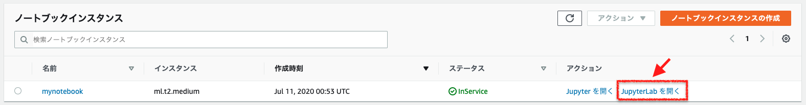

| JupyterLab を起動すると、下記のような「Launcher」タブが表示されます。
| Python を中心に様々な実行環境が用意されています。
| このチュートリアルでは、Python 3 の実行環境があれば良いので、「Notebook」の配下にある「conda_python3」をダブルクリックします。

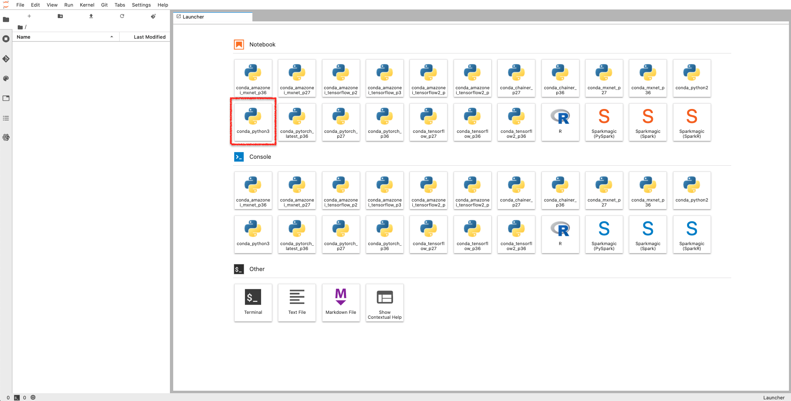

| すると、「Untitled.ipynb」というタブに切り替わり、左側のメニューに同名のファイルが表示されます。
| 今回はこの状態のまま進みますが、左側のメニューを右クリックして、「Rename」を選択することによりファイル名を変更することも可能です。

.. image:: ../../../images/blog/5th/sagemaker-jupyterlab-python3-notebook.png
  :width: 900px

| グレーの部分を「セル」と呼び、ここにコードを記述していきます。
| 下記のコードをコピー＆ペーストして、「Run」を押下するか、「Shift」+「Enter」で実行できます。
| この後もいくつかコードを示しますが、同様の方法で実行してください。

.. code-block:: python

  # import libraries
  import boto3, re, sys, math, json, os, sagemaker, urllib.request
  from sagemaker import get_execution_role
  import numpy as np
  import pandas as pd
  import matplotlib.pyplot as plt
  from IPython.display import Image
  from IPython.display import display
  from time import gmtime, strftime
  from sagemaker.predictor import csv_serializer

  # Define IAM role
  role = get_execution_role()
  prefix = 'sagemaker/DEMO-xgboost-dm'
  containers = {'us-west-2': '433757028032.dkr.ecr.us-west-2.amazonaws.com/xgboost:latest',
                'us-east-1': '811284229777.dkr.ecr.us-east-1.amazonaws.com/xgboost:latest',
                'us-east-2': '825641698319.dkr.ecr.us-east-2.amazonaws.com/xgboost:latest',
                'eu-west-1': '685385470294.dkr.ecr.eu-west-1.amazonaws.com/xgboost:latest'} # each region has its XGBoost container
  my_region = boto3.session.Session().region_name # set the region of the instance
  print("Success - the MySageMakerInstance is in the " + my_region + " region. You will use the " + containers[my_region] + " container for your SageMaker endpoint.")

| セルの下側に下記のメッセージが出力されれば成功です。
| *Success - the MySageMakerInstance is in the us-east-1 region. You will use the 811284229777.dkr.ecr.us-east-1.amazonaws.com/xgboost:latest container for your SageMaker endpoint.*

コードの解説
********************
ここでは「`# import libraries`」と「`# Define IAM role`」から始まる大きく2つの処理に分けられます。

.. code-block:: python

  # import libraries
  import boto3, re, sys, math, json, os, sagemaker, urllib.request
  from sagemaker import get_execution_role
  import numpy as np
  import pandas as pd
  # (以下、省略)

| 「`# import libraries`」から始まる処理では、チュートリアルの実行に必要なライブラリ (モジュール) の読み込み (インポート) を行っています。
| Python でよく利用される「Numpy」や「Pandas」に加えて、「Boto3」と呼ばれる 「`AWS SDK for Python <https://aws.amazon.com/jp/sdk-for-python/>`_」、その名の通りで Amazon SageMaker の Python 向け SDK である「`Amazon SageMaker SDK for Python <https://sagemaker.readthedocs.io/en/stable/>`_」を読み込んでいます。
| Matplotlib など利用しないものも一部含まれますが、ここでは一旦無視しましょう。

「`# Define IAM role`」から始まる処理では、主に下記を実行しています。

| 1. ノートブックインスタンスにアタッチした IAM ロールの実行権限の取得
| 2. S3 バケットのプレフィックスの設定
| 3. 組み込みアルゴリズム XGBoost のコンテナイメージの ECR レジストリのパスの設定
| 4. リージョンの設定

特に、1 と 3 の処理について見ていきます。

1. ノートブックインスタンスにアタッチした IAM ロールの実行権限の取得
~~~~~~~~~~~~~~~~~~~~~~~~~~~~~~~~~~~~~~~~~~~~~~~~~~~~~~~~~~~~~~~~~~~~~~

.. code-block:: python

  role = get_execution_role()

| ノートブックインスタンスの実行ロールの ARN を取得して、その実行ロールを使用して操作を行います。
| ここでいう「実行ロール」とは、ノートブックインスタンス作成時に新規作成した IAM ロールであり、「AmazonSageMakerFullAccess ポリシー」が操作権限として与えられています。
| 詳細に知りたい方は、「`Amazon SageMaker の実行ロールを取得する <https://docs.aws.amazon.com/ja_jp/sagemaker/latest/dg/automatic-model-tuning-ex-role.html>`_」「`sagemaker.session.get_execution_role(sagemaker_session=None) <https://sagemaker.readthedocs.io/en/stable/api/utility/session.html#sagemaker.session.get_execution_role>`_」を参照してください。

3. 組み込みアルゴリズム XGBoost のコンテナイメージの ECR レジストリのパスの設定
~~~~~~~~~~~~~~~~~~~~~~~~~~~~~~~~~~~~~~~~~~~~~~~~~~~~~~~~~~~~~~~~~~~~~~~~~~~~~~~~~~~~~~~

.. code-block:: python

  containers = {'us-west-2': '433757028032.dkr.ecr.us-west-2.amazonaws.com/xgboost:latest',
                'us-east-1': '811284229777.dkr.ecr.us-east-1.amazonaws.com/xgboost:latest',
                'us-east-2': '825641698319.dkr.ecr.us-east-2.amazonaws.com/xgboost:latest',
                'eu-west-1': '685385470294.dkr.ecr.eu-west-1.amazonaws.com/xgboost:latest'} # each region has its XGBoost container

| 前回説明したように、Amazon SageMaker では Amazon ECR から学習用コンテナイメージをダウンロードし、学習用インスタンス上でコンテナを起動して学習を行います。
| 「組み込みアルゴリズムによる学習を行う」とは、すなわち、「AWS が管理する学習用コンテナイメージを利用して学習を行う」ということです。

| 上記のコードは AWS が管理する Amazon ECR のレジストリから「XGBoost リリース 0.72 のコンテナイメージで最新 (latest) 」取得するための設定です。
| AWS が管理する Amazon ECR のレジストリはリージョンごとに用意されており、今回は「バージニア北部 (us-east-1)」ですので、「`811284229777.dkr.ecr.us-east-1.amazonaws.com/xgboost:latest`」からコンテナイメージを取得します。
| 「東京 (ap-northeast-1)」で利用する場合は、「`'ap-northeast-1': '501404015308.dkr.ecr.ap-northeast-1.amazonaws.com'`」を追加するなどコードの改変が必要です。

| また、今回は「XGBoost リリース 0.72」を利用していますが、より新しい「XGBoost リリース 0.90」もリリースされています。
| リリース 0.72 と 0.90 とではレジストリのパスが異なりますので、ご注意ください。
| 詳細に知りたい方は、「`組み込みアルゴリズムの共通パラメータ <https://docs.aws.amazon.com/ja_jp/sagemaker/latest/dg/sagemaker-algo-docker-registry-paths.html>`_」を参照してください。

(開発) 学習・推論に利用するデータを格納するための S3 バケットを作成する
^^^^^^^^^^^^^^^^^^^^^^^^^^^^^^^^^^^^^^^^^^^^^^^^^^^^^^^^^^^^^^^^^^^^^^^^^^^^^^^^^^^^^^
ここから Amazon S3 に関連する作業が続きます。
チュートリアルでは AWS SDK for Python (Boto3) を利用してノートブックで S3 バケットを作成する方法が示されています。
AWS マネジメントコンソールを利用しても同等の作業ができますが、後々の開発効率を考えると手作業でこれらを実施するよりもノートブックから自動作業を実施した方が好ましいと考えられます。
作業の慣れの問題でもあるので、これを機にしてノートブックで作成する方法を習得した方が良いと思います。

.. image:: ../../../images/amazon_sagemaker_notebook_instance_1.png
  :width: 900px

これを Boto3 を利用して作成します。
S3 バケット名は世界で唯一の値にする必要があります。
`bucket_name` の `your-s3-bucket-name` の箇所を変更してください。
「AWS アカウント ID (12桁の数字)」を含めるなどすると重複しづらいと思います。
検証であれば「日付」を入れても良いと思います。

.. code-block:: python

  bucket_name = 'your-s3-bucket-name' # <--- CHANGE THIS VARIABLE TO A UNIQUE NAME FOR YOUR BUCKET
  s3 = boto3.resource('s3')
  try:
      if  my_region == 'us-east-1':
        s3.create_bucket(Bucket=bucket_name)
      else: 
        s3.create_bucket(Bucket=bucket_name, CreateBucketConfiguration={ 'LocationConstraint': my_region })
      print('S3 bucket created successfully')
  except Exception as e:
      print('S3 error: ',e)

(開発) 学習・推論に利用するデータを準備する
^^^^^^^^^^^^^^^^^^^^^^^^^^^^^^^^^^^^^^^^^^^^

.. code-block:: python

  try:
    urllib.request.urlretrieve ("https://d1.awsstatic.com/tmt/build-train-deploy-machine-learning-model-sagemaker/bank_clean.27f01fbbdf43271788427f3682996ae29ceca05d.csv", "bank_clean.csv")
    print('Success: downloaded bank_clean.csv.')
  except Exception as e:
    print('Data load error: ',e)

  try:
    model_data = pd.read_csv('./bank_clean.csv',index_col=0)
    print('Success: Data loaded into dataframe.')
  except Exception as e:
      print('Data load error: ',e)

.. code-block:: python

  train_data, test_data = np.split(model_data.sample(frac=1, random_state=1729), [int(0.7 * len(model_data))])
  print(train_data.shape, test_data.shape)

(開発) 学習用のコードを開発する
^^^^^^^^^^^^^^^^^^^^^^^^^^^^^^^^^^^^
- (メモ) ECR の言及
- 長くなりそうなので、(開発) で一度話を切った方が良いかも。

.. code-block:: python

  pd.concat([train_data['y_yes'], train_data.drop(['y_no', 'y_yes'], axis=1)], axis=1).to_csv('train.csv', index=False, header=False)
  boto3.Session().resource('s3').Bucket(bucket_name).Object(os.path.join(prefix, 'train/train.csv')).upload_file('train.csv')
  s3_input_train = sagemaker.s3_input(s3_data='s3://{}/{}/train'.format(bucket_name, prefix), content_type='csv')

.. code-block:: python

  sess = sagemaker.Session()
  xgb = sagemaker.estimator.Estimator(containers[my_region],role, train_instance_count=1, train_instance_type='ml.m4.xlarge',output_path='s3://{}/{}/output'.format(bucket_name, prefix),sagemaker_session=sess)
  xgb.set_hyperparameters(max_depth=5,eta=0.2,gamma=4,min_child_weight=6,subsample=0.8,silent=0,objective='binary:logistic',num_round=100)

(学習) XGBoost (ビルトインアルゴリズム) を利用して学習を行う
^^^^^^^^^^^^^^^^^^^^^^^^^^^^^^^^^^^^^^^^^^^^^^^^^^^^^^^^^^^^^^^
- (メモ) ビルトインアルゴリズムを利用することでコーディング量が減る。

.. code-block:: python

  xgb.fit({'train': s3_input_train})

(推論) 学習済モデルを推論用インスタンスにデプロイする
^^^^^^^^^^^^^^^^^^^^^^^^^^^^^^^^^^^^^^^^^^^^^^^^^^^^^^^^^

.. code-block:: python

  xgb_predictor = xgb.deploy(initial_instance_count=1,instance_type='ml.m4.xlarge')

.. code-block:: python

  test_data_array = test_data.drop(['y_no', 'y_yes'], axis=1).values #load the data into an array
  xgb_predictor.content_type = 'text/csv' # set the data type for an inference
  xgb_predictor.serializer = csv_serializer # set the serializer type
  predictions = xgb_predictor.predict(test_data_array).decode('utf-8') # predict!
  predictions_array = np.fromstring(predictions[1:], sep=',') # and turn the prediction into an array
  print(predictions_array.shape)

(推論) 精度の評価を行う
^^^^^^^^^^^^^^^^^^^^^^^^^^^^^
- (メモ) デプロイ前におきたいな。
- (メモ) ROC 曲線、AUC を利用しても良いかも。
- (メモ) アプリからの接続方法についても言及する。

.. code-block:: python

  cm = pd.crosstab(index=test_data['y_yes'], columns=np.round(predictions_array), rownames=['Observed'], colnames=['Predicted'])
  tn = cm.iloc[0,0]; fn = cm.iloc[1,0]; tp = cm.iloc[1,1]; fp = cm.iloc[0,1]; p = (tp+tn)/(tp+tn+fp+fn)*100
  print("\n{0:<20}{1:<4.1f}%\n".format("Overall Classification Rate: ", p))
  print("{0:<15}{1:<15}{2:>8}".format("Predicted", "No Purchase", "Purchase"))
  print("Observed")
  print("{0:<15}{1:<2.0f}% ({2:<}){3:>6.0f}% ({4:<})".format("No Purchase", tn/(tn+fn)*100,tn, fp/(tp+fp)*100, fp))
  print("{0:<16}{1:<1.0f}% ({2:<}){3:>7.0f}% ({4:<}) \n".format("Purchase", fn/(tn+fn)*100,fn, tp/(tp+fp)*100, tp))

(後片付け) 作成したリソースを削除する
^^^^^^^^^^^^^^^^^^^^^^^^^^^^^^^^^^^^^
- (メモ) 任意で実施。課金が気になる場合は必ず実施する。
- (メモ) 課金されるリソース・課金されないリソースを書いておく。

.. code-block:: python

  sagemaker.Session().delete_endpoint(xgb_predictor.endpoint)
  bucket_to_delete = boto3.resource('s3').Bucket(bucket_name)
  bucket_to_delete.objects.all().delete()

考察
----------------
- (メモ) ここまででかなりの長さになることが予想されるので、連載を分けた方が良いかも。
- (メモ) 自分のビジネス課題に応用するにはどうすれば良いのか？
- (メモ) XGBoost の詳細を知る必要があるか？ (下記あたりを抑えておけば良いのでは？)

  - どんな課題に適用できるか？
  - どんなデータを準備すれば良いか？
  - どうやって利用するか？

まとめ
--------------------
| 今回の記事では、Amazon SageMaker を実際に使って開発・学習・推論をする方法についてご説明させていただきました。
| 次回は、Amazon SageMaker Studio の使い方についてみていきたいと思います。

参考文献
-----------------
- `「機械学習モデルの構築およびトレーニング、デプロイ with Amazon SageMaker」 <https://aws.amazon.com/jp/getting-started/hands-on/build-train-deploy-machine-learning-model-sagemaker/>`_
- `「Amazon SageMaker 開発者ガイド」 <https://docs.aws.amazon.com/ja_jp/sagemaker/latest/dg/whatis.html>`_
- `「Amazon SageMaker ML インスタンスタイプ」 <https://aws.amazon.com/jp/sagemaker/pricing/instance-types/>`_
- `「Amazon SageMaker の料金」 <https://aws.amazon.com/jp/sagemaker/pricing/>`_

+++++++++++

.. include:: ../author/author.rst
