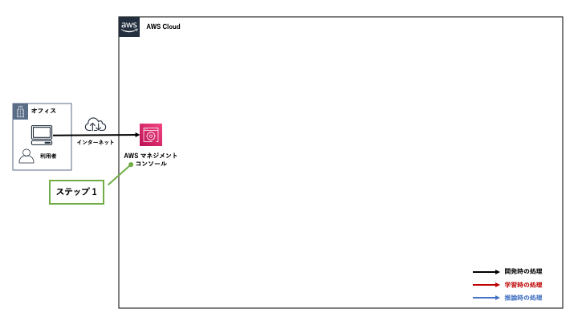
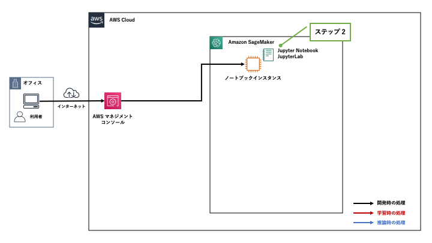

[第5回] Amazon SageMaker の基本的な使い方を理解する (1)
========================================================

はじめに
--------------------
| `前回 <https://news.mynavi.jp/itsearch/article/devsoft/4983>`_ は、ML サービスおよび Amazon SageMaker の概要と利用方法についてご説明させていただきました。
| 図を用いて「開発」「学習」「推論」の流れを説明しましたが、今回から数回の記事では、実際に Amazon SageMaker を使ってみたいと思います。
| 下記を理解していただくことを目標に解説をしていきます。

- Amazon SageMaker を使って実際に「開発」を始めるまでの準備作業の流れがわかる。
- Amazon SageMaker を使って、「開発」「学習」「推論」の流れがわかる。

実際に Amazon SageMaker を使う
---------------------------------------
`「機械学習モデルの構築およびトレーニング、デプロイ with Amazon SageMaker」 <https://aws.amazon.com/jp/getting-started/hands-on/build-train-deploy-machine-learning-model-sagemaker/>`_ というチュートリアルがありますので、これをベースに進めたいと思います。

チュートリアルの概要
^^^^^^^^^^^^^^^^^^^^^^^^^^^^
今回利用するチュートリアルの概要を下記に示します。

- Amazon SageMaker を使って、「開発」「学習」「推論」の一連の流れを体験できるものである。
- 学習・推論に利用するデータは、カリフォルニア大学アーバイン校 (UCI) が公開しているオープンデータを利用する。
  「`Bank Marketing Data Set <https://archive.ics.uci.edu/ml/datasets/Bank+Marketing>`_」と呼ばれる「ポルトガルの銀行マーケティングキャンペーン」のデータを利用する。
- このデータはポルトガルの金融機関が顧客に電話によるダイレクトマーケティングキャンペーンを行った際のデータが記録されている。
- データには大きく2種類の情報が記録されている。

  - データ 1：「年齢」や「職業」といった顧客の属性情報
  - データ 2：ダイレクトマーケティングを行った結果、その顧客が定期預金を申し込んだか否かのフラグ

- 「データ 1」から機械学習アルゴリズムによって何らかのパターンを見出して、これから営業をかける顧客 (「データ 2」が未知の顧客) の中から「定期預金を申し込む見込みのある顧客」を予測して営業活動に役立てる。

機械学習を使って見込み顧客を予測ができることにより、営業活動を効率化することができます。つまり、**無策に顧客名簿の上から順に営業をかけるよりも顧客を獲得できる可能性が高まるということであり、機械学習を導入する意義はここにあります。**

| ここでは、顧客の属性データから顧客が定期預金を「申し込む」か「申し込まないか」の二値分類を行います。
| Amazon SageMaker の組み込みアルゴリズムとして提供されている「`XGBoost リリース 0.72 <https://docs.aws.amazon.com/ja_jp/sagemaker/latest/dg/xgboost-72.html>`_」という機械学習アルゴリズムを利用します。
| 組み込みアルゴリズムとして提供されている XGBoost は「0.90-1」「0.90-2」「1.0-1」というより新しいバージョンも提供されていますが、ここではチュートリアルに従って「0.72」を利用します。
| 新しいバーションの XGBoost について知りたい方は「`XGBoost アルゴリズム <https://docs.aws.amazon.com/ja_jp/sagemaker/latest/dg/xgboost.html>`_」をご参照ください。

これから数回の記事で実施すること
^^^^^^^^^^^^^^^^^^^^^^^^^^^^^^^^^^^^^
今回利用するチュートリアルは 30 分以内に実施可能な簡単な内容ですが、下記を理解できるよう注意しながら詳しく解説を進めていきます。

- 「自分が Amazon SageMaker を使って今何をしているのか」
- 「Amazon SageMaker が背後でどのような処理が行っているか」

| 解説のボリュームが多いため、これからの 4 回に渡って解説を行っていきます。
| 解説はチュートリアルの流れに沿って進めていきますが、途中で現在地がわからなくなってしまった場合は下記の表をご参照ください。

.. list-table::
    :header-rows: 1

    * - 工程
      - ステップ
      - 枝番
      - 実施内容
      - 連載回
    * - 開発
      - 1
      - 
      - Amazon SageMaker コンソールにログインする
      - 第 5 回
    * -
      - 2
      - 
      - Amazon SageMaker notebook instance を作成する
      - 第 5 回
    * -
      - 3
      - 
      - データの準備
      - 第 6 回
    * -
      - 
      - 3a, 3b
      - ノートブックを起動する
      - 
    * -
      - 
      - 3c
      - ノートブックの利用準備をする
      - 
    * -
      - 
      - 3d
      - S3 バケットを作成する
      - 
    * -
      - 
      - 3e
      - 学習・推論に利用するデータをダウンロードする
      - 
    * -
      - 
      - 3f
      - データを分割する
      - 
    * - 学習
      - 4
      - 
      - データからのモデルのトレーニング
      - 第 7 回
    * - 
      - 
      - 4a
      - 学習データを S3 バケットにアップロードする
      - 
    * - 
      - 
      - 4b
      - 学習の設定をする
      - 
    * - 
      - 
      - 4c
      - 学習を行う
      - 
    * - 推論
      - 5
      - 
      - モデルのデプロイ
      - 第 8 回
    * - 
      - 
      - 5a
      - 推論エンドポイントを作成して、モデルをデプロイする
      - 
    * - 
      - 
      - 5b
      - 推論を行う
      - 
    * - 
      - 6
      - 
      - モデルの性能評価
      - 第 8 回
    * - 後片付け
      - 7
      - 
      - リソースを終了する
      - 第 8 回

注意事項
^^^^^^^^^^^^^^^^^^^^^^^^
今回の記事の内容を実施する際の注意事項を下記に示します。

- `第 4 回 <https://news.mynavi.jp/itsearch/article/devsoft/4983>`_  の記事で「開発」「学習」「推論」の流れを示しました。概ね同じ流れであるものの、チュートリアルの手順とは多少前後する箇所があるのでご注意ください。
- 記事で示す画面イメージや手順は、2020年7月11日時点のものとなります。仕様変更などにより表示内容や設定値に変更が入る可能性がありますので、予めご了承ください。
- 想定外の影響を避けるため、本番環境 (商用サービスが稼働する AWS アカウント) ではなく、開発環境や検証環境で実施してください。
- AWS アカウントを持っていない場合は、「`Amazon SageMaker をセットアップします <https://docs.aws.amazon.com/ja_jp/sagemaker/latest/dg/gs-set-up.html>`_」を参照して取得・セットアップをしてください。
  今回は Amazon SageMaker Studio は利用しないため、下記の 2 つの手順を実施してください。

  - 「`AWS アカウントを作成する <https://docs.aws.amazon.com/ja_jp/sagemaker/latest/dg/gs-account.html>`_」
  - 「`IAM 管理者ユーザーおよびグループの作成 <https://docs.aws.amazon.com/ja_jp/sagemaker/latest/dg/gs-account-user.html>`_」

- | チュートリアルでは下記の 4 つのいずれかのリージョンで作業する前提となっています。
  | この記事では、**「米国東部 (バージニア北部)」** で実施しています。

  - us-west-2: 米国西部 (オレゴン)
  - us-east-1: 米国東部 (バージニア北部)
  - us-east-2 : 米国東部 (オハイオ)
  - eu-west-1: 欧州 (アイルランド)

- ノートブックインスタンスの Python と主要なパッケージのバージョンは下記です。

.. list-table::
    :header-rows: 1

    * - 名前
      - バージョン
    * - Python
      - 3.6.10
    * - Numpy
      - 1.18.1
    * - Pandas
      - 1.0.3
    * - AWS SDK for Python (Boto3)
      - 1.14.16
    * - Amazon SageMaker SDK for Python
      - 1.67.1.post0

- XGBoost は組み込みアルゴリズムとして提供されている「`XGBoost リリース 0.72 <https://docs.aws.amazon.com/ja_jp/sagemaker/latest/dg/xgboost-72.html>`_」を利用します。
- **この記事の内容を実施すると数百円程度の課金が発生する可能性があります。無用な課金を避けるためには作成したリソースの削除が必要ですが、「後片付け」の手順は第 7 回に掲載予定です。あまり期間を開けずに掲載する予定であるため、課金を避けたい方は第 7 回の掲載後に試してください。**

ステップ 1: Amazon SageMaker コンソールにログインする
^^^^^^^^^^^^^^^^^^^^^^^^^^^^^^^^^^^^^^^^^^^^^^^^^^^^^^^^^^^
AWS マネジメントコンソールにログインして、Amazon SageMaker のコンソールに移動します。

実施手順
********************
AWS マネジメントコンソールに自身の IAM ユーザでログインします。

.. image:: ../../../images/blog/5th/aws-management-console.png
  :width: 900px

リージョンは「 **米国東部 (バージニア北部)** 」を利用しますので、その他のリージョンにいる場合は AWS マネジメントコンソールの右上のプルダウンメニューから移動してください。

.. image:: ../../../images/blog/5th/region-check.png
  :width: 600px

| それでは、Amazon SageMaker に移動します。
| 「サービスを検索する」の箇所にある検索バーに「sage」程度を入れると、「Amazon SageMaker」が登場しますので、これをクリックして移動します。

.. image:: ../../../images/blog/5th/search-sagemaker.png
  :width: 900px

下記のいずれかの画面に移動しますが、どちらでも問題ありません。

.. image:: ../../../images/blog/5th/sagemaker-initial.png
  :width: 900px

.. image:: ../../../images/blog/5th/sagemaker-dashboard.png
  :width: 900px

ステップ 2: Amazon SageMaker notebook instance を作成する
^^^^^^^^^^^^^^^^^^^^^^^^^^^^^^^^^^^^^^^^^^^^^^^^^^^^^^^^^^^^^^^^^^^^^^^^^
学習・推論用のコードの開発環境となる「ノートブックインスタンス」を作成していきます。

実施手順
********************
| 左側の折りたたみメニューの「ノートブック」をクリックして開き、「ノートブックインスタンス」をクリックします。
| ダッシュボードにいる場合は、画面中央の「概要」の中にある「ノートブックインスタンス」をクリックしても構いません。

.. image:: ../../../images/blog/5th/sagemaker-dashboard-notebook.png
  :width: 900px

| ノートブックインスタンスの画面に移動します。
| 現在はノートブックインスタンスが存在しませんが、ここにそのリージョンに存在するノートブックインスタンスの一覧が表示されます。

.. image:: ../../../images/blog/5th/sagemaker-notebook-instance-initial.png
  :width: 900px

ノートブックインスタンスの作成画面に移動します。

.. image:: ../../../images/blog/5th/sagemaker-notebook-instance-create.png
  :width: 900px

| ノートブックインスタンス作成時の設定項目を下記の表に示します。
| 今回は簡単なチュートリアルですので、原則としてデフォルト値を設定します。各設定値の説明を記しますので、実際の業務で利用する際は要件に従って適切に設定してください。
| 設定が完了したら、画面の最下部にある「ノートブックインスタンスの作成」をクリックします。

.. list-table::
    :header-rows: 1

    * - 大分類
      - 小分類
      - 設定値名
      - 説明
      - デフォルト値
    * - ノートブックインスタンス設定
      - 
      - ノートブックインスタンス名
      - | ノートブックインスタンスの名前を設定する。
        | 最大 63 文字まで設定可能。英数字もしくはハイフン (-) の利用が可能。
        | 1つのAWS リージョンのアカウント内で一意である必要がある。
      - | (空白)
        | 今回は「mynotebook」と設定
    * - 
      - 
      - ノートブックインスタンスのタイプ
      - | ノートブックインスタンスのタイプを設定する。
        | まずは「ml.t2.medium」など小さいインスタンスで試した方が良い。
        | CPU やメモリなどのリソース不足が発生した場合にスケールアップもしくは不足するリソースに応じたインスタンスタイプを選択する。
        | (例) CPUを重点的に増やしたい：コンピューティング最適化 (ml.c5.large など)、 メモリを重点的に増やしたい：メモリの最適化 (ml.r5.large など)
        | `「Amazon SageMaker ML インスタンスタイプ」 <https://aws.amazon.com/jp/sagemaker/pricing/instance-types/>`_
        | `「Amazon SageMaker の料金」 <https://aws.amazon.com/jp/sagemaker/pricing/>`_
      - ml.t2.medium
    * - 
      - 
      - Elastic Inference
      - | GPU リソースをアタッチする。ディープラーニングフレームワーク TensorFlow、 Apache MXNet、PyTorch でサポートされている。 
        | `「Amazon SageMaker Elastic Inference (EI) を使用する」 <https://docs.aws.amazon.com/ja_jp/sagemaker/latest/dg/ei.html>`_
      - なし
    * - 
      - 追加設定
      - ライフサイクル設定
      - ノートブックインスタンスの作成時にスクリプトを実行して、ノートブックインスタンスをカスタマイズする。
      - 設定値なし
    * - 
      - 
      - ボリュームサイズ (GB 単位)
      - | ノートブックインスタンスにアタッチする EBS ボリューム (ディスク) のサイズ。
        | ボリュームサイズは 5 GB - 16 TB の範囲で設定可能。 
      - 5
    * - アクセス許可と暗号化
      - 
      - IAM ロール
      - | ノートブックインスタンスに付与する AWS リソースの操作権限を IAM ロールとして設定する。
        | AmazonSageMakerFullAccess を付与する場合、`「AmazonSageMakerFullAccess ポリシー」 <https://docs.aws.amazon.com/ja_jp/sagemaker/latest/dg/sagemaker-roles.html#sagemaker-roles-amazonsagemakerfullaccess-policy>`_ に記載されている操作権限が付与される。
      - 新しい IAM ロールの作成
    * - 
      - 
      - ルートアクセス - オプション
      - 
      - 有効化 - ノートブックへのルートアクセス権をユーザーに付与する
    * - 
      - 
      - 暗号化キー - オプション
      - ノートブックインスタンスにアタッチする EBS ボリューム (ディスク) の Amazon KMS の暗号鍵を設定する。
      - カスタム暗号化なし
    * - ネットワーク - オプション
      - 
      - VPC - オプション
      - 
      - 非 VPC
    * - Git リポジトリ - オプション
      - デフォルトのリポジトリ
      - リポジトリ
      - | ノートブックインスタンスの作成時に自動で Git リポジトリをクローンする。
        | 例えば、学習・推論用コードが格納された Git リポジトリやアプリのコードが格納されたリポジトリを自動でクローンし、その分の手間が省ける。
        | デフォルトのリポジトリを1つ、追加のリポジトリを最大3つ設定可能。
      - なし
    * - タグ - オプション
      - 
      - キー、値
      - | キーバリュー形式で値を設定する。
        | (例) Name タグ (Name: *<notebook_instance_name>*)、環境タグ (Environment: Production)
      - (空白)

| ノートブックインスタンスに付与する IAM ロールに関して補足します。
| IAM ロールは AWS のリソースに操作権限を与えるために利用します。
| 例えば、学習用データの取得のためにノートブックインスタンスから Amazon S3 のバケットにアクセスが必要となります。
| IAM ユーザに紐づく認証情報として「アクセスキー ID」と「シークレットキー」がありますが、これをコードにハードコーディングすることはアンチパターンとなります。
| IAM ロールに操作権限を定義してノートブックインスタンスに付与することで、具体的な認証情報を記述せずに操作権限を付与することができます。

- (備忘) 図を入れる。

| 今回新規作成した IAM ロールは「AmazonSageMakerFullAccess ポリシー」が操作権限として与えられています。
| 特に、下記の条件に当てはまる Amazon S3 のバケットとオブジェクトの操作権限が与えられる点に注意してください。

.. list-table::
  :header-rows: 1

  * - 条件
    - 説明
  * - 指定する S3 バケット - オプション
    - | 本項目以外の条件に当てはまらない S3 バケットに対するアクセスを許可する。オプション項目であり、これを設定しないことも可能。
      | - **任意の S3 バケット**
      | (例) my-s3-bucket
      | - **特定の S3 バケット**
      | (例) my-s3-bucket-1, my-s3-bucket-2
      | - **なし**
  * - 名前に「sagemaker」が含まれる任意の S3 バケット
    - | 下記のように S3 バケット名に「sagemaker」を含む S3 バケットにはアクセスが可能。
      | (例) **アクセス可能** : my-sagemaker-s3-bucket、**アクセス不可能** : my-s3-bucket
  * - 名前に「sagemaker」が含まれる任意の S3 オブジェクト
    - | 下記のように S3 バケットに格納されているオブジェクト (ファイル) 名に 「sagemaker」を含むオブジェクトにはアクセスが可能。
      | (例) **アクセス可能** : my-sagemaker-object.csv、**アクセス不可能** : my-object.csv
  * - タグ「sagemaker」と値「true」が含まれる任意の S3 オブジェクトにはアクセスが可能。
    - | キーが「sagemaker」、値が「true」と設定されたオブジェクトにはアクセスが可能。
  * - SageMaker へのアクセスを許可するバケットポリシーを持つ S3 バケット
    - 条件に記載されている通り、バケットポリシーにて Amazon SageMaker のアクセスが許可された S3 バケットにはアクセスが可能。

| 設定値に問題がなければ画面が切り替わり、「成功! ノートブックインスタンスが作成されています。」と表示されます。
| 数分間待って、「ステータス」が「**Pending**」から「**InService**」に変わると、ノートブックインスタンスの作成が完了です。

.. image:: ../../../images/blog/5th/sagemaker-notebook-instance-create-pending.png
  :width: 900px

.. image:: ../../../images/blog/5th/sagemaker-notebook-instance-create-inservice.png
  :width: 900px

まとめ
--------------------
| 今回の記事では、Amazon SageMaker のチュートリアルをベースにして、ノートブックインスタンスの作成するまでの手順をご説明させていただきました。
| 次回は学習の実行までの手順を扱います。

参考文献
-----------------
- `「機械学習モデルの構築およびトレーニング、デプロイ with Amazon SageMaker」 <https://aws.amazon.com/jp/getting-started/hands-on/build-train-deploy-machine-learning-model-sagemaker/>`_
- `「Amazon SageMaker 開発者ガイド」 <https://docs.aws.amazon.com/ja_jp/sagemaker/latest/dg/whatis.html>`_
- `「Amazon SageMaker ML インスタンスタイプ」 <https://aws.amazon.com/jp/sagemaker/pricing/instance-types/>`_
- `「Amazon SageMaker の料金」 <https://aws.amazon.com/jp/sagemaker/pricing/>`_

+++++++++++

.. include:: ../author/author.rst
