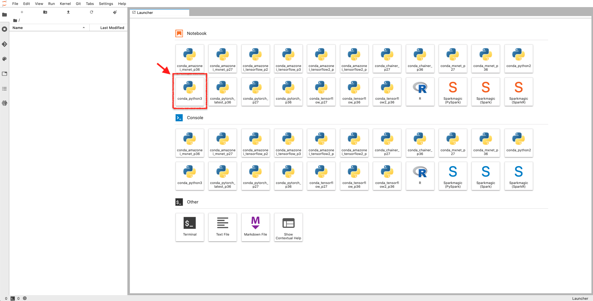
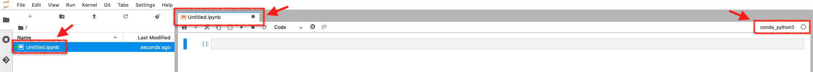

[第6回] Amazon SageMaker の基本的な使い方を理解する (2)
========================================================

はじめに
--------------------
| 前回は、Amazon SageMaker のチュートリアルをベースにして、ノートブックインスタンスの作成までをご説明させていただきました。
| 早速続きの手順から実施していきたいと思います。

今回の記事で実施すること
^^^^^^^^^^^^^^^^^^^^^^^^^^^^^^^^^^^^^
今回は下記の表の「ステップ 3: データの準備」を扱います。

.. list-table::
    :header-rows: 1

    * - 工程
      - ステップ
      - 枝番
      - 実施内容
      - 連載回
    * - 開発
      - 1
      - 
      - Amazon SageMaker コンソールにログインする
      - 第 5 回
    * -
      - 2
      - 
      - Amazon SageMaker notebook instance を作成する
      - 第 5 回
    * -
      - 3
      - 
      - データの準備
      - 第 6 回
    * -
      - 
      - 3a, 3b
      - ノートブックを起動する
      - 
    * -
      - 
      - 3c
      - ノートブックの利用準備をする
      - 
    * -
      - 
      - 3d
      - S3 バケットを作成する
      - 
    * -
      - 
      - 3e
      - 学習・推論に利用するデータをダウンロードする
      - 
    * -
      - 
      - 3f
      - データを分割する
      - 
    * - 学習
      - 4
      - 
      - データからのモデルのトレーニング
      - 第 7 回
    * - 
      - 
      - 4a
      - 学習データを S3 バケットにアップロードする
      - 
    * - 
      - 
      - 4b
      - 学習の設定をする
      - 
    * - 
      - 
      - 4c
      - 学習を行う
      - 
    * - 推論
      - 5
      - 
      - モデルのデプロイ
      - 第 8 回
    * - 
      - 
      - 5a
      - 推論エンドポイントを作成して、モデルをデプロイする
      - 
    * - 
      - 
      - 5b
      - 推論を行う
      - 
    * - 
      - 6
      - 
      - モデルの性能評価
      - 第 8 回
    * - 後片付け
      - 7
      - 
      - リソースを終了する
      - 第 8 回

ステップ 3: データの準備
-------------------------------------
ノートブックインスタンスの作成まで完了したので、ノートブックを起動してデータの準備を行います。

.. image:: ../../../images/blog/5th/amazon-sagemaker-tutorial-step3.png
  :width: 900px

ステップ 3a, 3b: ノートブックを起動する
^^^^^^^^^^^^^^^^^^^^^^^^^^^^^^^^^^^^^^^^^
| Amazon SageMaker のノートブックインスタンスでは、「Jupyter Notebook」もしくは「JupyterLab」が利用できます。
| これらがプリインストールされた状態でノートブックインスタンスが作成されており、利用者側でインストールは必要ありません。

| Jupyter Notebook、JupyterLab は、「`Project Jupyter <https://jupyter.org/index.html>`_」と呼ばれる非営利の OSS プロジェクトにより管理されているプログラミングのツールです。
| Python をはじめとして、R や Spark など様々な言語で利用することができます。

| コードを「セル」と呼ばれるブロックに記載して、少しずつ確認しながら実行することができます。
| また、マークダウンでテキストや画像、数式なども記載することもできますので、従来のテキストベースのソースコードと比較すると背景や設計根拠などを詳細に残すことができます。

- (備忘) サンプルか何かのノートブックの画像を入れる。

| JupyterLab は Jupyter Notebook の後継となるノートブックです。
| このチュートリアルを実施範囲ではどちらを選んでも問題ありません。
| AWS のチュートリアルは Jupyter Notebook を利用していますので、こちらの記事では「**JupyterLab**」を利用して進めたいと思います。

| 「アクション」の「JupyterLab を開く」をクリックします。
| なお、前者をクリックすると従来からの Jupyter notebook が起動し、後者をクリックすると JupyterLab が起動します。

.. image:: ../../../images/blog/5th/sagemaker-notebook-launch.png
  :width: 900px

| JupyterLab を起動すると、下記のような「Launcher」タブが表示されます。
| Python を中心に様々な実行環境が用意されています。
| このチュートリアルでは、Python 3 の実行環境があれば良いので、「Notebook」の配下にある「conda_python3」をダブルクリックします。

| すると、「Untitled.ipynb」というタブに切り替わり、左側のメニューに同名のファイルが表示されます。
| これは Jupyter Notebook のファイルとなります。
| 今回はこの状態のまま進みますが、左側のメニューを右クリックして、「Rename」を選択することによりファイル名を変更することも可能です。

ステップ 3c: ノートブックの利用準備をする
^^^^^^^^^^^^^^^^^^^^^^^^^^^^^^^^^^^^^^^^^^^^^^^^^^^
ノートブックが起動しましたので、ノートブックの利用準備としてこのチュートリアルで利用するライブラリ (モジュール) の読み込み (インポート) や権限の設定などを行います。

実行するコード
********************
下記のコードをセルにコピー＆ペーストして実行してください。

| グレーの部分を「セル」と呼び、ここにコードを記述していきます。
| 下記のコードをコピー＆ペーストして、「Run」を押下するか、「Shift」+「Enter」で実行できます。
| この後もいくつかコードを示しますが、同様の方法で実行してください。

.. code-block:: python

  # import libraries
  import boto3, re, sys, math, json, os, sagemaker, urllib.request
  from sagemaker import get_execution_role
  import numpy as np
  import pandas as pd
  import matplotlib.pyplot as plt
  from IPython.display import Image
  from IPython.display import display
  from time import gmtime, strftime
  from sagemaker.predictor import csv_serializer

  # Define IAM role
  role = get_execution_role()
  prefix = 'sagemaker/DEMO-xgboost-dm'
  containers = {'us-west-2': '433757028032.dkr.ecr.us-west-2.amazonaws.com/xgboost:latest',
                'us-east-1': '811284229777.dkr.ecr.us-east-1.amazonaws.com/xgboost:latest',
                'us-east-2': '825641698319.dkr.ecr.us-east-2.amazonaws.com/xgboost:latest',
                'eu-west-1': '685385470294.dkr.ecr.eu-west-1.amazonaws.com/xgboost:latest'} # each region has its XGBoost container
  my_region = boto3.session.Session().region_name # set the region of the instance
  print("Success - the MySageMakerInstance is in the " + my_region + " region. You will use the " + containers[my_region] + " container for your SageMaker endpoint.")

| セルの下側に下記のメッセージが出力されれば成功であり、一旦ノートブックインスタンスとノートブックが正常に作成できたと考えて良いと思います。
| *Success - the MySageMakerInstance is in the us-east-1 region. You will use the 811284229777.dkr.ecr.us-east-1.amazonaws.com/xgboost:latest container for your SageMaker endpoint.*

コードの解説
********************
ここでは「`# import libraries`」と「`# Define IAM role`」から始まる大きく2つの処理に分けられます。

.. code-block:: python

  # import libraries
  import boto3, re, sys, math, json, os, sagemaker, urllib.request
  from sagemaker import get_execution_role
  import numpy as np
  import pandas as pd
  # (以下、省略)

| 「`# import libraries`」から始まる処理では、チュートリアルの実行に必要なライブラリ (モジュール) の読み込み (インポート) を行っています。
| Python でよく利用される「Numpy」や「Pandas」に加えて、「Boto3」と呼ばれる 「`AWS SDK for Python <https://aws.amazon.com/jp/sdk-for-python/>`_」、その名の通りで Amazon SageMaker の Python 向け SDK である「`Amazon SageMaker SDK for Python <https://sagemaker.readthedocs.io/en/stable/>`_」を読み込んでいます。
| Matplotlib など利用しないものも一部含まれますが、ここでは一旦無視しましょう。

.. code-block:: python

  # Define IAM role
  role = get_execution_role()
  prefix = 'sagemaker/DEMO-xgboost-dm'
  containers = {'us-west-2': '433757028032.dkr.ecr.us-west-2.amazonaws.com/xgboost:latest',
                'us-east-1': '811284229777.dkr.ecr.us-east-1.amazonaws.com/xgboost:latest',
                'us-east-2': '825641698319.dkr.ecr.us-east-2.amazonaws.com/xgboost:latest',
                'eu-west-1': '685385470294.dkr.ecr.eu-west-1.amazonaws.com/xgboost:latest'} # each region has its XGBoost container
  my_region = boto3.session.Session().region_name # set the region of the instance

「`# Define IAM role`」から始まる処理では、主に下記を実行しています。

| 1. ノートブックインスタンスにアタッチした IAM ロールの実行権限の取得
| 2. S3 バケットのプレフィックスの設定
| 3. 組み込みアルゴリズム XGBoost のコンテナイメージの ECR レジストリのパスの設定
| 4. リージョンの設定

特に、1 と 3 の処理について見ていきます。

1. ノートブックインスタンスにアタッチした IAM ロールの実行権限の取得
~~~~~~~~~~~~~~~~~~~~~~~~~~~~~~~~~~~~~~~~~~~~~~~~~~~~~~~~~~~~~~~~~~~~~~

.. code-block:: python

  role = get_execution_role()

| ノートブックインスタンスの実行ロールの ARN を取得して、その実行ロールを使用して操作を行います。
| ここでいう「実行ロール」とは、ノートブックインスタンス作成時に新規作成した IAM ロールであり、「AmazonSageMakerFullAccess ポリシー」が操作権限として与えられています。
| 詳細に知りたい方は、「`Amazon SageMaker の実行ロールを取得する <https://docs.aws.amazon.com/ja_jp/sagemaker/latest/dg/automatic-model-tuning-ex-role.html>`_」「`sagemaker.session.get_execution_role(sagemaker_session=None) <https://sagemaker.readthedocs.io/en/stable/api/utility/session.html#sagemaker.session.get_execution_role>`_」を参照してください。

3. 組み込みアルゴリズム XGBoost のコンテナイメージの ECR レジストリのパスの設定
~~~~~~~~~~~~~~~~~~~~~~~~~~~~~~~~~~~~~~~~~~~~~~~~~~~~~~~~~~~~~~~~~~~~~~~~~~~~~~~~~~~~~~~

.. code-block:: python

  containers = {'us-west-2': '433757028032.dkr.ecr.us-west-2.amazonaws.com/xgboost:latest',
                'us-east-1': '811284229777.dkr.ecr.us-east-1.amazonaws.com/xgboost:latest',
                'us-east-2': '825641698319.dkr.ecr.us-east-2.amazonaws.com/xgboost:latest',
                'eu-west-1': '685385470294.dkr.ecr.eu-west-1.amazonaws.com/xgboost:latest'} # each region has its XGBoost container

| 前回説明したように、Amazon SageMaker では Amazon ECR から学習用コンテナイメージをダウンロードし、学習用インスタンス上でコンテナを起動して学習を行います。
| 「組み込みアルゴリズムによる学習を行う」とは、すなわち、「AWS が管理する学習用コンテナイメージを利用して学習を行う」ということです。

| 上記のコードは AWS が管理する Amazon ECR のレジストリから「XGBoost リリース 0.72 のコンテナイメージで最新 (latest) 」取得するための設定です。
| AWS が管理する Amazon ECR のレジストリはリージョンごとに用意されており、今回は「バージニア北部 (us-east-1)」ですので、「`811284229777.dkr.ecr.us-east-1.amazonaws.com/xgboost:latest`」からコンテナイメージを取得します。
| 「東京 (ap-northeast-1)」で利用する場合は、「`'ap-northeast-1': '501404015308.dkr.ecr.ap-northeast-1.amazonaws.com'`」を追加するなどコードの改変が必要です。

| また、今回は「XGBoost リリース 0.72」を利用していますが、より新しい「XGBoost リリース 0.90」もリリースされています。
| リリース 0.72 と 0.90 とではレジストリのパスが異なりますので、ご注意ください。
| 詳細に知りたい方は、「`組み込みアルゴリズムの共通パラメータ <https://docs.aws.amazon.com/ja_jp/sagemaker/latest/dg/sagemaker-algo-docker-registry-paths.html>`_」を参照してください。
| 今回は組み込みアルゴリズムの中から XGBoost を利用していますが、その他のアルゴリズムについても記載されていますので、応用する際に参照して適切に変更してください。

ステップ 3d: S3 バケットを作成する
^^^^^^^^^^^^^^^^^^^^^^^^^^^^^^^^^^^^^^^^^
| 前のセクションで開発環境であるノートブックインスタンスの作成が完了しました。
| ここでは、学習・推論に利用するデータを格納するための S3 バケットを作成します。
| 作業は引き続き、JupyterLab で行います。

- (備忘) このセクションでの該当箇所は下記の赤枠です。

.. image:: ../../../images/amazon_sagemaker_notebook_instance_1.png
  :width: 900px

実行するコード
********************
下記のコードをセルにコピー＆ペーストして実行してください。

| 下記のコードをセルにコピー＆ペーストした後に、必ず ** `bucket_name` の `your-s3-bucket-name` の箇所を変更してから** 実行してください。
| S3 バケット名は世界で唯一の値にする必要がありますので、名前が重複するとエラーとなります。
| S3 バケット名には、「AWS アカウント ID (12桁の数字)」を含めるなどすると重複しづらいと思います。検証目的であれば「日付」を入れても良いと思います。

.. code-block:: python

  bucket_name = 'your-s3-bucket-name' # <--- CHANGE THIS VARIABLE TO A UNIQUE NAME FOR YOUR BUCKET
  s3 = boto3.resource('s3')
  try:
      if  my_region == 'us-east-1':
        s3.create_bucket(Bucket=bucket_name)
      else: 
        s3.create_bucket(Bucket=bucket_name, CreateBucketConfiguration={ 'LocationConstraint': my_region })
      print('S3 bucket created successfully')
  except Exception as e:
      print('S3 error: ',e)

コードの解説
********************
| チュートリアルでは AWS SDK for Python (Boto3) を利用してノートブックから S3 バケットを作成する方法が示されています。
| AWS マネジメントコンソールを利用しても同等の作業ができますが、ノートブックで作成した方が後々の開発効率を考えても好ましいと考えられます。
| 作業の慣れの問題でもあると考えられるので、これを機に習得した方が良いと思います。

.. code-block:: python

  s3 = boto3.resource('s3')

| AWS SDK for Python (Boto3) では、 AWS のリソースを操作する方法に「Resources」と「Clients」の2種類があります。
| このチュートリアルでは、抽象度の高い「Resources」の方の API を使って S3 バケットを作成しています。

- `Resources <https://boto3.amazonaws.com/v1/documentation/api/latest/guide/resources.html>`_ : 高レベルのオブジェクト指向インターフェース。Clients と比べて抽象度が高い。
- `Clients <https://boto3.amazonaws.com/v1/documentation/api/latest/guide/clients.html>`_: 低レベルのサービス接続。メソッドはサービス API とほぼ1：1で対応し、すべてのサービスの操作がサポートされる。

.. code-block:: python

  if  my_region == 'us-east-1':
    s3.create_bucket(Bucket=bucket_name)
  else: 
    s3.create_bucket(Bucket=bucket_name, CreateBucketConfiguration={ 'LocationConstraint': my_region })

| `create_bucket <https://boto3.amazonaws.com/v1/documentation/api/latest/reference/services/s3.html#S3.Client.create_bucket>`_ メソッドの `CreateBucketConfiguration` という引数では S3 バケットを作成するリージョンを指定します。
| これが省略された場合、作成するリージョンが「バージニア北部 (us-east-1)」となるため、`my_region` の値によって条件分岐をしています。

ステップ 3e: 学習・推論に利用するデータをダウンロードする
^^^^^^^^^^^^^^^^^^^^^^^^^^^^^^^^^^^^^^^^^^^^^^^^^^^^^^^^^^^^^^
| 前のセクションで学習・推論用のデータを格納するための S3 バケットの作成が完了しました。
| ここでは、インターネット上で公開されているデータをノートブックインスタンスのローカルディスク上にダウンロードして簡単な前処理を行います。
| 作業は引き続き、JupyterLab で行います。

実行するコード
********************
下記のコードをセルにコピー＆ペーストして実行してください。

.. code-block:: python

  try:
    urllib.request.urlretrieve ("https://d1.awsstatic.com/tmt/build-train-deploy-machine-learning-model-sagemaker/bank_clean.27f01fbbdf43271788427f3682996ae29ceca05d.csv", "bank_clean.csv")
    print('Success: downloaded bank_clean.csv.')
  except Exception as e:
    print('Data load error: ',e)

  try:
    model_data = pd.read_csv('./bank_clean.csv',index_col=0)
    print('Success: Data loaded into dataframe.')
  except Exception as e:
      print('Data load error: ',e)

コードの解説
********************

.. code-block:: python

  urllib.request.urlretrieve ("https://d1.awsstatic.com/tmt/build-train-deploy-machine-learning-model-sagemaker/bank_clean.27f01fbbdf43271788427f3682996ae29ceca05d.csv", "bank_clean.csv")

| `urllib.request.urlretrieve <https://docs.python.org/ja/3.6/library/urllib.request.html#urllib.request.urlretrieve>`_ メソッドは、引数に指定した URL からファイルをローカルにダウンロードします。
| 引数に示した URL は ドメイン名から AWS の静的ファイルを配布するための CDN サービスである Amazon CloudFront もしくは Amazon S3 と思われます。
| ここからノートブックインスタンスのローカルディスク上に、学習や推論に利用するデータである「Bank Marketing Data Set」をダウンロードしています。

| AWS が配布しているデータは、チュートリアルを進めやすいように前処理の実施済のデータです。
| UCI の Machine Learning Repository で公開されているデータをダウンロードして利用する場合は、そのままの状態では利用できず、機械学習で利用できるようにデータの前処理が必要となりますのでご注意ください。

ステップ 3f: データを分割する
^^^^^^^^^^^^^^^^^^^^^^^^^^^^^^^^^^^^

実行するコード
********************
下記のコードをセルにコピー＆ペーストして実行してください。

.. code-block:: python

  train_data, test_data = np.split(model_data.sample(frac=1, random_state=1729), [int(0.7 * len(model_data))])
  print(train_data.shape, test_data.shape)

コードの解説
********************

.. code-block:: python

  train_data, test_data = np.split(model_data.sample(frac=1, random_state=1729), [int(0.7 * len(model_data))])

| Numpy の split メソッドを使って、DataFrame として読み込んだデータ (model_data) を学習データ (train_data) とテストデータ (test_data) を 7:3 の割合で分割しています。
| 更に、Pandas の `sample <https://pandas.pydata.org/pandas-docs/stable/reference/api/pandas.DataFrame.sample.html>`_ メソッドを使ってランダムにデータを選択することでデータの順序性を排除しています。

まとめ
--------------------
| 今回の記事では、Amazon SageMaker のチュートリアルをベースにして、学習・推論に利用するデータの準備を行う手順をご説明させていただきました。
| 次回は、今回準備したデータを使って学習を行います。

+++++++++++

.. include:: ../author/author.rst
