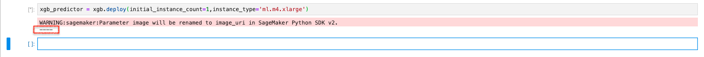
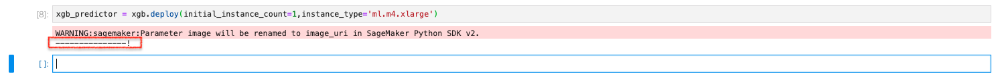
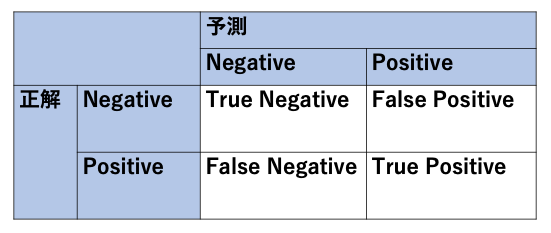
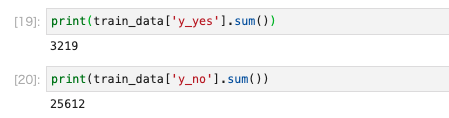
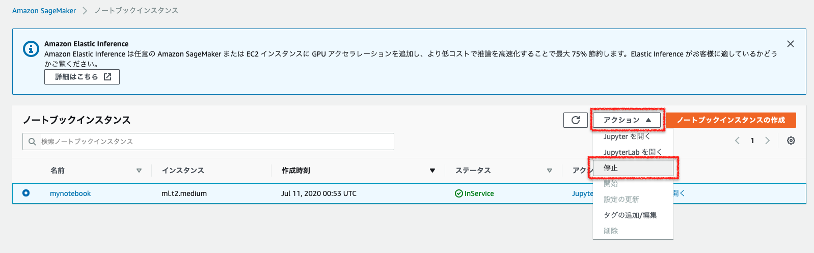
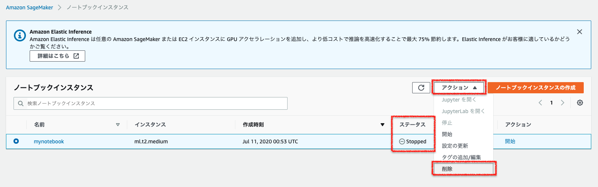
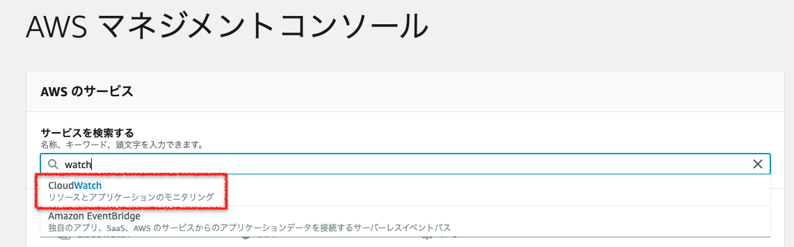
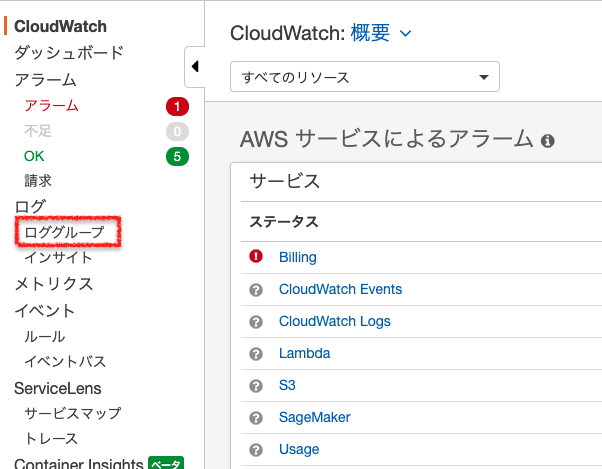
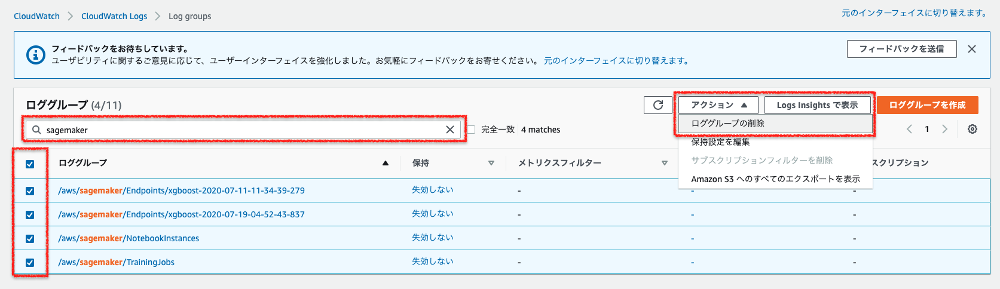
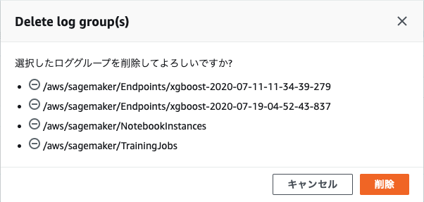

[第8回] Amazon SageMaker の基本的な使い方を理解する (4)
========================================================

はじめに
--------------------
| 前回は、Amazon SageMaker のチュートリアルをベースにして、学習を行って機械学習モデルの構築まで実施しました。
| 今回は学習を行って構築した機械学習モデルを使って、推論を実行してみます。

今回の記事で実施すること
^^^^^^^^^^^^^^^^^^^^^^^^^^^^^^^^^^^^^
今回は下記の表の「ステップ 5: モデルのデプロイ」、「ステップ 6: モデルの性能評価」、「ステップ 7: モデルの性能評価」を扱います。

.. list-table::
    :header-rows: 1

    * - 工程
      - ステップ
      - 枝番
      - 実施内容
      - 連載回
    * - 開発
      - 1
      - 
      - Amazon SageMaker コンソールにログインする
      - 第 5 回
    * -
      - 2
      - 
      - Amazon SageMaker notebook instance を作成する
      - 第 5 回
    * -
      - 3
      - 
      - データの準備
      - 第 6 回
    * -
      - 
      - 3a, 3b
      - ノートブックを起動する
      - 
    * -
      - 
      - 3c
      - ノートブックの利用準備をする
      - 
    * -
      - 
      - 3d
      - S3 バケットを作成する
      - 
    * -
      - 
      - 3e
      - 学習・推論に利用するデータをダウンロードする
      - 
    * -
      - 
      - 3f
      - データを分割する
      - 
    * - 学習
      - 4
      - 
      - データからのモデルのトレーニング
      - 第 7 回
    * - 
      - 
      - 4a
      - 学習データを S3 バケットにアップロードする
      - 
    * - 
      - 
      - 4b
      - 学習の設定をする
      - 
    * - 
      - 
      - 4c
      - 学習を行う
      - 
    * - 推論
      - 5
      - 
      - モデルのデプロイ
      - 第 8 回
    * - 
      - 
      - 5a
      - 推論エンドポイントを作成して、モデルをデプロイする
      - 
    * - 
      - 
      - 5b
      - 推論を行う
      - 
    * - 
      - 6
      - 
      - モデルの性能評価
      - 第 8 回
    * - 後片付け
      - 7
      - 
      - リソースを終了する
      - 第 8 回

ステップ 5: モデルのデプロイ
--------------------------------------
学習を実行し、機械学習モデルの構築まで完了しました。ここでは、機械学習モデルをデプロイします。

ステップ 5a: 推論エンドポイントを作成して、モデルをデプロイする
^^^^^^^^^^^^^^^^^^^^^^^^^^^^^^^^^^^^^^^^^^^^^^^^^^^^^^^^^^^^^^^^
| ここでいう「デプロイ」とは、API サーバの構築を指します。
| 下記に示す一連の処理を deploy メソッドを利用することで実行できます。

- 推論用インスタンスの作成
- S3 バケットからの機械学習モデルのダウンロード
- 推論用コンテナの起動
- API の公開

実行するコード
********************
下記のコードをセルにコピー＆ペーストして実行してください。

.. code-block:: python

  xgb_predictor = xgb.deploy(initial_instance_count=1,instance_type='ml.m4.xlarge')

なお、デプロイが開始されると、下記の画像に示したように処理の進行とともに「- (ハイフン)」が出力されていきます。

デプロイが完了すると、下記のように完了を示す「!」が出力されます。
デプロイ処理は数分で完了します。

コードの解説
********************

.. code-block:: python

  xgb_predictor = xgb.deploy(
    initial_instance_count=1,
    instance_type='ml.m4.xlarge'
  )

| この処理も改行して記載します。
| `deploy <https://sagemaker.readthedocs.io/en/stable/api/training/estimators.html#sagemaker.estimator.Estimator.deploy>`_ メソッドを使って、機械学習モデルのデプロイを実行します。
| ここで設定するパラメータ (引数) とそれぞれの意味を下記に示します。

.. list-table::
    :header-rows: 1

    * - パラメータ (引数)
      - パラメータの意味
    * - initial_instance_count
      - | 推論用インスタンス数を設定する。
    * - instance_type
      - | 推論用インスタンスのインスタンスタイプを設定する。
        | ML インスタンスとして様々なタイプが用意されており、学習の特性に応じたものを選択する。
        | ここでは、汎用 (M4) の xlarge を設定している。その他に利用できるインスタンスタイプと料金は下記を参照のこと。
        | - 「`Amazon SageMaker ML インスタンスタイプ <https://aws.amazon.com/jp/sagemaker/pricing/instance-types/>`_」
        | - 「`Amazon SageMaker の料金 <https://aws.amazon.com/jp/sagemaker/pricing/>`_」

| 推論用インスタンスを作成して、S3 バケットから学習済の機械学習モデルを、Amazon ECR から推論用コンテナイメージをダウンロードして、推論用コンテナを起動します。
| アプリなどからアクセスするためのエンドポイントを作成しています。エンドポイントには HTTPS で接続します。

ステップ 5b: 推論を行う
^^^^^^^^^^^^^^^^^^^^^^^^^^^^^^

実行するコード
********************
下記のコードをセルにコピー＆ペーストして実行してください。

.. code-block:: python

  test_data_array = test_data.drop(['y_no', 'y_yes'], axis=1).values #load the data into an array
  xgb_predictor.content_type = 'text/csv' # set the data type for an inference
  xgb_predictor.serializer = csv_serializer # set the serializer type
  predictions = xgb_predictor.predict(test_data_array).decode('utf-8') # predict!
  predictions_array = np.fromstring(predictions[1:], sep=',') # and turn the prediction into an array
  print(predictions_array.shape)

実行した結果出力される `(12357,)` は、予測した顧客の数 (12,357人) です。

コードの解説
********************

.. code-block:: python

  test_data_array = test_data.drop(['y_no', 'y_yes'], axis=1).values #load the data into an array

| 前段でデータを学習データとテストデータに分割しました。
| その際には単純に分割しただけで、テストデータには正解の値 (「y_yes」と「y_no」) が含まれます。
| 顧客の属性情報から申し込みを行うか否かを予測したいので、正解の値を削除 (drop) しています。

.. code-block:: python

  xgb_predictor.content_type = 'text/csv' # set the data type for an inference
  xgb_predictor.serializer = csv_serializer # set the serializer type

推論に用いるテストデータの Content type とシリアライザのタイプに CSV 用のものを指定しています。

.. code-block:: python

  predictions = xgb_predictor.predict(test_data_array).decode('utf-8') # predict!

テストデータを推論エンドポイントに送信して、推論結果を得ています。

.. code-block:: python

  predictions_array = np.fromstring(predictions[1:], sep=',') # and turn the prediction into an array

推論結果がカンマ区切りのテキストデータで返されるので、後続の精度の評価をするために Numpy の `fromstring <https://numpy.org/doc/1.18/reference/generated/numpy.fromstring.html>`_ メソッドを使って Array に変換しています。

ステップ 6: モデルの性能評価
^^^^^^^^^^^^^^^^^^^^^^^^^^^^^^^^^^^^
| 推論結果を得ることができましたので、最後に精度の評価を行います。
| 二値分類の精度評価においてよく利用される「混同行列 (confusion matrix)」を使います。

実行するコード
********************
下記のコードをセルにコピー＆ペーストして実行してください。

.. code-block:: python

  cm = pd.crosstab(index=test_data['y_yes'], columns=np.round(predictions_array), rownames=['Observed'], colnames=['Predicted'])
  tn = cm.iloc[0,0]; fn = cm.iloc[1,0]; tp = cm.iloc[1,1]; fp = cm.iloc[0,1]; p = (tp+tn)/(tp+tn+fp+fn)*100
  print("\n{0:<20}{1:<4.1f}%\n".format("Overall Classification Rate: ", p))
  print("{0:<15}{1:<15}{2:>8}".format("Predicted", "No Purchase", "Purchase"))
  print("Observed")
  print("{0:<15}{1:<2.0f}% ({2:<}){3:>6.0f}% ({4:<})".format("No Purchase", tn/(tn+fn)*100,tn, fp/(tp+fp)*100, fp))
  print("{0:<16}{1:<1.0f}% ({2:<}){3:>7.0f}% ({4:<}) \n".format("Purchase", fn/(tn+fn)*100,fn, tp/(tp+fp)*100, tp))

コードの解説
********************
Pandas の `crosstab <https://pandas.pydata.org/pandas-docs/version/1.0.3/reference/api/pandas.crosstab.html>`_ 関数を使って、推論結果のクロス集計を行っています。

ここで、精度評価で利用している混同行列について補足します。

| 行方向 (縦軸) が「正解 (観測; Observed)」、列方向 (横軸) が「予測 (Predicted)」を表します。
| 正解 (2種類) * 予測 (2種類) で、下記に示す 4 つの指標があります。
| 混同行列という名前の通りで混乱しやすいですが、Positive/Negative はあくまで「予測」に対してかかります。
| その予測の正解と不正解により、True/Negative が付いていると考えると理解しやすいと思います。

- True Positive (TP): 預金証書 (CD) を申し込むと予測して、実際に申し込んだ顧客の数
- False Poritive (FP): 預金証書 (CD) を申し込むと予測したが、実際には申し込まなかった顧客の数
- True Negative (TN): 預金証書 (CD) を申し込まないと予測して実際に申し込まなかった顧客の数
- False Negative (FN): 預金証書 (CD) を申し込まないと予測したが、実際には申し込んだ顧客の数

推論結果についての考察
******************************
上記のコードを実行すると、下記のような出力結果を得られます。

.. image:: ../../../images/sagemaker-predict-confusion-matrix.png
  :width: 450px

| `Overall Classification Rate` で示されている数値が正解率であり、今回は 89.5% でした。
| True Negative が 90% である一方で、True Poritive は 65% とかなり低いように見えます。
| なぜでしょうか？

| 学習データ (train_data) には、28,831 人分の顧客データを利用しました。
| このうち、預金証書 (CD) を申し込んだ顧客数 (`y_yes` が 1 の合計) と申し込まなかった (`y_no` が 1 の合計) を確認してみます。

| 前者が 3,219 人であることに対して、後者は 25,612 人と 5 倍近い差があります。
| 預金証書 (CD) を申し込んだ顧客数のデータを増やすと、True Positive の割合も高くなり、精度を高められる可能性があります。
| 二値分類においては、学習データとなる正解データは十分な量を同程度用意することが望ましいと言われています。
| 今回のチュートリアルでもその一端を垣間見ることができました。

ステップ 7: リソースを終了する
^^^^^^^^^^^^^^^^^^^^^^^^^^^^^^^^^^^^^
| 以上で「開発」「学習」「推論」を一通り実施することができました。
| 課金対象のリソースがありますので、課金を防ぐためにリソースを削除します。

- (メモ) 任意で実施。課金が気になる場合は必ず実施する。
- (メモ) 課金されるリソース・課金されないリソースを書いておく。

実行するコード
********************
下記のコードをセルにコピー＆ペーストして実行してください。

.. code-block:: python

  sagemaker.Session().delete_endpoint(xgb_predictor.endpoint)
  bucket_to_delete = boto3.resource('s3').Bucket(bucket_name)
  bucket_to_delete.objects.all().delete()

コードの解説
********************
上記のコードを実行することによって、下記が実行されます。

- 推論用エンドポイントの削除
- S3 バケット内のオブジェクトの削除

その他のリソースの削除
*********************************
この他にも「ノートブックインスタンス」と「CloudWatch Logs」が課金対象となりますので、削除忘れに注意してください。
ノートブックインスタンスは「停止」と「削除」の 2 段階での対応が必要です。

| まず、ノートブックインスタンスの削除を行います。
| JupyterLab のタブは、Web ブラウザの「×」ボタンなどで閉じてください。

| AWS マネジメントコンソールのノートブックインスタンスの画面に移動します。
| 削除対象のノートブックインスタンスをラジオボタンで選択し、「アクション」で「停止」を選択します。
| 停止処理に移ると、「ステータス」が「InService」から「Stopping」に移行しますので、数分待ちます。

「ステータス」が「Stopped」になったことを確認して、「アクション」で「削除」をクリックします。

ノートブックインスタンスの削除を確認するウィンドウが表示されますので、「削除」をクリックします。

| 「ステータス」が「Deleting」に移行し、数分待つとノートブックインスタンスが画面からなくなります。
| これでノートブックインスタンスの削除は完了です。

| 次に、CloudWatch Logs の削除を行います。
| AWS マネジメントコンソールのトップ画面などから「CloudWatch」を検索して移動します。

CloudWatch の画面に移動できたら、左側のメニューから「ロググループ」を選択します。

| ロググループの画面に移動できたら、検索バーに「sagemaker」と入力してログを検索します。
| 削除するログを全て選択して、「アクション」で「削除」をクリックします。

ロググループの削除を確認するウィンドウが表示されますので、「削除」をクリックします。

ロググループが画面からなくなったら削除は完了です。

| S3 バケットと IAM ロールも作成しましたが、これらは存在するだけでは課金されません。
| それぞれのサービスの画面から必要に応じて削除してください。

考察
----------------
- (メモ) ここまででかなりの長さになることが予想されるので、連載を分けた方が良いかも。
- (メモ) 自分のビジネス課題に応用するにはどうすれば良いのか？
- (メモ) XGBoost の詳細を知る必要があるか？ (下記あたりを抑えておけば良いのでは？)

  - どんな課題に適用できるか？
  - どんなデータを準備すれば良いか？
  - どうやって利用するか？

まとめ
--------------------
| 今回までの数回の記事では、Amazon SageMaker を実際に使って開発・学習・推論をする方法についてご説明させていただきました。
| 次回は、Amazon SageMaker Studio の使い方についてみていきたいと思います。

参考文献
-----------------
- `「機械学習モデルの構築およびトレーニング、デプロイ with Amazon SageMaker」 <https://aws.amazon.com/jp/getting-started/hands-on/build-train-deploy-machine-learning-model-sagemaker/>`_
- `「Amazon SageMaker 開発者ガイド」 <https://docs.aws.amazon.com/ja_jp/sagemaker/latest/dg/whatis.html>`_
- `「Amazon SageMaker ML インスタンスタイプ」 <https://aws.amazon.com/jp/sagemaker/pricing/instance-types/>`_
- `「Amazon SageMaker の料金」 <https://aws.amazon.com/jp/sagemaker/pricing/>`_

+++++++++++

.. include:: ../author/author.rst
