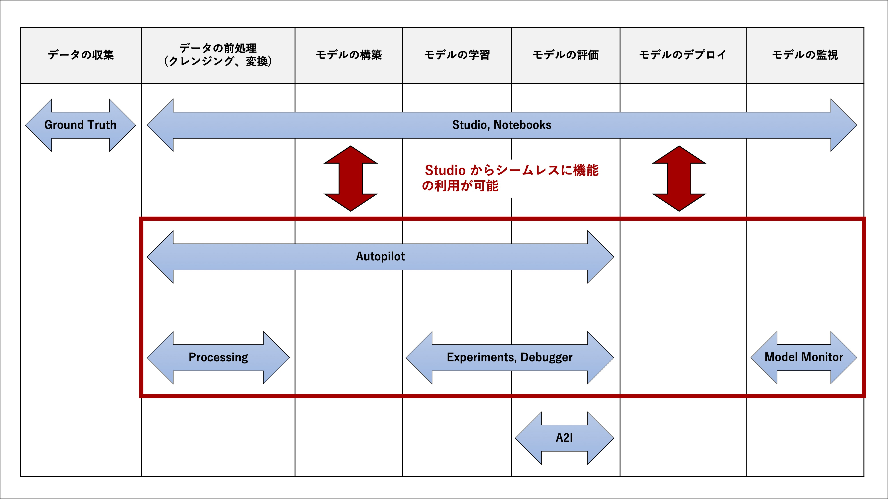

[第9回] Amazon SageMaker Studio の基本的な使い方 (1)
==============================================================

はじめに
-------------------

第5〜8回目の連載では、Amazon SageMaker のチュートリアルを使って、基本的な使い方の紹介をさせていただきました。

    * `「【第5回】Amazon SageMakerの基本的な使い方を理解する(1)」 <https://news.mynavi.jp/itsearch/article/devsoft/5099>`_
    * `「【第6回】Amazon SageMakerの基本的な使い方を理解する(2)」 <https://news.mynavi.jp/itsearch/article/devsoft/5101>`_
    * `「【第7回】Amazon SageMakerの基本的な使い方を理解する(3)」 <https://news.mynavi.jp/itsearch/article/devsoft/5113>`_
    * `「【第8回】Amazon SageMakerの基本的な使い方を理解する(4)」 <https://news.mynavi.jp/itsearch/article/devsoft/5115>`_

これから数回に渡って、昨年末にアメリカのラスベガスで開催された AWS re:Invent 2019 で発表された新機能である「Amazon SageMaker Studio」について扱いたいと思います。

.. これまでは、前回までに扱ったノートブックインスタンスを構築するスタイルだった。
.. ノートブックインスタンスを利用する開発では、利用者がノートブックインスタンスの構築と管理が必要であった。
.. 利用者は機械学習を利用したサービス (コード) の開発がしたい
.. ノートブックインスタンスの構築や管理は価値を生まない作業 (Undifferentiated Lifting) なのでしたくない
.. Amazon SageMaker Studio という IDE の登場により、利用者はそのような作業を AWS に任せて価値の創出に注力することができる。

.. Amazon SageMaker Studio の登場により開発スタイルが2種類になった。

.. * ノートブックインスタンスを利用する従来からの開発スタイル
.. * Amazon SageMaker Studio を利用する新しい開発スタイル

.. Amazon SageMaker Studio は、Amazon SageMaker が提供する様々な機能とシームレスに連携しており、利用者はより便利に使えるようになった。
.. 機械学習を利用するサービスの開発者の UX を変える機能であると言える。
.. まだ東京リージョンには対応していないが、機械学習は AWS における注力分野の1つであるため、近い将来に対応するものと考えられる。
.. 知っておくことは有用であると考えられる。

今回からの連載では、下記を理解していただくことを目標に解説をしていきます。

    * Amazon SageMaker Studio の概要と基本的な利用方法がわかる。
    * Amazon SageMaker Autopilot などの関連機能の概要や基本的な利用機能もわかる。

Amazon SageMaker Studio とは
----------------------------------------

| Amazon SageMaker Studio は、Amazon SageMaker が提供する統合開発環境 (IDE) です。

.. 画面イメージを入れる

| AWS re:Invent 2019 では、Amazon SageMaker にたくさんの機能が追加されましたが、これらの機能とシームレスに連携して利用することができます。
| 機械学習ワークフローの大部分のタスクをカバーしているので、利用者は Amazon SageMaker Studio だけで作業を完結することができます。

.. figure:: ../../../images/9th-aws-ml-stack-sagemaker-studio.jpg
  :width: 900px

  AWS の ML スタック

.. ここの図は書籍と全く同一だと問題になりそうなので、少し変えておく (未対応)

| 上図に登場する Amazon SageMaker 機能の概要を下記に示します。
| いくつかの機能は次回以降の連載でも登場します。その際に詳しく解説することとして、ここでは概要に留めます。

- Amazon SageMaker Notebooks : Amazon SageMaker Studio に統合された完全マネージドなノートブック
- Amazon SageMaker Experiments : 学習ジョブの実行履歴や設定、結果を一元管理
- Amazon SageMaker Debugger : 学習の監視、記録、分析と異常の検知
- `Amazon SageMaker Autopilot <https://aws.amazon.com/jp/sagemaker/autopilot/>`_ : AutoML 機能による機械学習モデルの自動構築
- Amazon SageMaker Model Monitor : 本番環境にデプロイした推論エンドポイントの継続的な監視

Amazon SageMaker Studio を利用するメリットについて考えていきたいと思います。

Amazon SageMaker の利用時の課題
^^^^^^^^^^^^^^^^^^^^^^^^^^^^^^^^^^^^^^^^^^^^^^^^^^^^

.. | まずは、従来の Amazon SageMaker における課題をみてみましょう。

| 下記に Amazon SageMaker を利用する際によく発生する課題とその所在を示します。(オレンジ色の吹き出しで記載)
| これらの作業は価値を生まない作業であり、開発者にとってはストレスとなるため、可能な限りなくしたい作業であると考えられます。

なお、「維持・運用」とは推論以降の本番システムの稼働後の維持・運用工程を指します。

.. figure:: ../../../images/9th-sagemaker-usage-problem.jpg
  :width: 900px

  Amazon SageMaker を利用する際の課題とその所在

.. list-table::
    :header-rows: 1
    :widths: 10 30 60

    * - 項番　　　　　
      - 主な関連工程
      - 問題点
    * - 1
      - | 開発
        | 維持・運用
      - * 利用者がノートブックインスタンスのサイジングを行い、作成する必要がある。
        * ノートブックインスタンスのリソースの利用状況のモニタリングを継続的に行い、必要に応じてスケールアップなどの対処を行う必要がある。
    * - 2
      - 全体
      - * 開発は主にノートブックインスタンスの Jupyter Notebook/JupyterLab 上で行うが、過去・現在の学習ジョブや推論エンドポイントの情報を確認したい場合はコマンドを実行するか、AWS マネジメントコンソールでのページ遷移が必要となる。(項番3とも関連)
        * 学習を繰り返す度に機械学習モデルが増えるので、それぞれの機械学習モデルとハイパーパラメータや精度などの情報を一覧で管理したくなるが、AWS マネジメントコンソールではそれができない。Excel や Jupyter で管理する仕組みを実装する必要がある。
    * - 3
      - | 開発
        | 維持・運用
      - * 開発者の増員とともに IAM ユーザの数が増える。機械学習エンジニアを一時的に雇用するようなケースでも IAM ユーザの払い出しが必要となる。

Amazon SageMaker Studio の導入メリット
^^^^^^^^^^^^^^^^^^^^^^^^^^^^^^^^^^^^^^^^^^^^^^^^^^^^

Amazon SageMaker Studio は、上記の課題に対するソリューションを提供してくれます。
利用者は価値を生まない作業から解放され、価値の創出に注力することができます。

ノートブックインスタンスの作成・管理が不要
++++++++++++++++++++++++++++++++++++++++++++++++++

Amazon SageMaker Studio では、「Amazon SageMaker Notebooks」というフルマネージドなノートブックを利用することができます。
Amazon SageMaker Notebooks は JypyterLab がベースとなるノートブックです。
これまでの Jupyter Notebook や JypyterLab と同じ調子で利用することができます。
既存のノートブックファイルを持ち込んで利用することができます。

ノートブックインスタンスを利用する開発スタイルとの違いがわかりづらいかもしれないですが、
利用者が明示的にノートブックインスタンスを作成する必要がありません。
インスタンスタイプやノートブックインスタンスにアタッチするディスクは負荷や利用量に応じて自動調整されるため、利用者が意識する必要がありません。

.. Notebooks の図を入れる

次回以降に実際に Amazon SageMaker Studio を利用してみますので、ノートブックインスタンスの作成・管理が不要であることを実際に示したいと思います。

開発・学習・推論のほぼ全ての作業が Amazon SageMaker Studio で完結
++++++++++++++++++++++++++++++++++++++++++++++++++++++++++++++++++++++++++++

  機械学習ワークフローにおける Amazon SageMaker Studio のカバー範囲

過去の学習ジョブの情報をみたいという場合
現在デプロイされている推論エンドポイントに関する情報をみたい
下記のいずれか。一手間が必要。

* ノートブックから Python のコードか AWS CLI で情報参照
* Web ブラウザで新しいタブを開いて、AWS マネジメントコンソールで学習ジョブへ

上記は単一の場合。
並べて比較したいということもある。
やはり同じような対応が必要。
場合によっては、Excel で管理するかもしれない。作成も更新も面倒。

Amazon SageMaker Studio では画面遷移をせずにここだけで情報が完結する。
メニューを選択したり、タブを切り替える程度で情報を参照することができる。

情報は自動で一覧化されている。
詳細な情報はドリルダウンするような感じで確認することができる。

グラフを作ることもできる。

IAM ユーザを持たない利用者でも利用が可能
+++++++++++++++++++++++++++++++++++++++++++++++++++

Amazon SageMaker Studio では、AWS SSO と連携して外部 ID による認証認可を行うことができる。
これにより、IAM ユーザを作成せずに機械学習の開発を行うことができます。

.. 図をいれる。

組織の Idp を使う、外部から機械学習に強いエンジニアを一時的に追加する場合などが可能。
IAM ユーザを作成せずに済む、AWS マネジメントコンソールへのログインという一手間を省くことができる。
ID 管理の対象がへる。

AWS SSO は2020年9月に東京に対応した。https://aws.amazon.com/jp/blogs/news/aws-single-sign-on-tokyo/
Amazon SageMaker Studio の対応まち。

まとめ
-----------------

今回はAmazon SageMaker Studio の概要を中心に解説をしました。
次回からは実際に Amazon SageMaker Studio を使っていきたいと思います。

+++++++++++

.. include:: ../author/author.rst
