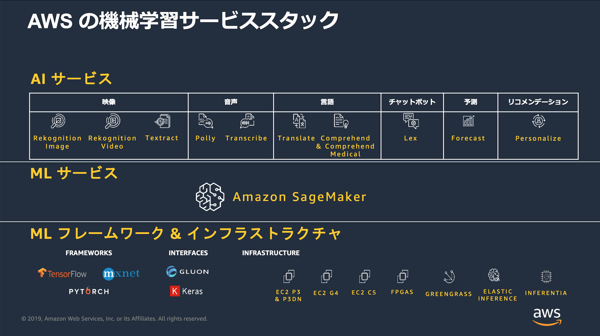

[第1回] AWS ではじめる機械学習
==================================

はじめに
---------------
昨今は、「デジタル・トランスフォーメーション (DX)」と言われ、ビジネスの様々な場面にデジタル技術が取り入れられて、ビジネスの変革が進められています。
デジタル技術の1つに「機械学習」があります。
2000年代以降から現在も「第3次人工知能ブーム」の真っ只中にあると言われていますが、ここ数年は「人工知能 (AI)」や「機械学習」に関連する情報を毎日のように目にするようになりました。
ビジネスに機械学習を取り入れて、従来は人間が行っていたような作業や判断を機械に任せることで多くの企業が成功を収めています。
その一方で、例えば下記のような悩みを持っている方が多くいるのではないでしょうか？

    - 機械学習を取り入れたいが、担い手がおらず導入に踏み切れない。
    - 機械学習の知識はある程度あるが、実装手段までは分からない。
    - 有償トレーニングの受講などノウハウ習得に費用をかけられない。

そこで、この記事ではこのような悩みを持つ読者が、パブリック・クラウドとしてシェアの高い `AWS (Amazon Web Services) <https://aws.amazon.com/jp/>`_ を使って、ビジネスに機械学習を取り入れていく方法を考えていきます。
AWS では、「Amazon で培った機械学習に関するノウハウをすべての開発者に届ける」というコンセプトのもと、多数の `「機械学習サービス」 <https://aws.amazon.com/jp/machine-learning/?nc2=h_ql_sol_use_ml>`_ が提供されています。
独自の機械学習モデルを開発・学習・推論したい開発者・データサイエンティスト向けの「ML サービス」だけでなく、機械学習のスキルがなくてもデータを用意するだけで気軽に機械学習をサービスとして利用できる「AI サービス」もあります。
機械学習の特別なノウハウは不要とはいいつつも、各サービスの概要や使い方、ユースケースなどを理解する必要があります。
機械学習サービスの基本事項を整理し、ビジネスに取り込んでいく方法を考えていきます。

(出典：`「20190924 AWS Black Belt Online Seminar AWS AI Service」 <https://www.slideshare.net/AmazonWebServicesJapan/20190924-aws-black-belt-online-seminar-aws-ai-services>`_  P.11)

前提事項について
----------------------
この記事における想定読者と記事の読了後に目指す状態は下記です。

想定読者
^^^^^^^^^^^

        - 普段の業務に機械学習を取り入れたいと考えているシステム開発担当者。
        - 機械学習に関する基礎的な知識を持っている。
        - AWS アカウントを持っており、AWS マネージメントコンソールを使って、Amazon S3 など基本的なサービスを使ったことがある。

目指す状態
^^^^^^^^^^^^^^

        - AWS の機械学習サービスの種類、それぞれのサービスの概要や使い方がわかる。
        - AWS の機械学習サービスや関連するサービスを組み合わせて、自身の担当するビジネスに活用できる。

注意事項
^^^^^^^^^^^^
この記事では、機械学習と AWS について、基礎的な知識があることを前提としています。
「機械学習とは？」「AWS とは？」といったそれぞれの基礎的な知識や AWS の基本的な使い方に関する解説は行いません。(当該の記事に関連する技術の解説は適宜行います)

機械学習に関する基礎的な知識は持っていない場合は、`「【連載】教えてカナコさん! これならわかるAI入門」 <https://news.mynavi.jp/itsearch/article/solution/2697>`_ を参照してください。
機械学習について非常にわかりやすく解説されています。

また、 AWS はオンラインで多数の学習リソースが提供されています。
例えば、下記のオンラインセミナーなどを必要に応じて参照してください。

        - `「はじめてのアマゾン ウェブ サービス」 <https://pages.awscloud.com/hajimete-ondemand-jp.html>`_
        - `「AWS ご利用開始時に最低限おさえておきたい10のこと」 <https://pages.awscloud.com/event_JAPAN_at-least-10-ondemand.html?trk=aws_event_page>`_
        - `「AWS サービス別資料」 <https://aws.amazon.com/jp/aws-jp-introduction/aws-jp-webinar-service-cut/>`_

今後の記事の投稿内容について
-----------------------------
今後は下記の流れで記事を投稿していくことを検討しています。

        - AWS の機械学習サービスの全体像について
        - AI サービスに分類される9種類(※)の個々のサービスの概要と使い方について(※ 2019年11月現在のサービス数)
        - ML サービスに分類される Amazon SageMaker の概要と使い方について

その他にも適宜下記の内容も織り交ぜていきます。

        - 実際のビジネスシーンを想定した例題を設定して、複数の AWS のサービスを組み合わせたソリューションを考える。
        - AWS re:Invent 等のイベント等で発表された新サービスや既存サービスの新機能の概要や使い方も紹介する。

次回は、まず総論としてAWS の機械学習サービスの全体像についてまとめます。

+++++++++++

.. include:: ../author/author.rst