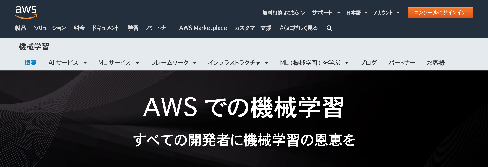

[第2回] AWS の機械学習サービスとは
=====================================

はじめに
-----------------
| `前回 <https://news.mynavi.jp/itsearch/article/cloud/4722>`_ は、本連載の背景についてご説明させていただき、想定読者や目指す状態などを設定しました。今回から AWS の機械学習サービスの具体的な内容を見ていきたいと思います。

| ところで、2019年12月1日〜6日にアメリカのラスベガスにて AWS の最大のイベントである `AWS re:Invent 2019 <https://reinvent.awsevents.com/>`_ が開催され、全部で70を超える新サービスが発表されました。
| 注目すべきなのは、機械学習サービスだけで20の新サービスが発表されており、全体の3割程度を占めている点です。AWS 社がサービスの開発に注力していることが伺え、今後も多数のサービスが登場することが予想されます。

| 後続の記事では、新サービスも含めて機械学習サービス全体を扱っていきますが、AWS re:Invent 2019 の新サービスについていち早く知りたい方は、Black Belt Online Seminar 「AWS re:Invent 2019 アップデート速報」の `[動画 (YouTube)] <https://www.youtube.com/watch?v=v9bu2LYN0PY&feature=youtu.be>`_ もしくは `[資料 (SlideShare)] <https://www.slideshare.net/AmazonWebServicesJapan/20191206-aws-black-belt-online-seminar-aws-reinvent-202177403>`_ をご確認ください。

さて、本題に戻り、今回の記事で扱う内容と目標を下記に示します。

今回の目標
^^^^^^^^^^^^^^^^^^^
- AWS の機械学習サービスの3種類のサービスとそれぞれの概要がわかる。
- 機械学習を活用する際の前提事項がわかる。

AWS の機械学習サービスとは
----------------------------
AWS の機械学習サービスについて整理をしていきます。

機械学習分野における AWS のミッション
^^^^^^^^^^^^^^^^^^^^^^^^^^^^^^^^^^^^^^^
| AWS 社はどのようなミッションの元で機械学習サービスを提供しているのでしょうか？
| それは機械学習サービスの製品紹介ページにて宣言されている通り「すべての開発者に機械学習の恩恵を」です。
| すなわち、機械学習を専門に扱う研究者やエンジニアだけでなく、これから機械学習をビジネスに取り入れたいなど機械学習に関する専門的な知識を持たないエンジニアに向けたサービスも用意されています。

(出典：`機械学習サービスの製品紹介ページ <https://aws.amazon.com/jp/machine-learning/?nc1=h_ls>`_)

機械学習サービスの種類
^^^^^^^^^^^^^^^^^^^^^^^^^^^^^^
| AWS の機械学習サービスのラインナップ (ML スタック) を下記の図に示します。
| `前回 <https://news.mynavi.jp/itsearch/article/cloud/4722>`_ の記事でも同様の図を示しましたが、AWS re:Invent 2019 にて新サービスが追加されたため、内容が異なっている点に注意してください。

.. image:: ../../../images/AWSのMLスタック_2019.png

(出典：2019年12月12日開催 「AWS re:Invent 2019 re:Cap | AI/ML」 の資料より)

| 機械学習サービスは、大きく「AI サービス」「ML サービス」「ML フレームワークとインフラストラクチャ」の3種類に分けることができます。
| それぞれの機械学習サービスの特徴を下記の表に簡単にまとめます。

.. list-table::
    :widths: 5, 5
    :header-rows: 1

    * - サービス名
      - サービスの特徴
    * - AI サービス
      - * | AWS がユースケースごとに用意したサービスと自身の解決したい問題・課題とマッチする人向けのサービス。
          | (例) 機械翻訳がしたい：Amazon Translate、商品の在庫を予測したい：Amazon Forecast など
        * | 学習済モデル、もしくは、学習モデルを生成する仕組みが AWS から提供される。
          | 利用者が考える部分が少なくて澄むため、導入の難易度は最も低い。
        * | 上記の理由で「機械学習の深い知識なしに利用可能」である。
    * - ML サービス
      - * | 機械学習エンジニアやデベロッパ向けのサービス。
          | Amazon SageMaker とその関連機能により、機械学習のプロセス (開発・学習・デプロイ・推論・監視など)
          | を効率良く行うための機能が提供されている。
        * | AWS が用意したビルトインアルゴリズムを利用して機械学習モデルを開発することや
          | 利用者独自のアルゴリズムを元に機械学習モデルを開発するも可能である。
        * | AI サービスと比較すると柔軟性が増す一方で利用者が準備する部分が増えるため、導入の難易度が上がる。
    * - | ML フレームワークと
        | インフラストラクチャ
      - * | Amazon SageMaker の実行環境をカスタマイズするためのサービス。
        * | 利用者が好きな ML (機械学習) フレームワークを選択して開発することや
          | 機械学習向けに最適化されたインスタンスを利用して、推論を実行することができる。

機械学習を活用する際の前提事項
^^^^^^^^^^^^^^^^^^^^^^^^^^^^^^^^
本連載ではビジネスに機械学習を活用することをテーマとしていますが、その前提として少なくとも下記の2点に気を付ける必要があります。

    - 自身のビジネスにおける問題・課題から入る
    - 機械学習を使って対処することが最善策なのかを考える

自身のビジネスにおける問題・課題から入る
***********************************************
機械学習に限りませんが、自身の「ビジネスにおける問題・課題」から入ることが重要です。すなわち、機械学習を利用することはビジネスで価値を出すための手段であり、機械学習の導入を目的化しないということです。

| 例えば、「機械学習を使ってとりあえず何かをやりたい！」という思いから出発してしまうパターンです。機械学習は技術的なトレンドになっていますので、試してみたい・世の中に流れに遅れを取りたくないなどの気持ちは理解できます。
| しかし、手段と目的が逆転した状態で開発を進めてしまうと、利用者に使われないシステムや機能が作られてしまいがちです。技術検証やPoC (Proof of Consent; 概念実証) を実施するにしても、背景にビジネス課題があって、それを確認するために実施するはずです。

まずは自身のビジネスにおける問題・課題を明確にし、機械学習を使うことで生み出されるビジネス価値をはっきりさせることが重要と考えます。

機械学習を使って対処することが最善策なのかを考える
****************************************************
| 端的にいうと、機械学習を使わずに対処可能な場合は使わないということです。
| 例えば、特定のエラーメッセージを検知した際の復旧方法が確定的なものであるならば、条件分岐で実装すれば済みます。

機械学習は過去のデータから機械学習アルゴリズムに従って何らかのパターンを見出し(学習し)、将来を予測するものです。それは文字通り「予測」であり、精度は一般的に100%にはならず、間違った判断をすることがあります。判断の間違いがあることを理解した上で利用するか、許容されない場合は適用を避けるべきです。

| また、機械学習モデルの維持や運用に手間がかかることも理由の1つです。
| 例えば、本番環境にデプロイした機械学習モデルは、定常的に予測精度を監視して、自身の提供するサービスとして十分な精度を出し続けているかを監視する必要があります。
| 過去のデータからパターンを抽出するということは、予測対象がその過去のデータに即した振る舞いをするという前提を置いています。振る舞いの傾向が変わるなどした場合 (例えば、利用者の購買行動の変化など) は、新たなデータを使って機械学習モデルを再学習させる必要があります。

これらの前提を踏まえた上で、機械学習の利用を検討していただきたいと思います。

まとめ
--------------
今回の記事では、AWS の機械学習サービスの3種類のサービスとそれぞれの概要、機械学習を活用する際の前提事項についてご説明させていただきました。

次回は、AI サービスとして提供されているサービスの概要やユースケースについて見ていきたいと思います。

+++++++++++

.. include:: ../author/author.rst